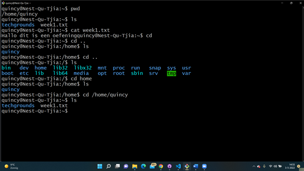

# LNX-02 Files and Directories
With this excercise I learned how to make directories and files within linux. I also learned how to move around the directory tree using absolute and relative paths.

## Key terminology
- Directories: A folder within Linux.
- Root: The highest directory in the hierarchy. 
- Absolute Path: An absolute path is specifying the location of a file or directory from the root.  
- Relative Path: A Relative path is the path related to the present working directory. 

## Exercise
### Sources
- https://www.hostinger.com/tutorials/linux-commands
- https://www.geeksforgeeks.org/absolute-relative-pathnames-unix/#:~:text=An%20absolute%20path%20is%20defined%20as%20specifying%20the%20location%20of,actual%20file%20system%20from%20%2F%20directory.&text=Relative%20path%20is%20defined%20as,present%20working%20directly(pwd).
- https://www.lifewire.com/what-is-a-root-folder-or-root-directory-2625989 

### Overcome challenges
- I couldn't make a new directory in the home directory, because of permissions. I then made a directory in the quincy directory. 
- I didn't remembered how to close a .txt file, so I had to search it up.
- I didn't know what a relative en absolute path is. 
### Results
- I made a new directory and in the directory a .txt file. After that I used different commands to move around the directory tree (absolute and relative).

