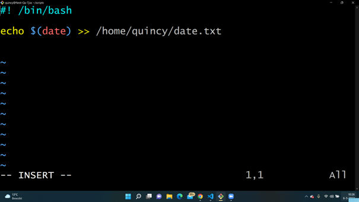
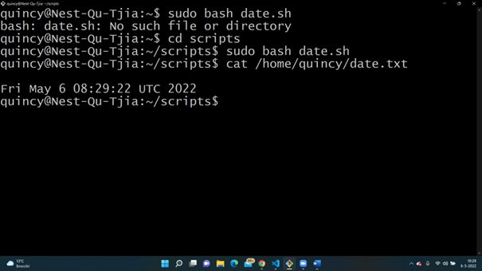
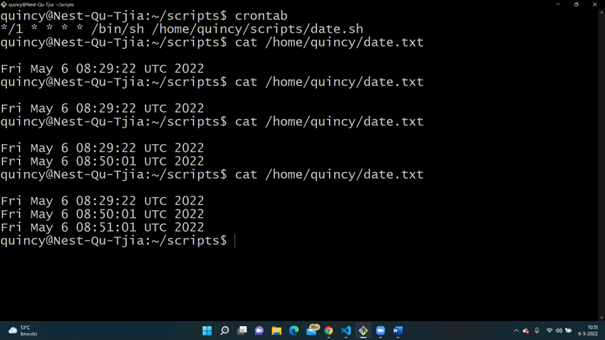
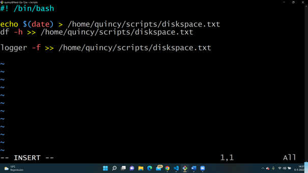
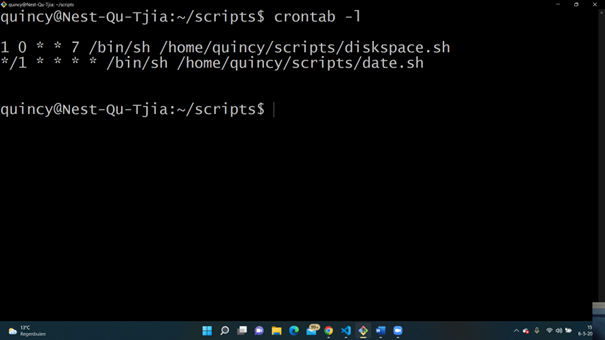
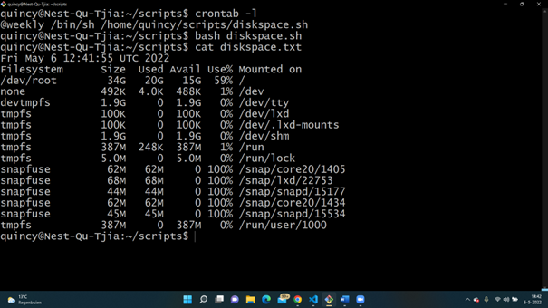
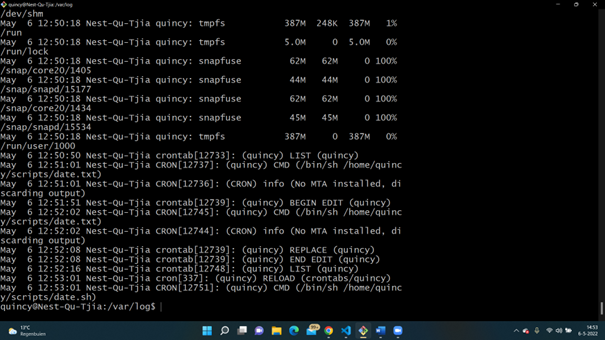

# LNX-08 Cron jobs 
With this excercise I learned what cron jobs are and how to use them within Linux.  

## Key terminology
- Cron jobs: A cron job is a scheduling daemon. It runs in the background and and operations scheduled with 'cron' are executed automatically. 
- 'date': With this command you can see the current date and timezone set in your system.
- crontab (-e): This is a list of commands you want to run on a regular schedule, it is also the name of the command use to manage the list and with -e you can edit the list.
- a(m) b(h) c(D) d(M) e(Day of the week) /directory/command output: This is the standard form for a crontab.
- , operator: seperate individual values
- (-) operator: range of values
- / operator: divide value into steps
- log file: log files are records that Linux stores and monitors. 
- /var/log: Here are the log files stored.
- df -h (disk filesystems): This command lets you see the available disc space and used disk space in human readable. 
- logger command: This manually creates a log entry.
- @weekly or 1 0 * * 7 (): Use this with the crontab command to do this every week.
 
## Exercise
### Sources
- https://www.digitalocean.com/community/tutorials/how-to-use-cron-to-automate-tasks-ubuntu-1804 
- https://tecadmin.net/get-current-date-and-time-in-bash/ 
- https://www.geeksforgeeks.org/crontab-in-linux-with-examples/#:~:text=Crontab%20stands%20for%20%E2%80%9Ccron%20table,according%20to%20a%20set%20schedule.
- https://phoenixnap.com/kb/set-up-cron-job-linux 
- https://www.eurovps.com/blog/important-linux-log-files-you-must-be-monitoring/#what 
- https://crontab.guru/ 
- https://www.howtogeek.com/409611/how-to-view-free-disk-space-and-disk-usage-from-the-linux-terminal/#:~:text=Bash%20contains%20two%20useful%20commands,terminal%20window%20to%20get%20started. 
- https://www.networkworld.com/article/3274570/using-logger-on-linux.html#:~:text=This%20easy.,var%2Flog%2Fsyslog%20file. 

### Overcome challenges
- First I had to search what excactly a cron job is.
- I had to find out out what the script is to see the current date and time.
- I had to find out what a crontab is. 
- I had to find out how to make a crontab and how to register the script within.
- After I found out how to do it, I needed to find out how to write it every minute.
- I had to find out what excactly is a log file.
- I had to find out the command to see the available disc space.
- I had to found the command to open a log entry.
- I had to found out how to make the cronjob for the file. 

### Results
- I created a bash script in vi editor to write the current date and time to a file in  my home directory.
- I registered the script in my crontab and it works and it now shows the current date and time every minute.
- I had to make a script which writes the diskinfo (available diskspace) in a txt file. And also write this to a log file.
- I had to make a cron job to make sure every week the diskinfo will be printed in the txt file and log file. 

 

 