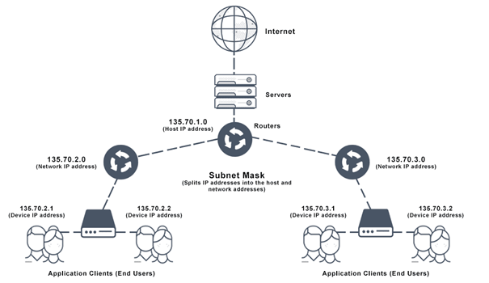
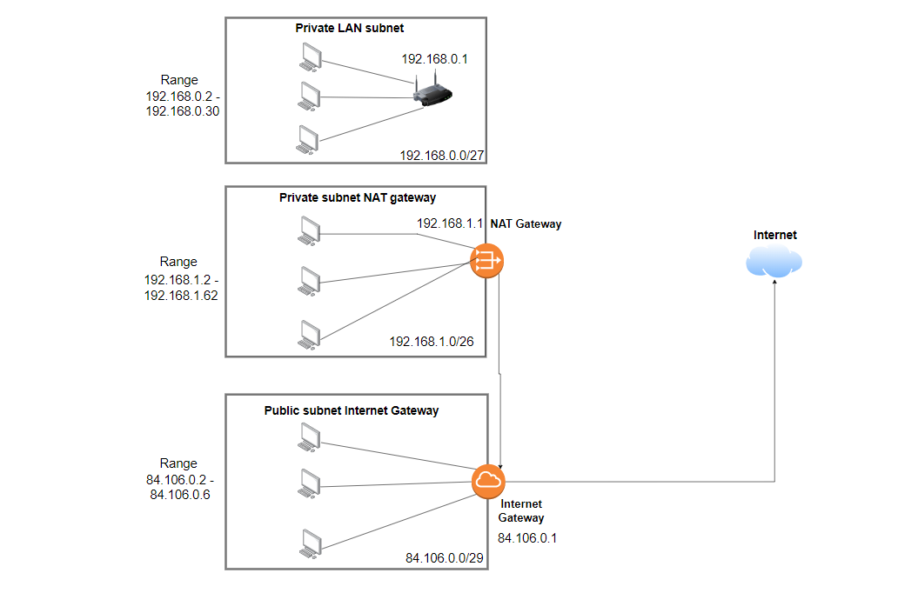

# NTW-06 Subnetting
With this excercise I learned what Subnetting means and how you are able to do that. I also learned how to work with subnet masks (prefix) end how to make a network diagram of my own. 

## Key terminology
- LAN: A local area network (LAN) is a collection of devices connected together in one physical location, such as a building, office, or home. A LAN can be small or large, ranging from a home network with one user to an enterprise network with thousands of users and devices in an office or school. 
- Host: Every device (host) within a LAN  
- Subnet: A smaller network within your bigger network.
- Subnet mask (prefix): Every device has an IP address with two pieces: the client or host address and the server or network address. IP addresses are either configured by a DHCP server or manually configured (static IP addresses). The subnet mask splits the IP address into the host and network addresses, thereby defining which part of the IP address belongs to the device and which part belongs to the network. A subnet mask is a 32-bit number created by setting host bits to all 0s and setting network bits to all 1s. In this way, the subnet mask separates the IP address into the network and host addresses.
- CIDR notation: Classless inter-domain routing (CIDR) is a set of Internet protocol (IP) standards that is used to create unique identifiers for networks and individual devices. The IP addresses allow particular information packets to be sent to specific computers. CIDR IP addresses consist of two groups of numbers, which are also referred to as groups of bits. The most important of these groups is the network address, and it is used to identify a network or a sub-network (subnet). The lesser of the bit groups is the host identifier. The host identifier is used to determine which host or device on the network should receive incoming information packets.  
- Subnet calculator: The subnet calculator is a handy tool for finding the number of possible subnets for any given network address block. You can choose the combination of subnets and number of hosts per subnet that suits your network and get the host address range and broadcast address for any given subnet mask. 
- NAT gateway: This gateway basically changes a Public IP Address to a Private one and vice versa.  
- Internet gateway: An Internet gateway is a network "node" that connects two different networks that use different protocols (rules) for communicating. In the most basic terms, an Internet gateway is where data stops on its way to or from other networks. Thanks to gateways, we can communicate and send data back and forth with each other. 

## Exercise
### Sources
- https://app.diagrams.net/ 
- https://www.subnet-calculator.com/  
- https://www.cisco.com/c/en/us/products/switches/what-is-a-lan-local-area-network.html 
- https://avinetworks.com/glossary/subnet-mask/ 
- https://whatismyipaddress.com/cidr 
- https://dnsmadeeasy.com/support/subnet 
- https://www.whatismypublicip.com/blog/what-is-an-internet-gateway/ 

### Overcome challenges
- I first had to search up what all the key terminology mean.  
- After that I had to find out how a Network Architecture could look like.
- After that I needed to find out what is in our network system and how to make subnets.
- I had to find out which IP addresses I needed to use. I looked that up by using the calculator and the Subnet Mask list. 
- It was really hard for me to start somewhere, I didn't know where to start. Eventually with some help from my teammates I managed to make it and understand it. 

### Results
- You can see the diagram I made below. 

A short summary:

The Private LAN subnet: I used the calculator to see which Private IP address I can use as a example. The subnet should be able to place 15 hosts at a minimum. I then went to the subnetmask list to see how many Mask Bits I should use to be able to place 15 hosts. I chose for 27 because then I could place 30 hosts. If I had chose 28 Mask Bits, then there would only had been place for 14 hosts. 

The Private subnet NAT Gateway: I first placed a NAT Gateway (after the Internet Gateway) because this has to be a Private Subnet. The subnet should be able to place 30 hosts including the NAT Gateway. I chose for 26 Mask Bits because if I had used 27 Mask Bits, it can place 30 hosts, but if a new host wants to be added to the subnet you have to change the whole structure. Now it can place 62 hosts.

The Public Subnet: This subnet should be able to place 5 hosts including the Internet Gateway. I chose for 29 Mask Bits because than you can place 6 hosts. I chose for this option because having more different Public IP addresses will be more expensive to have.   

 