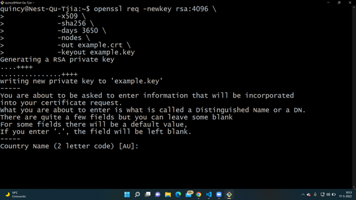
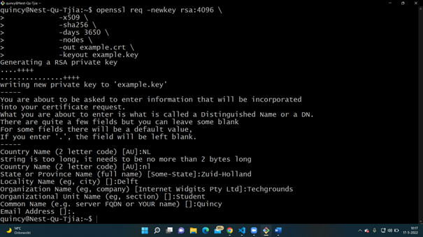
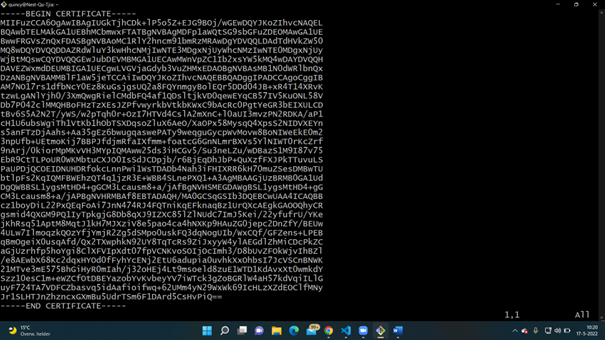
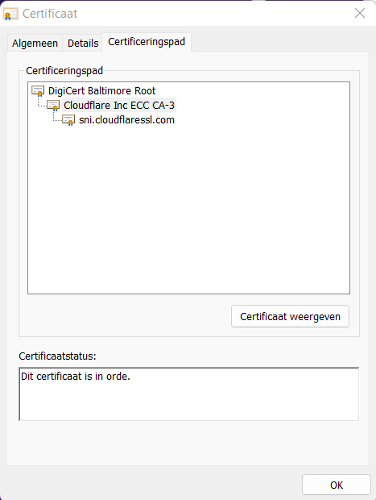
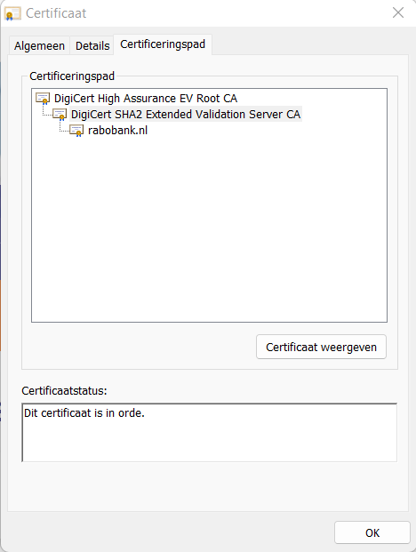
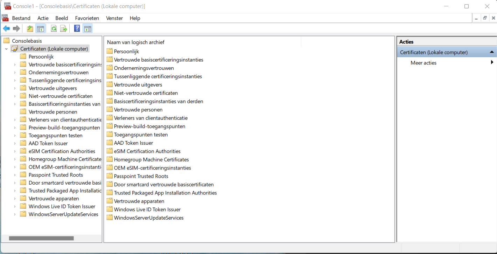

# SEC-06 Public Key Infrastructure
With this exercise I learned what PKI does and what SSL certificates are. I also learned how to make a self-signed certificate and how to see the certificates of certain websites. 

## Key terminology
- Public Key Infrastructure (PKI): Public key infrastructure (PKI) governs the issuance of digital certificates to protect sensitive data, provide unique digital identities for users, devices and applications and secure end-to-end communications. Public Key Infrastructure (PKI) is a set of roles, policies, hardware, software and procedures needed to create, manage, distribute, use, store and revoke digital certificates and manage public-key encryption. In short, PKI assigns identities to keys so that recipients can accurately verify the owners.
- X.509 standard: X.509 is a standard defining the format of public-key certificates. X.509 certificates are used in many Internet protocols, including TLS/SSL, which is the basis for HTTPS, the secure protocol for browsing the web. They are also used in offline applications, like electronic signatures. An X.509 (also called digital) certificate contains a public key and an identity (a hostname, or an organization, or an individual), and is either signed by a certificate authority or self-signed. 
- Self-signed SSL Certificate: A self-signed SSL certificate is a certificate that is signed by the person who created it rather than a trusted certificate authority. Self-signed certificates can have the same level of encryption as the trusted CA-signed SSL certificate.
 
## Exercise
- Create a self-signed certificate on your VM.
- Analyze some certification paths of known websites (ex. techgrounds.nl / google.com / ing.nl).
- Find the list of trusted certificate roots on your system (bonus points if you also find it in your VM).

### Sources
- https://www.keyfactor.com/resources/what-is-pki/
- https://www.youtube.com/watch?v=i-rtxrEz_E8
- https://www.appviewx.com/education-center/what-is-x-509-standard/#:~:text=509%20Standard%3F-,X.,offline%20applications%2C%20like%20electronic%20signatures.
- https://linuxize.com/post/creating-a-self-signed-ssl-certificate/
- https://www.venafi.com/education-center/ssl/how-to-check-ssl-certificate#:~:text=For%20most%20browsers%2C%20look%20to,to%20view%20the%20certificate%20information
- https://docs.microsoft.com/en-us/dotnet/framework/wcf/feature-details/how-to-view-certificates-with-the-mmc-snap-in

### Overcome challenges
- I first had to search for the key terminology and try to understand them.
- The next step was to find out how I can create a self-signed certificate on my VM.
- I then had to search how I can find certification paths of know websites.
- And at last I had to find out how to find a list of trusted certificate roots on my system.

### Results
- Create a self-signed certificate on your VM.

    The first step was to install the openssl package on my VM. It turned out it was already installed. After that I used the openssl req command to create a new self-signed SSL certificate. After that I filled in some information about myself and then the Self-signed certificate was created.

- Analyze some certification paths of known websites (ex. techgrounds.nl / google.com / ing.nl).

    To check if a website has a SSL certificate you have to look if the URL begins with https. You can then click on the padlock icon in the address bar to view the certificate information. 

- Find the list of trusted certificate roots on your system (bonus points if you also find it in your VM).

This is the certificate path for techgrounds. You can see that cloudflare has given the certificate.

This is the certificate path for Rabobank.

This is the list with certificate roots on my system.

 