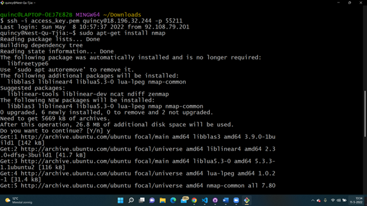
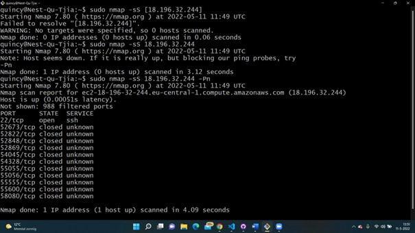
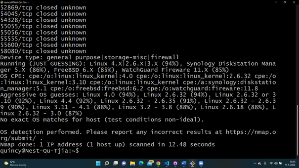
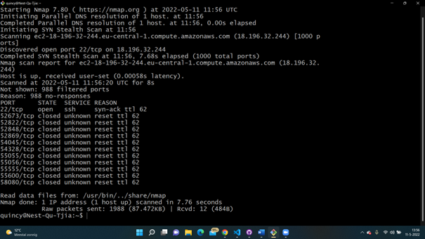
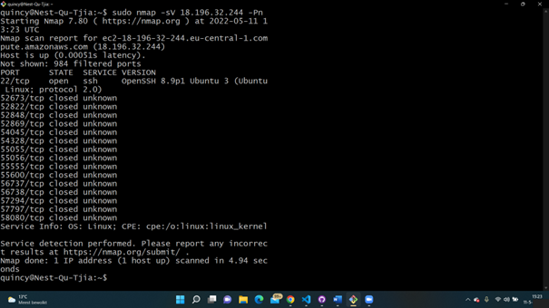
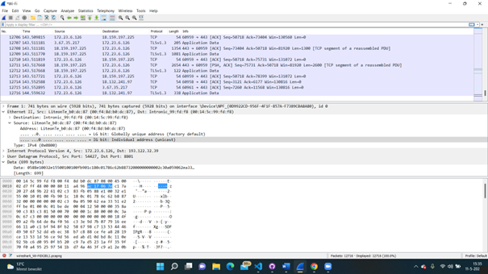

# Sec-02 Firewalls
With this excercise I learned there are tools to scan or analyze a network. I also learned how to use them.

## Key terminology
- Nmap: Network Mapper, this is a tool that scans a network to find information about it. For example, what ports are open in a host in your network. Use Nmap to identify what devices are running on their systems, discovering hosts that are available and the services they offer, finding open ports and detecting security risks.
- Wireshark: Wireshark is a protocol analyzer. It looks at network traffic and shows information about packets like protocol and destination (among other things).  

## Exercise
### Sources
- https://www.networkworld.com/article/3296740/what-is-nmap-why-you-need-this-network-mapper.html 
- https://www.howtoforge.com/tutorial/nmap-on-linux/ 

### Overcome challenges
- I had to find what nmap excactly means and what is does.
- After that I had to found out how to scan the network of my Linux machine to find information for it.SS 

### Results
- First I installed the nmap package on my Linux machine.
- After that I tried some commands to do some scans.
- The first one is a scan to see if the server or website is up and running.
- The second one I tried is to try and guess what operating system is run on the target system.
- The third one is a Ping scan to check the open ports available. 
- The fourth one is a check to see wich services are running. 
- I then opened Wireshark on my local machine to analyse what happens when I open an internet browser. I made a screenshot of that.

 