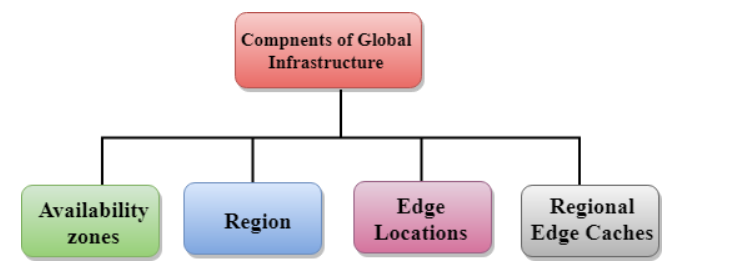

# AWS -01 AWS Global Infrastructure
With this exercise I learned what the AWS Global Infrastructure is and how it works. I learned what regions, Availability zones and edge locations are. 

## Key terminology
- Global Infrastructure: Global infrastructure is a region around the world in which AWS is based. Global infrastructure is a bunch of high-level IT services.
- Region: A Region is a physical location around the world where AWS clusters data centers. We call each group of logical data centers an Availability Zone. Each AWS Region consists of multiple, isolated, and physically separate AZs within a geographic area. A region is a geographical area. Each region consists of 2 more availability zones. A region is a collection of data centers which are completely isolated from other regions. A region consists of more than two availability zones connected to each other through links. 
- Availability zones: An Availability Zone (AZ) is one or more discrete data centers with redundant power, networking, and connectivity in an AWS Region. AZs give customers the ability to operate production applications and databases that are more highly available, fault tolerant, and scalable than would be possible from a single data center. An availability zone is a facility that can be somewhere in a country or in a city. Inside this facility, i.e., Data Centre, we can have multiple servers, switches, load balancing, firewalls. The things which interact with the cloud sits inside the data centers. An availability zone can be a several data centers, but if they are close together, they are counted as 1 availability zone.
- Edge Locations: An Edge location is basically a small setup in different locations that provides low latency connectivity by providing static contents to be available from nearest location of the request. What happens is that instead of getting the information from the source it just routes to the nearest edge location and delivers the information reducing the latency. This way the access time is less and response is faster.  
- IAM service: AWS Identity and Access Management (IAM) provides fine-grained access control across all of AWS. With IAM, you can specify who can access which services and resources, and under which conditions. With IAM policies, you manage permissions to your workforce and systems to ensure least-privilege permissions. 
- RDS instances: Amazon Relational Database Service (RDS) is a managed SQL database service provided by Amazon Web Services (AWS). Amazon RDS supports an array of database engines to store and organize data. It also helps with relational database management tasks, such as data migration, backup, recovery and patching. 
- Cloudfront: AWS CloudFront is a globally-distributed network offered by Amazon Web Services, which securely transfers content such as software, SDKs, videos, etc., to the clients, with high transfer speed.

## Exercise
Study:

- What is an AWS Availability Zone?
- What is a Region?
- What is an Edge Location?
- Why would you choose one region over another? (e.g. eu-central-1 (Frankfurt) over us-west-2 (Oregon)).

### Sources
- https://aws.amazon.com/about-aws/global-infrastructure/regions_az/#:~:text=the%20Middle%20East.-,Availability%20Zones,connectivity%20in%20an%20AWS%20Region.
- https://www.edureka.co/community/600/what-is-an-edge-location-in-aws
- https://aws.amazon.com/about-aws/global-infrastructure/#:~:text=The%20AWS%20Global%20Cloud%20Infrastructure,services%20from%20data%20centers%20globally.
- https://www.javatpoint.com/aws-global-infrastructure
- https://aws.amazon.com/blogs/architecture/what-to-consider-when-selecting-a-region-for-your-workloads/#:~:text=Choosing%20an%20AWS%20Region%20with,from%20one%20Region%20to%20another.
- https://aws.amazon.com/iam/
- https://www.simplilearn.com/tutorials/aws-tutorial/aws-cloudfront#:~:text=AWS%20CloudFront%20is%20a%20globally,Logo%20%2D%20CloudFront 
- https://www.youtube.com/watch?v=aNgda-qWT6w
- https://www.youtube.com/watch?v=RPis5mbM8c8      

### Overcome challenges
- I had to search for all the different key terminology.
- I had to study the different key terminology.

### Results
- What is an AWS Availability Zone?

    - An Availability Zone (AZ) is one or more discrete data centers with redundant power, networking, and connectivity in an AWS Region. AZs give customers the ability to operate production applications and databases that are more highly available, fault tolerant, and scalable than would be possible from a single data center. 

    - An availability zone is a facility that can be somewhere in a country or in a city. Inside this facility, i.e., Data Centre, we can have multiple servers, switches, load balancing, firewalls. The things which interact with the cloud sits inside the data centers.
    An availability zone can be a several data centers, but if they are close together, they are counted as 1 availability zone.

- What is a Region?

    - A Region is a physical location around the world where AWS clusters data centers. We call each group of logical data centers an Availability Zone. Each AWS Region consists of multiple, isolated, and physically separate AZs within a geographic area.

    - A region is a geographical area. Each region consists of 2 more availability zones.
    - A region is a collection of data centers which are completely isolated from other regions.
    - A region consists of more than two availability zones connected to each other through links.

- What is an Edge Location?

    - An Edge location is basically a small setup in different locations that provides low latency connectivity by providing static contents to be available from nearest location of the request. What happens is that instead of getting the information from the source it just routes to the nearest edge location and delivers the information reducing the latency. This way the access time is less and response is faster. 

    - Edge locations are the endpoints for AWS used for caching content.
    - Edge locations consist of CloudFront, Amazon's 
    - Edge location is not a region but a small location that AWS have. It is used for caching the content.
    - Edge locations are mainly located in most of the major cities to distribute the content to end users with reduced latency.
    - For example, some user accesses your website from Singapore; then this request would be redirected to the edge location closest to Singapore where cached data can be read. 

- Why would you choose one region over another? (e.g. eu-central-1 (Frankfurt) over us-west-2 (Oregon)).

    - There are four main factors that play into evaluating each AWS Region for a workload deployment:

    1. Compliance. If your workload contains data that is bound by local regulations, then selecting the Region that complies with the regulation overrides other evaluation factors. This applies to workloads that are bound by data residency laws where choosing an AWS Region located in that country is mandatory.
    2. Latency. A major factor to consider for user experience is latency. Reduced network latency can make substantial impact on enhancing the user experience. Choosing an AWS Region with close proximity to your user base location can achieve lower network latency. It can also increase communication quality, given that network packets have fewer exchange points to travel through.
    3. Cost. AWS services are priced differently from one Region to another. Some Regions have lower cost than others, which can result in a cost reduction for the same deployment.
    4. Services and features. Newer services and features are deployed to Regions gradually. Although all AWS Regions have the same service level agreement (SLA), some larger Regions are usually first to offer newer services, features, and software releases. Smaller Regions may not get these services or features in time for you to use them to support your workload. 

Global Infrastructure

