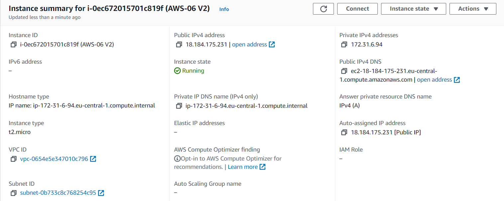
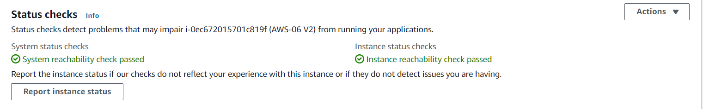
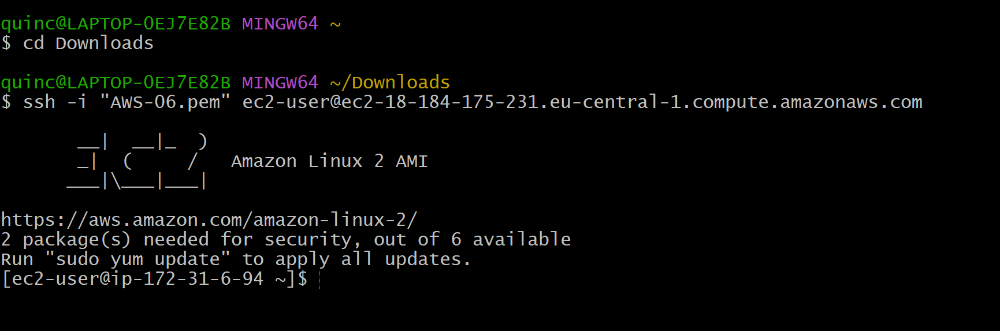

# AWS-06 Elastic Compute Cloud (EC2)
With this exercise I learned what the EC2 service is and how you can use it. I also learned how to make a instance and how to connect to your VM with a ssh connection. 

## Key terminology
- Remote Desktop Protocol(RDP): For a connection to Windows machines, you use the Remote Desktop Protocol (RDP). RDP (Remote Desktop Protocol) is a network communications protocol developed by Microsoft, which allows users to connect to another computer from a remote location.

- Amazon Machine Image (AMI): An Amazon Machine Image (AMI) is a supported and maintained image provided by AWS that provides the information required to launch an instance. You must specify an AMI when you launch an instance. You can launch multiple instances from a single AMI when you require multiple instances with the same configuration. You can use different AMIs to launch instances when you require instances with different configurations. An AMI is a blueprint for your machine. It contains a template for the OS among other things.  

- Instance Types: Amazon EC2 provides a wide selection of instance types optimized to fit different use cases. Instance types comprise varying combinations of CPU, memory, storage, and networking capacity and give you the flexibility to choose the appropriate mix of resources for your applications. Each instance type includes one or more instance sizes, allowing you to scale your resources to the requirements of your target workload. 

- Elastic Block Store(EBS): Amazon Elastic Block Store (Amazon EBS) provides block level storage volumes for use with EC2 instances. EBS volumes behave like raw, unformatted block devices. You can mount these volumes as devices on your instances. EBS volumes that are attached to an instance are exposed as storage volumes that persist independently from the life of the instance. You can create a file system on top of these volumes, or use them in any way you would use a block device (such as a hard drive). You can dynamically change the configuration of a volume attached to an instance. This is also known as persistent storage. 

- Instance store: An instance store provides temporary block-level storage for your instance. This storage is located on disks that are physically attached to the host computer. Instance store is ideal for temporary storage of information that changes frequently, such as buffers, caches, scratch data, and other temporary content, or for data that is replicated across a fleet of instances, such as a load-balanced pool of web servers. This is also known as ephemeral storage.   

- Ephemeral storage: Ephemeral storage is the volatile temporary storage attached to your instances which is only present during the running lifetime of the instance. In the case that the instance is stopped or terminated or underlying hardware faces an issue, any data stored on ephemeral storage would be lost. 

- Persistent storage: Persistent storage is any data storage device that retains data after power to that device is shut off. It is also sometimes referred to as nonvolatile storage. 

- Security Group: An AWS security group acts as a virtual (stateful) firewall for your EC2 instances to control incoming and outgoing traffic. Both inbound and outbound rules control the flow of traffic to and traffic from your instance, respectively. 

- User data: AWS userdata is the set of commands/data you can provide to a instance at launch time. For example if you are launching an ec2 instance and want to have docker installed on the newly launched ec2, than you can provide set of bash commands in the userdata field of aws ec2 config page. With User Data you can specify a (bash) script that runs on boot. This is a way to quickly configure servers without having to log in and without doing any manual work. 

- On demand instances: With On-Demand Instances, you pay for compute capacity by the second with no long-term commitments. You have full control over its lifecycle—you decide when to launch, stop, hibernate, start, reboot, or terminate it. There is no long-term commitment required when you purchase On-Demand Instances. You pay only for the seconds that your On-Demand Instances are in the running state, with a 60-second minimum. On demand instances are the most expensive option, but they’re also the most flexible.  

- Reserved instances: Amazon EC2 Reserved Instances (RI) provide a significant discount (up to 72%) compared to On-Demand pricing and provide a capacity reservation when used in a specific Availability Zone. Reserved instances provide a greater discount depending on how much you pay up front. You can reserve instances only for 1 or 3 years.
  
- Spot instances: A Spot Instance is an instance that uses spare EC2 capacity that is available for less than the On-Demand price. Because Spot Instances enable you to request unused EC2 instances at steep discounts, you can lower your Amazon EC2 costs significantly. The hourly price for a Spot Instance is called a Spot price. Spot instances are generally considered the cheapest, but their availability depends on the demand, so they’re not always reliable.  

## Exercise
Exercise 1

- Navigate to the EC2 menu.
- Launch an EC2 instance with the following requirements:

    - AMI: Amazon Linux 2 AMI (HVM), SSD Volume Type
    - Instance type: t2.micro
    - Default network, no preference for subnet
    - Termination protection: enabled
    - User data:
    #!/bin/bash
     yum -y install httpd
    systemctl enable httpd
    systemctl start httpd
    echo '< html>< h1>Hello From Your Web Server!</ h1></ html>' >   /var/www/html/index.html
- Root volume: general purpose SSD, Size: 8 GiB
- New Security Group:
    Name: Web server SG
    Rules: Allow SSH, HTTP and HTTPS from anywhere

Exercise 2

- Wait for the Status Checks to get out of the initialization stage. When you click the Status Checks tab, you should see that the System reachability and the Instance reachability checks have passed.
- Log in to your EC2 instance using an ssh connection.
- Terminate your instance.

### Sources
- https://www.ericom.com/whatis/rdp/
- https://docs.aws.amazon.com/AWSEC2/latest/UserGuide/AMIs.html 
- https://aws.amazon.com/ec2/instance-types/?trk=ae6753b2-c1f0-4ff0-ba50-38eafd7a0321&sc_channel=ps&sc_campaign=acquisition&sc_medium=ACQ-P|PS-GO|Brand|Desktop|SU|Compute|EC2|BEN|EN|Text&s_kwcid=AL!4422!3!536392709935!e!!g!!aws%20instance%20types&ef_id=Cj0KCQjwhLKUBhDiARIsAMaTLnFBbdNcOYJNwYDTlHtRgjovmnAiGbSpLLE2QelNmKHKIxm_AvA96lEaAisEEALw_wcB:G:s&s_kwcid=AL!4422!3!536392709935!e!!g!!aws%20instance%20types
- https://docs.aws.amazon.com/AWSEC2/latest/UserGuide/AmazonEBS.html 
- https://docs.aws.amazon.com/AWSEC2/latest/UserGuide/InstanceStorage.html 
- https://n2ws.com/blog/how-to-guides/ephemeral-storage-on-ebs-volume#:~:text=Ephemeral%20storage%20is%20the%20volatile,ephemeral%20storage%20would%20be%20lost. 
- https://www.netapp.com/data-management/max-memory-accelerated-data/persistent-storage/#:~:text=Persistent%20storage%20is%20any%20data,referred%20to%20as%20nonvolatile%20storage.
- https://www.checkpoint.com/cyber-hub/cloud-security/what-is-aws-security-groups/#:~:text=Check%20Point%20solution-,What%20are%20AWS%20Security%20Groups%3F,traffic%20from%20your%20instance%2C%20respectively.
- https://stackoverflow.com/questions/9764145/amazon-ec2-user-data-how-does-it-work#:~:text=AWS%20userdata%20is%20the%20set,of%20aws%20ec2%20config%20page. 
- https://docs.aws.amazon.com/AWSEC2/latest/UserGuide/ec2-on-demand-instances.html 
- https://aws.amazon.com/ec2/pricing/reserved-instances/
- https://docs.aws.amazon.com/AWSEC2/latest/UserGuide/using-spot-instances.html  
- https://docs.aws.amazon.com/AWSEC2/latest/UserGuide/AccessingInstancesLinux.html

### Overcome challenges
- I first had to search what the different key terminology mean.
- After that I had to find out how to launch an EC2 instance.
- After that I had to find out how to login to my instance using an ssh connection. 
- I found out I needed to create a keypair in order to login using the ssh connection.

### Results
Exercise 1

- Navigate to the EC2 menu.
- Launch an EC2 instance. 

Exercise 2

- Wait for the Status Checks to get out of the initialization stage. When you click the Status Checks tab, you should see that the System reachability and the Instance reachability checks have passed.

- Log in to your EC2 instance using an ssh connection.

- Terminate your instance.

