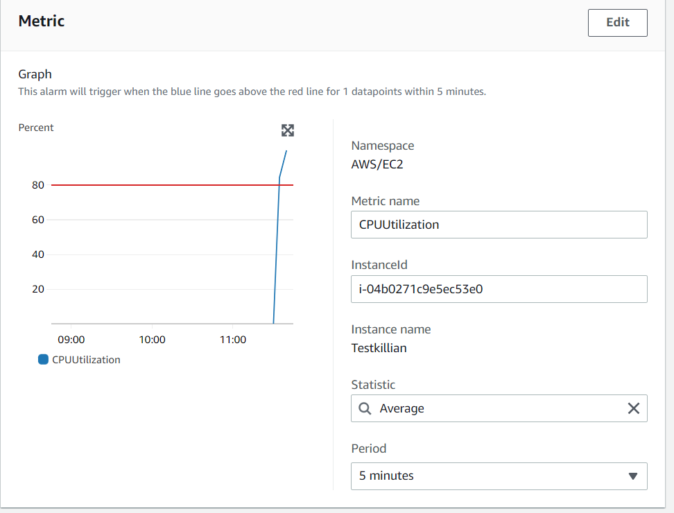
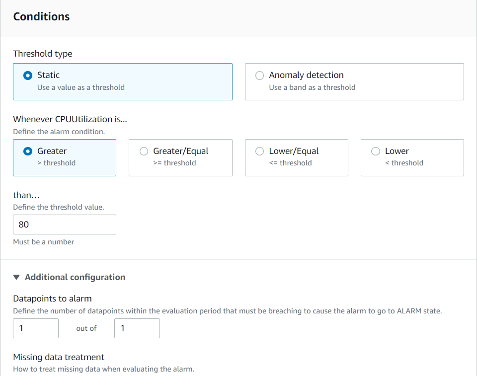
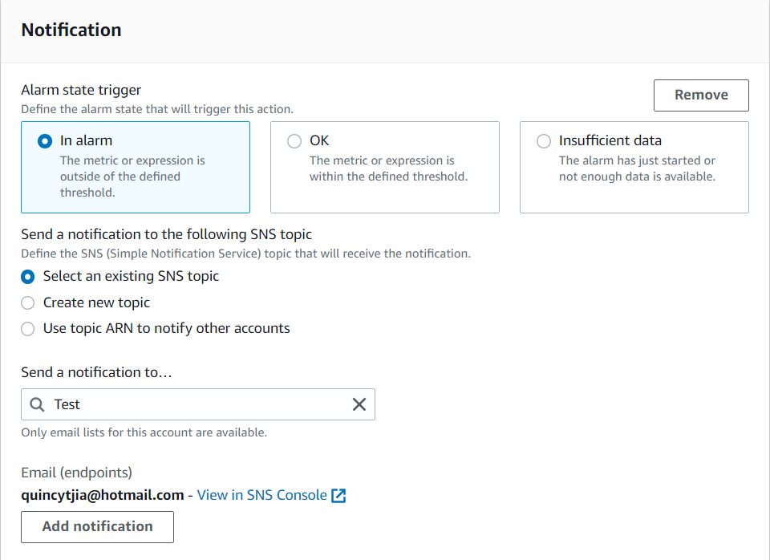
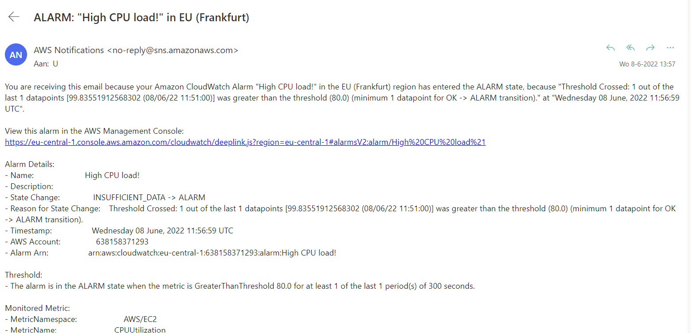
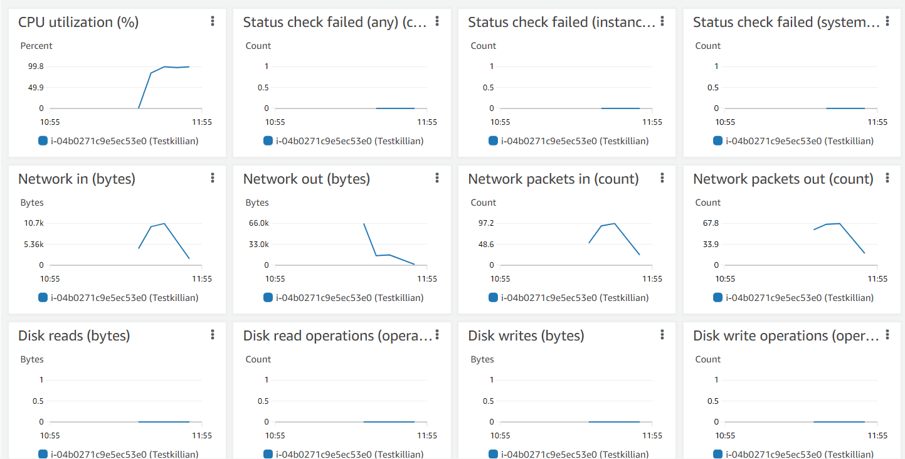

# AWS-14.3 AWS Cloudwatch
With this exercise I learned what Cloudwatch is and how you can use it. 

## Key terminology
- AWS Cloudwatch: Amazon CloudWatch monitors your Amazon Web Services (AWS) resources and the applications you run on AWS in real time. You can use CloudWatch to collect and track metrics, which are variables you can measure for your resources and applications. You can create alarms that watch metrics and send notifications or automatically make changes to the resources you are monitoring when a threshold is breached. For example, you can monitor the CPU usage and disk reads and writes of your Amazon EC2 instances and then use that data to determine whether you should launch additional instances to handle increased load. You can also use this data to stop under-used instances to save money.

## Exercise
Exercise

- Cloudwatch

### Sources
- https://docs.aws.amazon.com/AmazonCloudWatch/latest/monitoring/WhatIsCloudWatch.html
- https://aws.amazon.com/cloudwatch/
- https://www.youtube.com/watch?v=a4dhoTQCyRA
- https://www.youtube.com/watch?v=k7wuIrHU4UY
- https://www.youtube.com/watch?v=_xPihEu6p5Q

### Overcome challenges
None really, just had to search for things and I tried to work with it by myself by just trying things out on AWS.

### Results
 Cloudwatch practice

Before I can use Cloudwatch to monitor my services I had to make an EC2 instance (or other service) because I had not running anything.  

There are a lot of options you can do with Cloudwatch, like setting allarms etc. You can see the youtube link for all the options. You can set alarms on any of your metrics to receive notifacations when your metric crosses your specified thrrshold. You can also make a custom Dashboard on Cloudwatch to see all your chosen metrics. For this exercise I will look at my running EC2 instance and its metrics at the monitoring part of the instance. I will also set an alarm so see how it works. To actually see some data I did the load test to give the instance a high CPU Load. 

Here you can see the alarm I set for the EC2 instance with the load test. I set the condition at > 80%. If the CPU load will go above the 80% I will receive a alarm.

I will receive the alarm on my e-mail (SNS). You can also choose to immediately do an action with auto scaling etc., but for now I will only set an alarm.

As you can see I received the e-mail, so the alarm worked.

And lastly, here you can see the metrics for the instance with the load test. 

    

