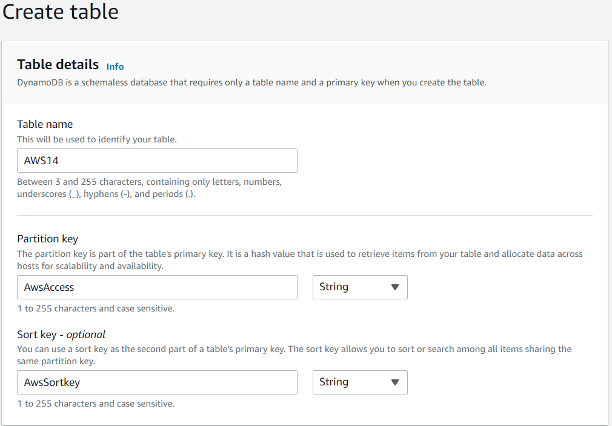
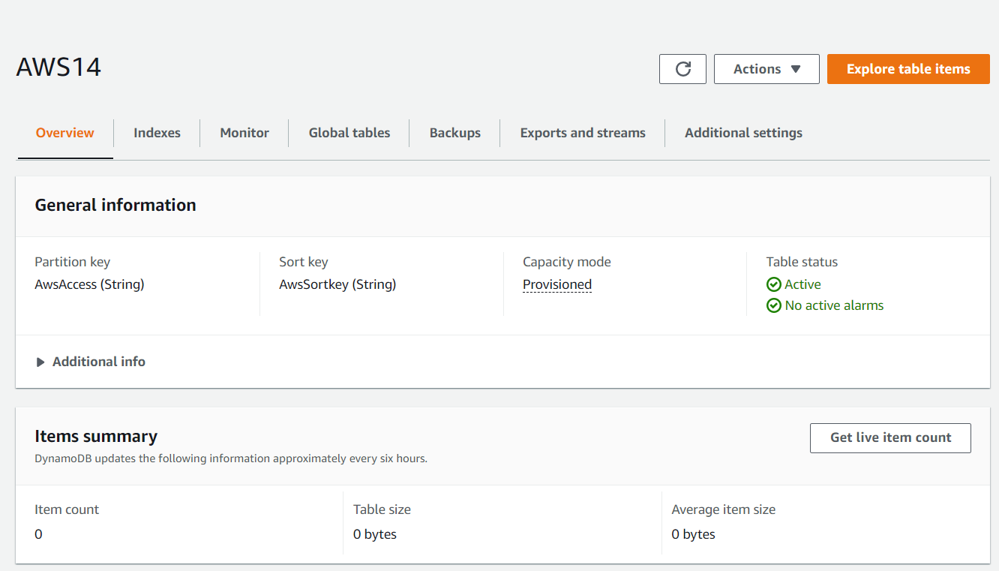
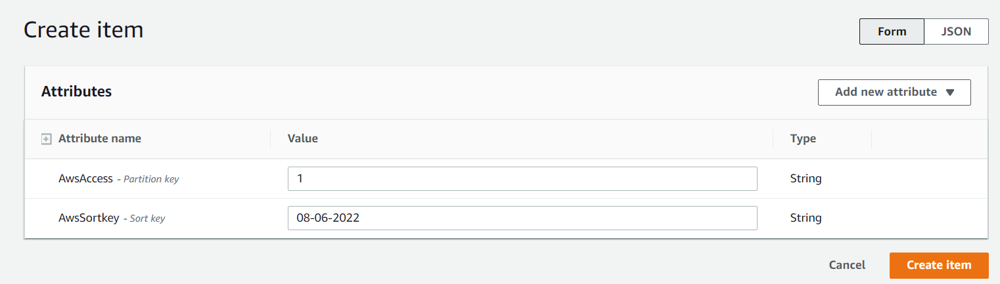
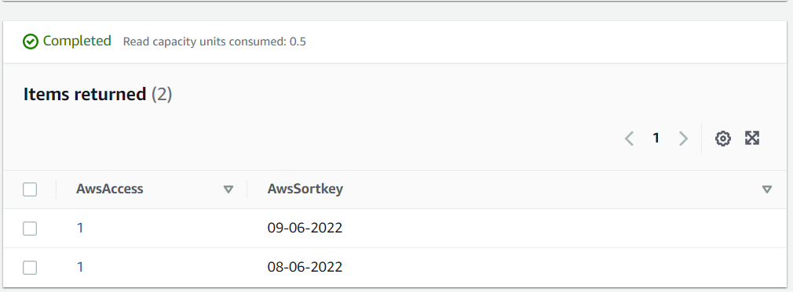
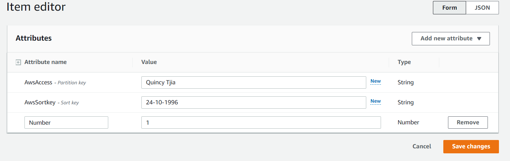
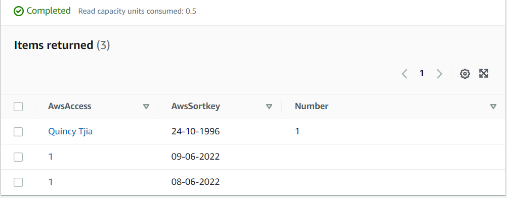

# AWS-14.4 DynamoDB
With this exercise I learned what DynamoDB is and how to create a DynamoDB database and how to add files to it.  

## Key terminology
- NoSQL: NoSQL databases (aka "not only SQL") are non-tabular databases and store data differently than relational tables. NoSQL databases come in a variety of types based on their data model. The main types are document, key-value, wide-column, and graph. They provide flexible schemas and scale easily with large amounts of data and high user loads. Over time, four major types of NoSQL databases emerged: document databases, key-value databases, wide-column stores, and graph databases.

    - Document databases store data in documents similar to JSON (JavaScript Object Notation) objects. Each document contains pairs of fields and values. The values can typically be a variety of types including things like strings, numbers, booleans, arrays, or objects.
    - Key-value databases are a simpler type of database where each item contains keys and values.
    - Wide-column stores store data in tables, rows, and dynamic columns.
    - Graph databases store data in nodes and edges. Nodes typically store information about people, places, and things, while edges store information about the relationships between the nodes.

- DynamoDB: Amazon DynamoDB is a fully managed NoSQL database service that provides fast and predictable performance with seamless scalability. DynamoDB lets you offload the administrative burdens of operating and scaling a distributed database so that you don't have to worry about hardware provisioning, setup and configuration, replication, software patching, or cluster scaling. DynamoDB also offers encryption at rest, which eliminates the operational burden and complexity involved in protecting sensitive data. With DynamoDB, you can create database tables that can store and retrieve any amount of data and serve any level of request traffic. You can scale up or scale down your tables' throughput capacity without downtime or performance degradation. You can use the AWS Management Console to monitor resource utilization and performance metrics. 

- DynamoDB vs Aurora: For the full difference see the link. The most important differences are: 

    - DynamoDB is a NoSQL databse while Aurora is a relational database. 
    - If we consider massive amounts of data, DynamoDB is the winner, supporting petabytes of data and seamlessly scales up or down. However, Aurora cluster volume can also grow up to 128 Terabytes, but it may take up to 15 minutes when changing its size.
    - Both DynamoDB and Aurora support encryption at rest using encryption keys stored in AWS KMS (Key Management Service). We can use AWS KMS to create, store, and manage their encryption keys.

## Exercise
Exercise

- DynamoDB

### Sources
- https://www.mongodb.com/nosql-explained
- https://docs.aws.amazon.com/amazondynamodb/latest/developerguide/Introduction.html
- https://www.youtube.com/watch?v=sI-zciHAh-4
- https://dynobase.dev/dynamodb-vs-aurora/#:~:text=Shared%20Attributes%20for%20DynamoDB%20and%20Aurora&text=And%2C%20the%20most%20significant%20difference,seamlessly%20scales%20up%20or%20down.
- https://www.youtube.com/watch?v=2k2GINpO308

### Overcome challenges
DynamoDB was a little harder to understand. I think I understand the basics of it and how to create a database on the dashboard and att items.

### Results
 DynamoDB practice

I created a table for practice and after that I will add a item to the database.

Here I named the table and named the partition key. The rest of the settings I remained on the default settings. 

I created an Item here.

Lastly I added some extra attributes to show that you can change the items.

    

