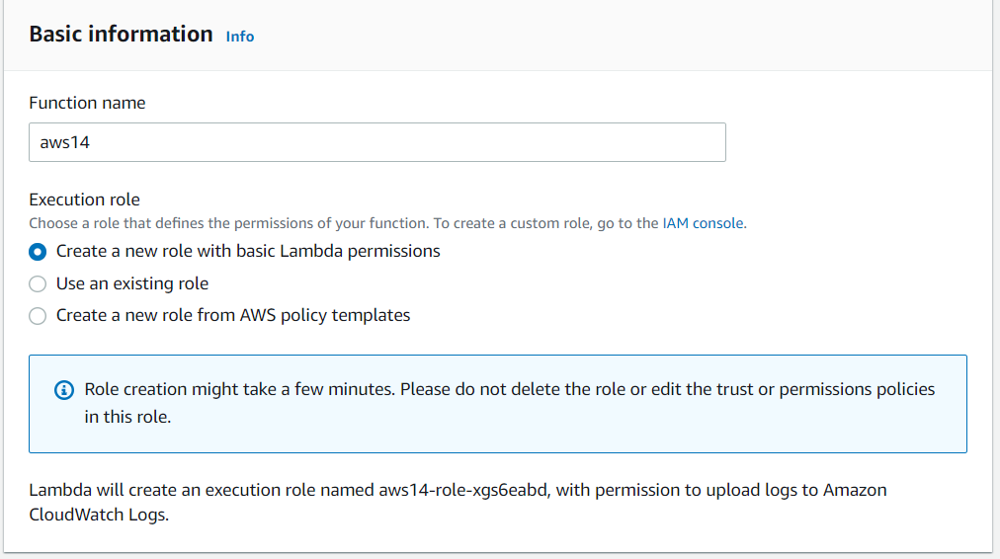
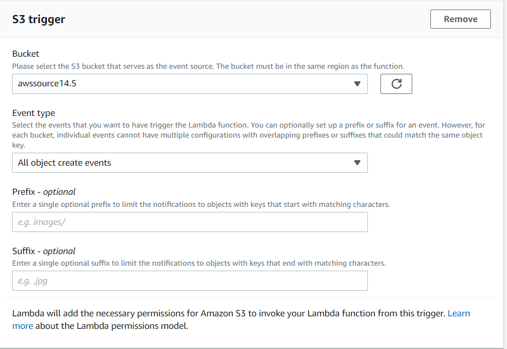
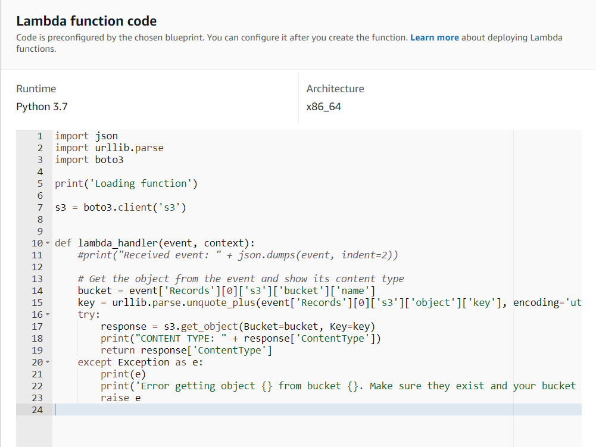
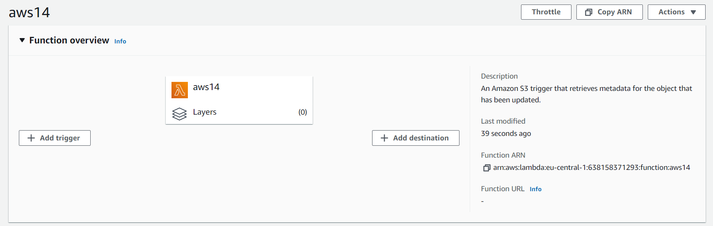
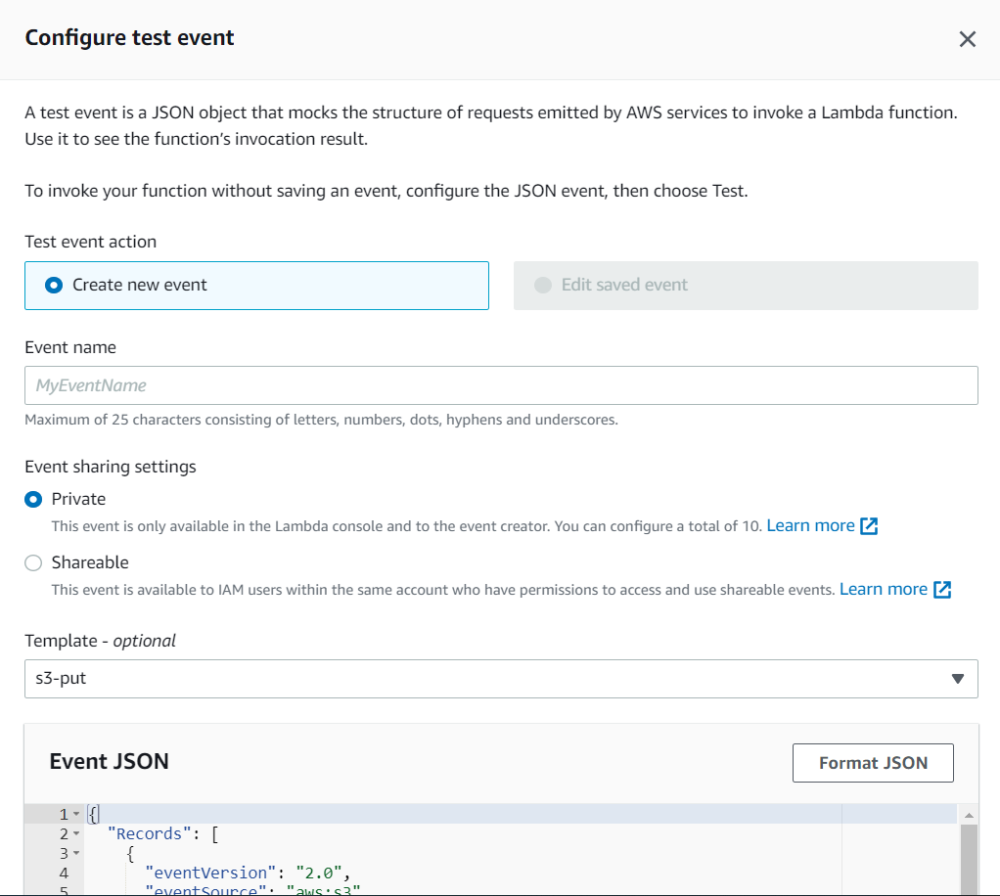
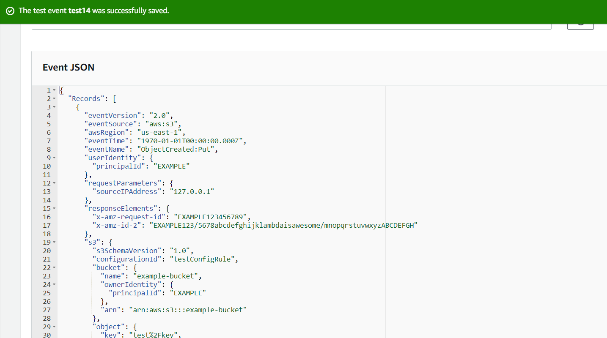

# AWS-14.5 AWS Lambda 
With this exercise I learned what AWS Lambda is and how it works.

## Key terminology
- AWS Lambda: Lambda is a compute service that lets you run code without provisioning or managing servers. Lambda runs your code on a high-availability compute infrastructure and performs all of the administration of the compute resources, including server and operating system maintenance, capacity provisioning and automatic scaling, code monitoring and logging. With Lambda, you can run code for virtually any type of application or backend service. All you need to do is supply your code in one of the languages that Lambda supports. You organize your code into Lambda functions. Lambda runs your function only when needed and scales automatically, from a few requests per day to thousands per second. You pay only for the compute time that you consume—there is no charge when your code is not running. When using Lambda, you are responsible only for your code. Lambda manages the compute fleet that offers a balance of memory, CPU, network, and other resources to run your code. If you need to manage your own compute resources, AWS has other compute services to meet your needs. For example: Amazon Elastic Compute Cloud (Amazon EC2) offers a wide range of EC2 instance types to choose from. It lets you customize operating systems, network and security settings, and the entire software stack. You are responsible for provisioning capacity, monitoring fleet health and performance, and using Availability Zones for fault tolerance and AWS Elastic Beanstalk enables you to deploy and scale applications onto Amazon EC2. You retain ownership and full control over the underlying EC2 instances.  

## Exercise
Exercise

- AWS Lambda

### Sources
- https://docs.aws.amazon.com/lambda/latest/dg/welcome.html
- https://www.youtube.com/watch?v=eOBq__h4OJ4
- https://www.youtube.com/watch?v=97q30JjEq9Y

### Overcome challenges
The theory was quite understandable but at first I didn't know what to do to practice it. Then I found out I was thinking to far ahead and just kept the practice simple.

### Results
Lambda practice

For this exercise I will keep it simple. I want to create a function and test if it works. There many things you can do with it, like connecting it to S3 for example. But for now I will only do this.  

I made a function using a blueprint which already excisted. I already made a S3 bucket, so I could choose that bucket as the event source. 

The python code, this was already given due to the blueprint I choose.

This is the overview of the function I created.

To see if the code worked, I created a test event.

The test event was successfull. 

