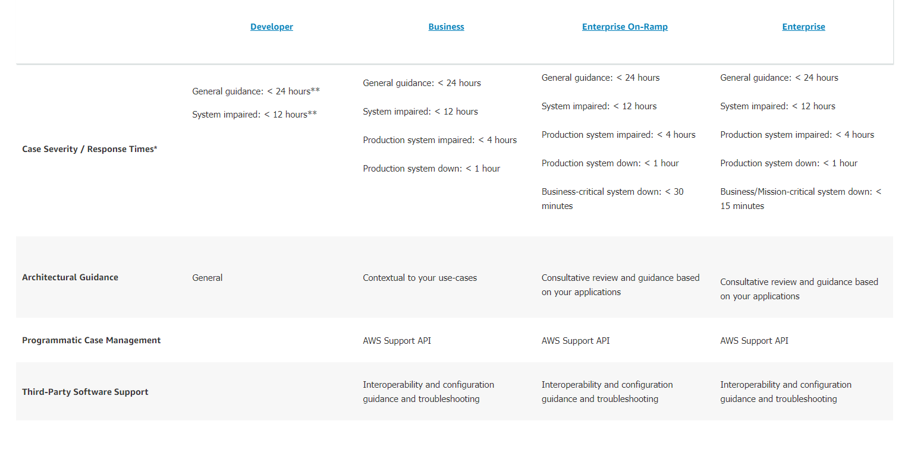
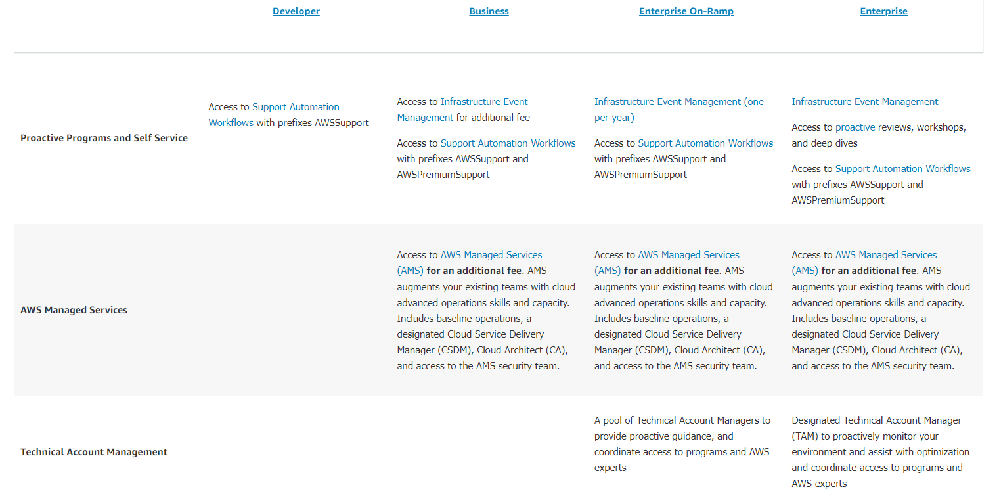
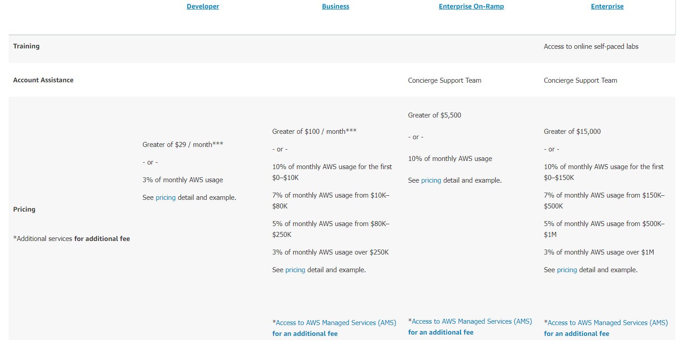

- OpsWork: AWS OpsWorks is a configuration management service that provides managed instances of Chef and Puppet. Chef and Puppet are automation platforms that allow you to use code to automate the configurations of your servers.

- AWS Glue: AWS Glue is a serverless data integration service that makes it easy to discover, prepare, and combine data for analytics, machine learning, and application development. AWS Glue provides all the capabilities needed for data integration so that you can start analyzing your data and putting it to use in minutes instead of months.

- VPN Cloudhub: You can securely communicate from one site to another using the AWS VPN CloudHub. The AWS VPN CloudHub operates on a simple hub-and-spoke model that you can use with or without a VPC. 

- Resource Group: You can use resource groups to organize your AWS resources. AWS Resource Groups is the service that lets you manage and automate tasks on large numbers of resources at one time. 

    In AWS, a resource is an entity that you can work with. Examples include an Amazon EC2 instance, an AWS CloudFormation stack, or an Amazon S3 bucket. If you work with multiple resources, you might find it useful to manage them as a group rather than move from one AWS service to another for each task. 

- Ingress and egress data: Ingress means entering the cloud and egress means exiting the cloud. 

- Reserverd instances pricing types: 

Standard RIs: These provide the most significant discount (up to 72% off On-Demand) and are best suited for steady-state usage.

Convertible RIs: These provide a discount (up to 54% off On-Demand) and the capability to change the attributes of the RI as long as the exchange results in the creation of Reserved Instances of equal or greater value. Like Standard RIs, Convertible RIs are best suited for steady-state usage.

Scheduled RIs: These are available to launch within the time windows you reserve. This option allows you to match your capacity reservation to a predictable recurring schedule that only requires a fraction of a day, a week, or a month. 

- TCO calculator: The TCO (total cost of ownership) calculator is a free tool provided by AWS that allows you to estimate the cost savings of using the AWS Cloud vs. using an on-premised data center. Use this calculator to compare the cost of your applications in an on-premises or traditional hosting environment to AWS. Describe your on-premises or hosting environment configuration to produce a detailed cost comparison with AWS.

- ITIL processes: The framework managed by AXELOS Limited defines an internationally recognized, best practice approach to IT Service Management (ITSM). Although it builds on ISO/IEC 20000 which “provides a formal and universal standard for organizations seeking to have their Service Management capabilities audited and certified,” (ITIL Service Operation, AXELOS, 2011, page 5) ITIL goes one step further to propose operational processes to achieve the standard. 

- ITSM tool: AWS Managed Services manages the daily operations of your AWS infrastructure in alignment with ITIL processes. AWS Managed Services provides a baseline integration with IT Service Management (ITSM) tools such as the ServiceNow platform.

- Support plans: 

- S3 Soorten: https://aws.amazon.com/s3/storage-classes/ 

- PCI DSS: The Payment Card Industry Data Security Standard (PCI DSS) is a proprietary information security standard administered by the PCI Security Standards Council, which was founded by American Express, Discover Financial Services, JCB International, MasterCard Worldwide and Visa Inc. PCI DSS applies to entities that store, process, or transmit cardholder data (CHD) or sensitive authentication data (SAD), including merchants, processors, acquirers, issuers, and service providers. The PCI DSS is mandated by the card brands and administered by the Payment Card Industry Security Standards Council. 

- HIPAA: AWS enables covered entities and their business associates subject to the U.S. Health Insurance Portability and Accountability Act of 1996 (HIPAA) to use the secure AWS environment to process, maintain, and store protected health information.

- SOC 1: AWS System and Organization Controls (SOC) Reports are independent third-party examination reports that demonstrate how AWS achieves key compliance controls and objectives. The purpose of these reports is to help you and your auditors understand the AWS controls established to support operations and compliance. There are five AWS SOC Reports: AWS SOC 1 Report, available to AWS customers from AWS Artifact. 

- ISO 27001: ISO/IEC 27001:2013 is a security management standard that specifies security management best practices and comprehensive security controls following the ISO/IEC 27002 best practice guidance. The basis of this certification is the development and implementation of a rigorous security program, which includes the development and implementation of an Information Security Management System (ISMS) which defines how AWS perpetually manages security in a holistic, comprehensive manner. 

