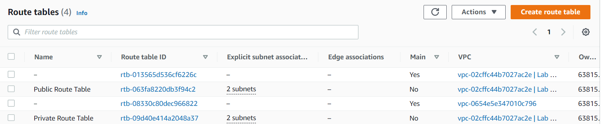

# AWS-10 Virtual Private Cloud (VPC)
With his exercise I learned how to make a VPC and I learned what Elastic IP's are. I also learned how to make subnets and security groups within the VPC. 

## Key terminology
- VPC: Amazon Virtual Private Cloud (Amazon VPC) enables you to launch AWS resources into a virtual network that you've defined. This virtual network closely resembles a traditional network that you'd operate in your own data center, with the benefits of using the scalable infrastructure of AWS. Amazon VPC is typically described as a virtual private data center in the cloud. It is a virtual network that is logically isolated from other VPCs. With a VPC you have full control over the design of the network. You can create subnets, internet gateways (igw), NAT gateways, VPN connections, and more.

- CIDR block: CIDR is an acronym that stands for Classless Inter-Domain Routing. In simpler terms, a CIDR block is an IP address range. A VPC can accommodate two CIDR blocks, one for IPv4 and another for IPv6. 

- Elastic Ip's: An Elastic IP address is a static public IPv4 address associated with your AWS account in a specific Region. Unlike an auto-assigned public IP address, an Elastic IP address is preserved after you stop and start your instance in a virtual private cloud (VPC).

- Route Table: A route table contains a set of rules, called routes, that are used to determine where network traffic from your subnet or gateway is directed. 

## Exercise
Exercise 1

- Allocate an Elastic IP address to your account.
- Use the Launch VPC Wizard option to create a new VPC with the following requirements:

    - Region: Frankfurt (eu-central-1)
    - VPC with a public and a private subnet
    - Name: Lab VPC
    - CIDR: 10.0.0.0/16

- Requirements for the public subnet:
    - Name: Public subnet 1
    - CIDR: 10.0.0.0/24
    - AZ: eu-central-1a

- Requirements for the private subnet:
    - Name: Private subnet 1
    - CIDR: 10.0.1.0/24
    - AZ: eu-central-1a
    
Your network should now look like this:

Exercise 2

- Create an additional public subnet without using the wizard with the following requirements:
    - VPC: Lab VPC
    - Name: Public Subnet 2
    - AZ: eu-central-1b
    - CIDR: 10.0.2.0/24

- Create an additional private subnet without using the wizard with the following requirements:
    - VPC: Lab VPC
    - Name: Private Subnet 2
    - AZ: eu-central-1b
    - CIDR: 10.0.3.0/24

- View the main route table for Lab VPC. It should have an entry for the NAT gateway. Rename this route table to Private Route Table.
- Explicitly associate the private route table with your two private subnets.
- View the other route table for Lab VPC. It should have an entry for the internet gateway. Rename this route table to Public Route Table.
- Explicitly associate the public route table to your two public subnets.
  
Exercise 3

- Create a Security Group with the following requirements:
    - Name: Web SG
    - Description: Enable HTTP Access
    - VPC: Lab VPC
    - Inbound rule: allow HTTP access from anywhere
    - Outbound rule: Allow all traffic

Exercise 4

- Launch an EC2 instance with the following requirements:
    - AMI: Amazon Linux 2
    - Type: t3.micro
    - Subnet: Public subnet 2
    - Auto-assign Public IP: Enable
    -User data:
    #!/bin/bash
    #Install Apache Web Server and PHP

    yum install -y httpd mysql php

    #Download Lab files

    wget 

    https://aws-tc-largeobjects.s3.amazonaws.com/CUR-TF-100-RESTRT-1/80-lab-vpc-web-server/lab-app.zip

    unzip lab-app.zip -d /var/www/html/

    #Turn on web server

    chkconfig httpd on

    service httpd start

    - Tag:
    - Key: Name
    - Value: Web server
    - Security Group: Web SG
    - Key pair: no key pair
    - Connect to your server using the public IPv4 DNS name.

### Sources
- https://www.cloudflare.com/learning/cloud/what-is-a-virtual-private-cloud/
- https://docs.aws.amazon.com/vpc/latest/userguide/configure-your-vpc.html
- https://virtualizationreview.com/articles/2021/03/26/aws-subnetting.aspx#:~:text=CIDR%20is%20an%20acronym%20that,limit%20my%20discussion%20to%20IPv4.
- https://aws.amazon.com/premiumsupport/knowledge-center/ec2-associate-static-public-ip/#:~:text=An%20Elastic%20IP%20address%20is,virtual%20private%20cloud%20(VPC).
- https://docs.aws.amazon.com/AWSEC2/latest/UserGuide/elastic-ip-addresses-eip.html
- https://docs.aws.amazon.com/vpc/latest/userguide/working-with-vpcs.html#Create-VPC
- https://docs.aws.amazon.com/vpc/latest/userguide/VPC_Route_Tables.html   

### Overcome challenges
- I first had to search for the different key terminology.
- After that I had to find out how to generate a Elastic IP.
- After that I had to find out how to make a new VPC.
- After that I had to find out how you can associate a route table to subnets
- After that I everything went smooth untill the last part, at that point I had to ask my teammates how to open the webserver.

### Results
Exercise 1

- Allocate an Elastic IP address to your account.

- Use the Launch VPC Wizard option to create a new VPC with the following requirements:

    - Region: Frankfurt (eu-central-1)
    - VPC with a public and a private subnet
    - Name: Lab VPC
    - CIDR: 10.0.0.0/16

- Requirements for the public subnet:
    - Name: Public subnet 1
    - CIDR: 10.0.0.0/24
    - AZ: eu-central-1a

- Requirements for the private subnet:
    - Name: Private subnet 1
    - CIDR: 10.0.1.0/24
    - AZ: eu-central-1a
    
Your network should now look like this:

Exercise 2

- Create an additional public subnet without using the wizard with the following requirements:
    - VPC: Lab VPC
    - Name: Public Subnet 2
    - AZ: eu-central-1b
    - CIDR: 10.0.2.0/24

    

- Create an additional private subnet without using the wizard with the following requirements:
    - VPC: Lab VPC
    - Name: Private Subnet 2
    - AZ: eu-central-1b
    - CIDR: 10.0.3.0/24

- View the main route table for Lab VPC. It should have an entry for the NAT gateway. Rename this route table to Private Route Table.
- Explicitly associate the private route table with your two private subnets.
- View the other route table for Lab VPC. It should have an entry for the internet gateway. Rename this route table to Public Route Table.
- Explicitly associate the public route table to your two public subnets.

Exercise 3

- Create a Security Group with the following requirements:
    - Name: Web SG
    - Description: Enable HTTP Access
    - VPC: Lab VPC
    - Inbound rule: allow HTTP access from anywhere
    - Outbound rule: Allow all traffic

- Inbound Rule

    

- Outbound Rule

 

 Exercise 4

- Launch an EC2 instance with the following requirements:
    - AMI: Amazon Linux 2
    - Type: t3.micro
    - Subnet: Public subnet 2
    - Auto-assign Public IP: Enable
    - User data:
    - Tag:
    - Key: Name
    - Value: Web server
    - Security Group: Web SG
    - Key pair: no key pair
    - Connect to your server using the public IPv4 DNS name.

     

    

