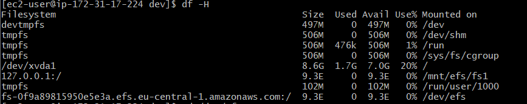

# AWS-13 Elastic Beanstalk, CLoudFront, Route53, EFS, Aurora

## Key terminology
- AWS Elastic Beanstalk: AWS Elastic Beanstalk is an easy-to-use service for deploying and scaling web applications and services developed with Java, .NET, PHP, Node.js, Python, Ruby, Go, and Docker on familiar servers such as Apache, Nginx, Passenger, and IIS. You can simply upload your code and Elastic Beanstalk automatically handles the deployment, from capacity provisioning, load balancing, auto-scaling to application health monitoring. At the same time, you retain full control over the AWS resources powering your application and can access the underlying resources at any time. There is no additional charge for Elastic Beanstalk - you pay only for the AWS resources needed to store and run your applications.

- Amazon CloudFront: Amazon CloudFront is a web service that speeds up distribution of your static and dynamic web content, such as .html, .css, .js, and image files, to your users. CloudFront delivers your content through a worldwide network of data centers called edge locations. When a user requests content that you're serving with CloudFront, the request is routed to the edge location that provides the lowest latency (time delay), so that content is delivered with the best possible performance. If the content is already in the edge location with the lowest latency, CloudFront delivers it immediately. If the content is not in that edge location, CloudFront retrieves it from an origin that you've defined—such as an Amazon S3 bucket, a MediaPackage channel, or an HTTP server (for example, a web server) that you have identified as the source for the definitive version of your content. You also get increased reliability and availability because copies of your files (also known as objects) are now held (or cached) in multiple edge locations around the world. 

- Content Delivery Network (CDN): A content delivery network (CDN) refers to a geographically distributed group of servers which work together to provide fast delivery of Internet content. A CDN allows for the quick transfer of assets needed for loading Internet content including HTML pages, javascript files, stylesheets, images, and videos. The popularity of CDN services continues to grow, and today the majority of web traffic is served through CDNs, including traffic from major sites like Facebook, Netflix, and Amazon. 

- Route53: Amazon Route 53 is a highly available and scalable cloud Domain Name System (DNS) web service. It is designed to give developers and businesses an extremely reliable and cost effective way to route end users to Internet applications by translating names like www.example.com into the numeric IP addresses like 192.0.2.1 that computers use to connect to each other. Amazon Route 53 is fully compliant with IPv6 as well. Amazon Route 53 effectively connects user requests to infrastructure running in AWS – such as Amazon EC2 instances, Elastic Load Balancing load balancers, or Amazon S3 buckets – and can also be used to route users to infrastructure outside of AWS. You can use Amazon Route 53 to configure DNS health checks, then continuously monitor your applications’ ability to recover from failures and control application recovery with Route 53 Application Recovery Controller. 

- Domain Name System (DNS): The Domain Name System (DNS) is the phonebook of the Internet. Humans access information online through domain names, like nytimes.com or espn.com. Web browsers interact through Internet Protocol (IP) addresses. DNS translates domain names to IP addresses so browsers can load Internet resources. Each device connected to the Internet has a unique IP address which other machines use to find the device. DNS servers eliminate the need for humans to memorize IP addresses such as 192.168.1.1 (in IPv4), or more complex newer alphanumeric IP addresses such as 2400:cb00:2048:1::c629:d7a2 (in IPv6).

- Amazon Elastic File System (EFS): Amazon Elastic File System (Amazon EFS) provides a simple, serverless, set-and-forget elastic file system for use with AWS Cloud services and on-premises resources. It is built to scale on demand to petabytes without disrupting applications, growing and shrinking automatically as you add and remove files, eliminating the need to provision and manage capacity to accommodate growth. Amazon EFS has a simple web services interface that allows you to create and configure file systems quickly and easily. The service manages all the file storage infrastructure for you, meaning that you can avoid the complexity of deploying, patching, and maintaining complex file system configurations. Its different from S3 and EBS. S3 is object file storage and EFS is a file storage. With object storages you store stuff and retrieve them when you need it. EFS is more for OS or apps that require high I/O. You can create an EFS and mount it to the EC2 intances and then you have a kind of hard disk that is connected to multiple EC2 instances. You only pay for the storage you use.   

- Network File System (NFSv4) protocol: NFS, or Network File System, was designed in 1984 by Sun Microsystems. This distributed file system protocol allows a user on a client computer to access files over a network in the same way they would access a local storage file. Because it is an open standard, anyone can implement the protocol. NFS started in-system as an experiment but the second version was publicly released after the initial success. To access data stored on another machine (i.e. a server) the server would implement NFS daemon processes to make data available to clients. The server administrator determines what to make available and ensures it can recognize validated clients. From the client's side, the machine requests access to exported data, typically by issuing a mount command. If successful, the client machine can then view and interact with the file systems within the decided parameters. 

## Exercise
Study

- Elastic Beanstalk
- CloudFront
- Route53

Practice

- EFS
- RDS, Aurora 

### Sources
- https://aws.amazon.com/elasticbeanstalk/
- https://youtu.be/uiM1xzOX8Qg
- https://docs.aws.amazon.com/elasticbeanstalk/latest/dg/Welcome.html
- https://docs.aws.amazon.com/AmazonCloudFront/latest/DeveloperGuide/Introduction.html
- https://aws.amazon.com/cloudfront/
- https://www.youtube.com/watch?v=AT-nHW3_SVI
- https://www.cloudflare.com/learning/cdn/what-is-a-cdn/
- https://www.cloudflare.com/learning/dns/what-is-dns/
- https://aws.amazon.com/route53/
- https://youtu.be/RGWgfhZByAI
- https://docs.aws.amazon.com/Route53/latest/DeveloperGuide/Welcome.html
- https://docs.aws.amazon.com/efs/latest/ug/whatisefs.html
- https://aws.amazon.com/efs/features/
- https://www.youtube.com/watch?v=6ZIPBC78U0s
- https://www.extrahop.com/resources/protocols/nfs/#:~:text=Network%20File%20System%20(NFS)%20Protocol,-What%20is%20NFS&text=NFS%2C%20or%20Network%20File%20System,access%20a%20local%20storage%20file.
- https://www.youtube.com/watch?v=vAV4ASDnbN0 
- https://docs.aws.amazon.com/efs/latest/ug/gs-step-two-create-efs-resources.html
- https://docs.amazonaws.cn/en_us/AWSEC2/latest/UserGuide/AmazonEFS.html
- 

### Overcome challenges
- I first hard to study the Elastic Beanstalk service
- Then I had to study what CloudFront is and how it works.
- After that I had to study what Route53 is and how it works.
- After that I needed to study what EFS is and do some practice with it. 
- I couldn't log in to my instance, turned out I needed to remove and add the inbound rule (SSH)
- 

### Results
EFS:

I first made a security group with the rules: Allow inbound SSH and Allow inbound NFS connections (source is the security group itself).

After that I made a EFS file system.

After that I made two EC2 instances. During the configuration for the instance I already mounted the EFS to the instances during a boot up:

You can see here that it is mounted. 

Added a text file on instance 1:

    

