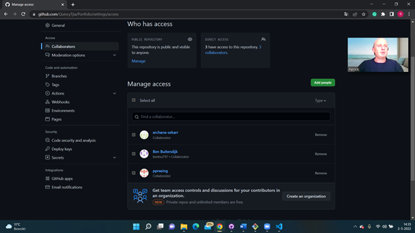
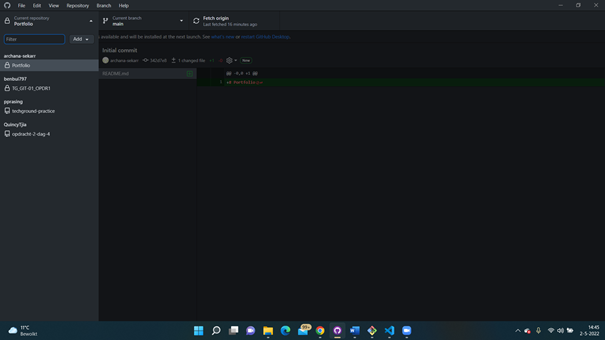

# GIT 01 – Git en GitHub
Today I have learned what is Git and GitHub and how it differs from eachother. I have also learned how to work with GitHub Desktop.
Git is a free open-source distributed control system. This means that the entire codebase and history is available on every computer used by a developer.

GitHub is a cloud-based Git repository hosting service. It makes it a lot easier for people and teams to use it instead of Git beacause you can use a GUI.

## Key terminology
-	Repository: This is used to organize a project. It can contain       folders, files etc. 
-	Main / Master: This is the definitive branch of your repository. You can use different versions of the project via branches. You can use branches to experiment before making them definitive. 
-	Commit: These are saved changes to files in your repository. 
-	Push / Pull: With the push button, you upload the new changes to the files to GitHub. With pull you can propose your changes and request someone to look at it.
-	Merge: With merge, you can can branch the different branches into the main branch.
-   Fork: A fork is a copy of a repository that you manage.

## Exercise
### Sources
- https://www.youtube.com/watch?v=hwP7WQkmECE 
- https://git-scm.com/book/nl/v2/Aan-de-slag-Over-versiebeheer 
- https://docs.github.com/en/repositories/-creating-and-managing-repositories/about-repositories 
- https://docs.github.com/en/get-started/quickstart/hello-world 
- https://docs.github.com/en/repositories/managing-your-repositorys-settings-and-features/managing-repository-settings/managing-teams-and-people-with-access-to-your-repository 
- https://www.w3schools.com/git/git_getstarted.asp?remote=github 
- https://docs.github.com/en/pull-requests/collaborating-with-pull-requests/working-with-forks/about-forks#:~:text=A%20fork%20is%20a%20copy,original%20repository%20with%20pull%20requests

### Overcome challanges
- At the beginning it was a bit overwhelming. But after the Q&A everything made a lot more sense. I had to search for a lot of terminology, but eventually I found a very helpfull website with a lot of questons answered. 

### Results
All of my teammates have permission to my depository on GitHub. I also have copied the depositories of my teammates on GitHub Desktop. 

