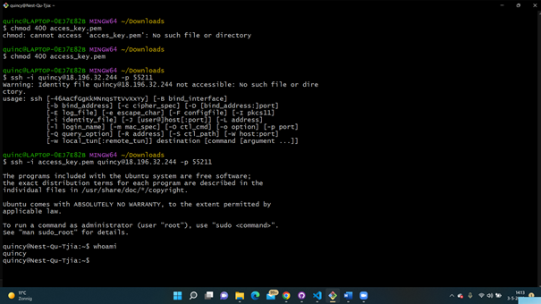

# LNX-02 Files and Directories
Today I have learned how to make a SSH connection to my machine. You need a key to log in, this was generated by AWS. After I logged in I had to type in whoami to see if I was logged in.

## Key terminology
- SSH: SSH is a network communication protocol that enables two computers to communicate and share data. It is often used to login and perform operations on remote computers. 
- PEM file: A PEM file is a container file used to store cryptographic keys. It can be used to represent all types of data but is often used to encode keyfiles ues for SSH.

## Exercise
### Sources
- https://docs.microsoft.com/en-us/windows-server/administration/openssh/openssh_install_firstuse
- https://docs.microsoft.com/en-us/windows-server/administration/openssh/openssh_keymanagement
- https://www.howtogeek.com/devops/what-is-a-pem-file-and-how-do-you-use-it/
- https://www.ucl.ac.uk/isd/what-ssh-and-how-do-i-use-it#:~:text=SSH%20or%20Secure%20Shell%20is,web%20pages)%20and%20share%20data.

### Overcome challanges
- I was stuck for quite a while because I couldn't login. After a while we found out that we couldn't login because we didn't had access to the right ports. 

### Results
I have logged in and I am ready to work on the VM.

