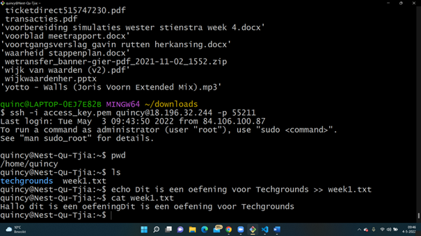
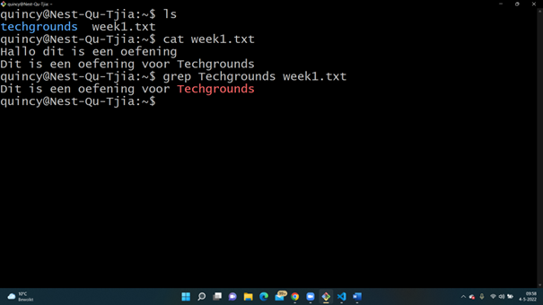
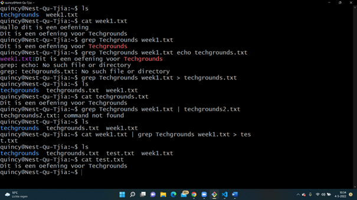

# LNX-03 Working with text (CLI)
With this excercise I learned how to add new text to a text file using the echo command. I also learned how to filter the output of a input and to redirect the output to a new file.    

## Key terminology
- Input: In Linux this means the keyboard, this is the standard input.
- Output: The input gives an output. The standard output in Linux is the screen.
- Pipe (|): A pipe is used to combine two or more commands. 
- Redirection: With redirection you can change the output/input. You transfer the standard output to another destination. 
- Echo command: You can use this command to move data in a file. 
- grep command: This command lets you search trough all the text in a file.

## Exercise
### Sources
- https://www.w3cschoool.com/linux-tutorial
- https://www.hostinger.com/tutorials/linux-commands 
- https://www.tutorialspoint.com/unix/index.htm
- https://www.guru99.com/linux-redirection.html
- https://www.geeksforgeeks.org/piping-in-unix-or-linux/#:~:text=A%20pipe%20is%20a%20form,program%2Fprocess%20for%20further%20processing. 

### Overcome challenges
- At first I had to look up the echo command, what is means. After that I had to found out to filter the output. 
- I had to found out what excactly a pipe means.
### Results
- I used the echo command to write something new in a existing text file.
- I used the grep command to filter the output
- I made a new file with text using a pipe and using a different solution I found.

