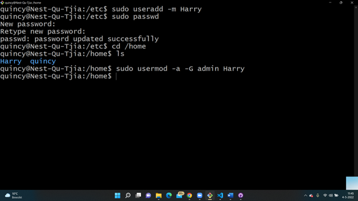
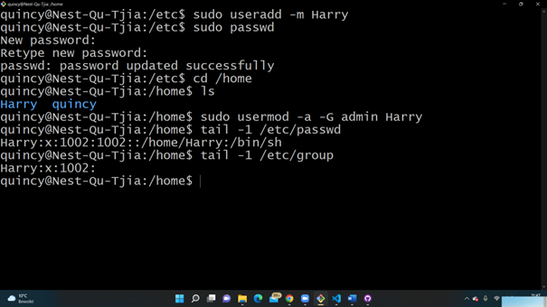
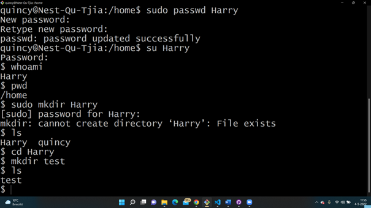

# LNX-04 Users and Groups
With this excercise I learned how to add users to a specific group and how to give the new user a password. I also learned how to change the permissions for a new user. And at last I learned the files are located to see the users and groups.    

## Key terminology
- Root user: User account which has permissions to everything. 
- sudo command: "Superuser do", with this command you can perform tasks that reguire root permissions.
- admin: 
- useradd -m: Add a new user (and map)
- sudo passwd user1: Create a password for a user
- usermod (-a -G group user): user modify, modifies the properties of a user (and change group here)
- /etc/passwd: See list of users and where the files are stored.
- su user: login with user

## Exercise
### Sources
- https://www.w3cschoool.com/linux-create-user
- https://linuxize.com/post/how-to-list-users-in-linux/
- https://www.ssh.com/academy/iam/user/root#:~:text=Root%20is%20the%20superuser%20account,account%2C%20regardless%20of%20the%20name.
- https://www.youtube.com/watch?v=7d_4b7uZTtk&t=562s 

### Overcome challenges
- It took quite a while to work on this excercise. I had some trouble with finding the right solution, but after watching a video and with help from my collegues I managed to work it out. 
### Results
- I used the sudo useradd command to add a new user.
- I used the sudo passwd command change the password for the user.
- I used the usermod command to place the user in a group. 
- I used the etc/passwd/ command to find the list with users.

