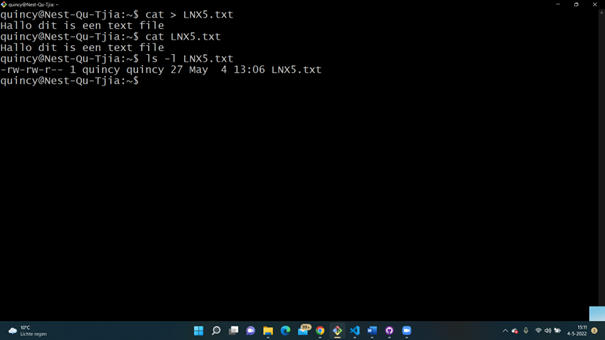
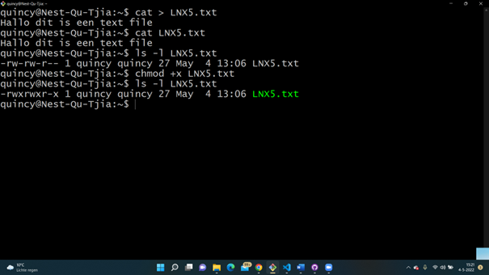
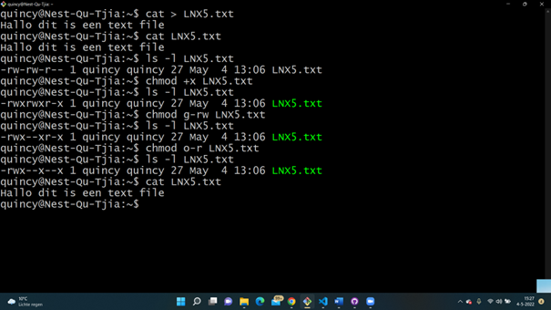
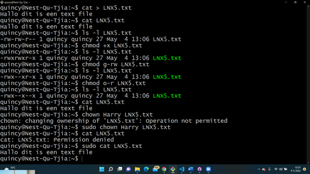
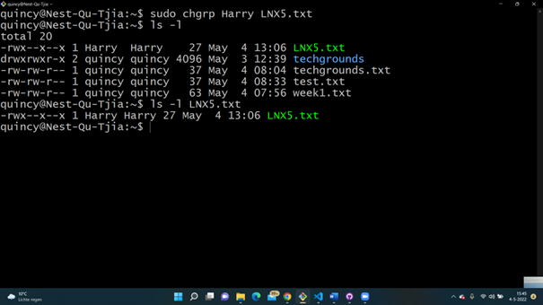

# LNX-05 File permissions
With this excercise I learned how to give and remove certain permissions for users for specific files.     

## Key terminology
- Long listing: ls -l, with this command you can see information about a certain file or users. You can see the permissions of the file, owner, group, size, date and time.  
- r: Permission to read the file
- w: Permission to write the file
- x: Permission to execute the file.
- chmod (change mode): With this command you can change te permissions for a user for a file. 
- chmod g-rw: With this command you can remove the r an w permissions for the group for a file.
- chmod o-rw: With this command you can remove the permissions r and w for others for a file.

## Exercise
### Sources
- https://linuxize.com/post/how-to-list-files-in-linux-using-the-ls-command/#:~:text=commonly%20used%20options.-,Long%20Listing%20Format,The%20file%20type.
- https://www.pluralsight.com/blog/it-ops/linux-file-permissions
- https://docs.oracle.com/cd/E19683-01/816-4883/6mb2joat3/index.html 

### Overcome challenges
- I had to search which commands to use to change permissions. 
- I had to search what the different permissions mean.
- I had to search what long listing means. 

### Results
- I created a text file with cat >
- I used the ls -l command to long listing the text file. The owner is quincy and also the group is quincy. The owner (quincy) has the r (read) and w (write) permissions.
- I used the chmod +x command to add execute permissions.
- I used the chmod g-rw and chmod o-r command to remove permissions for read and writing permissions the group and others. Then I checked if I could still read it.
- I changed the owner of the file to Harry with the sudo chown Harry LNX5.txt. after that I tried to read the file and the permission was denied. With sudo it succeeded.
- I changed the group ownership of the file for the group with the sudo chgrp command. After that I used ls -l command to show it changed. 

