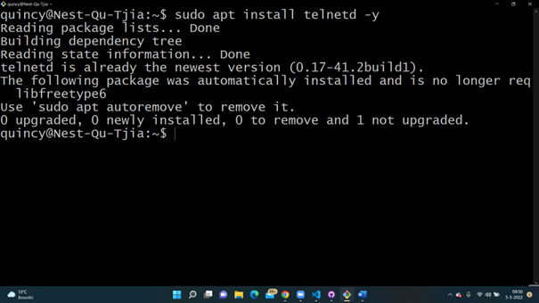
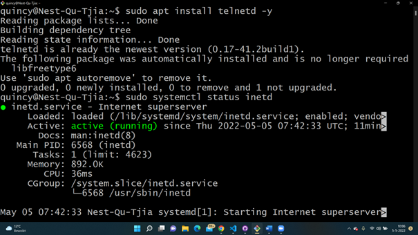
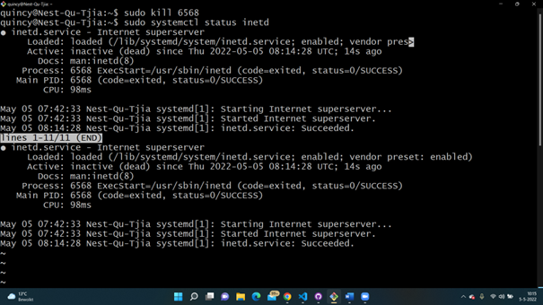
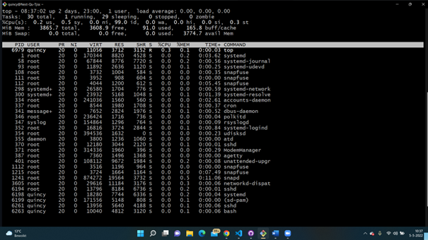

# LNX-06 Processes 
With this excercise I learned what kind of processes there are within Linux. I learned how to install and start a daemon and how to close is.    

## Key terminology
- Daemons proces: This is a service process that runs in the background. It provides functionality to other processes.
- Services proces: A service responds to a request from a program.
- Programs proces: This is run by a user.
- Telnet: Telnet is a networkprotocol to login on another machine. 
- PID: Process ID
- sudo apt install telnetd -y command: this installs the telnet service (daemon)
- sudo systemctl status inetd command: You can check the status of the process.
- kill (PIP): this stops the process
- top: Check memory usage for all processes

## Exercise
### Sources
- https://man7.org/linux/man-pages/man7/daemon.7.html#:~:text=A%20daemon%20is%20a%20service,scheme%20originating%20in%20SysV%20Unix.
- https://www.cyberciti.biz/faq/how-do-i-turn-on-telnet-service-on-for-a-linuxfreebsd-system/
- https://stackoverflow.com/questions/28139377/daemon-and-service-difference
- https://www.howtoforge.com/how-to-install-and-use-telnet-on-ubuntu/

### Overcome challenges
- I had to find out what a deamon service is excactly. After that I had to find out how to install the telnet service and how to run it.
- I didn't know how to stop the process but with help from my collegues and the peer coach I found the answer.

### Results
- I installed the Telnet server with the sudo apt install telnetd -y command.
- After I had installed it, I checked the status using the sudo systemctl status inetd command.
- The PID of the Telnet Deamon is 6568.
- The amount of memory telnet is using is 892.0K
- After i looked this information up I stopped the telnet process using the sudo kill 6568 commmand.
- Used top to see if the process was stopped. You do not see the PIP number anymore, so it has stopped.

 
