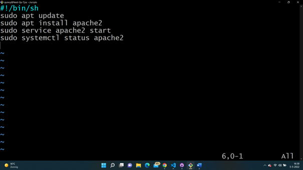

# LNX-07 bash scripting 
With this excercise I learned what a bash script is and how to use scripts. I also learned what variables are and how to make and use them. And at the end I learned what conditions are and how to use them.

## Key terminology
- Shell script: This is a computer program designed to run by the Linux shell. This is a command-line interpreter.
- Bash script: A series of commands written in a text file. By executing the script you can execute multiple commands in a row.
- Variables: A value that can change, depending on conditions or on information passed to the program.
- conditions: Something you can use to only run parts of your script if a certain condition is met. 
- PATH variable: This is a variable that contains an ordered list of paths. Linux will search for executables in this list when you run a command. You dont need to specify a absolute path when you run this command. 
- HINT: End your script names with '.sh'
- export NAME=VALUE command: add new variable to the list (environment)
- echo $NAME command: shows variables wich are on the terminal
- close vi: exit, then :wq to save the changes
- '=': assigning a variable.
- $NAME: reading the variable
- echo $[ $RANDOM % 10 + 1]: This command generates a random number between 1 and 10.
- if/elif/else conditions: With this type of conditions you can choose to only run parts of your script if a certain condition is met.   
 
## Exercise
### Sources
- https://www.tutorialspoint.com/unix/shell_scripting.htm
- https://www.techtarget.com/whatis/definition/variable#:~:text=In%20programming%2C%20a%20variable%20is,uses%20when%20it%20is%20running.
-https://www.baeldung.com/linux/path-variable#:~:text=The%20PATH%20variable%20is%20an,path%20when%20running%20a%20command. 
- https://www.youtube.com/watch?v=pjh9rU9h22Q 
- https://www.theserverside.com/blog/Coffee-Talk-Java-News-Stories-and-Opinions/run-Unix-shell-script-Linux-Ubuntu-command-chmod-777-permission-steps#:~:text=Step%2Dby%2Dstep%20shell%20script%20execution&text=Create%20a%20file%20in%20your,name%20in%20the%20Terminal%20window 
- https://linuxhint.com/bash_append_line_to_file/#:~:text=Using%20  
- https://www.guru99.com/introduction-to-shell-scripting.html 
- https://www.codegrepper.com/code-examples/shell/install+apache2+in+ubuntu 
- https://ryanstutorials.net/bash-scripting-tutorial/bash-if-statements.php#if 

### Overcome challenges
- I had to find out what excactly a PATH variable is and how to use it. 
- I had to find out how to make a bash script.
- I used the wrong command to make a .sh file, you should do it with vi editor.
- I didn't know how to close the vi editor.
- I didn't know what the commands where to install and open apache.
- I had to find out how to generate a random number between 1 and 10.
- I had to find out how to attach a value to a variable and struggled with that, it turned out I used the wrong order of the command.
- I Had to search how a if statement works an after that is struggled a bit with the syntax and how to use them. With some help from my teammates I quicky figured out what I did wrong.

### Results
- I used the export PATH=$PATH:/home/quincy/scripts command to add the new directory variable to the list. After that I used the echo $PATH command to see the list.
- I used the vi editor to make a bash script using the vi command. After that I used the bash test.sh command to see if it worked.
- I used the vi editor to make a bash script file using the vi command.
- I the vi editor to make a bash script.

 

 

 