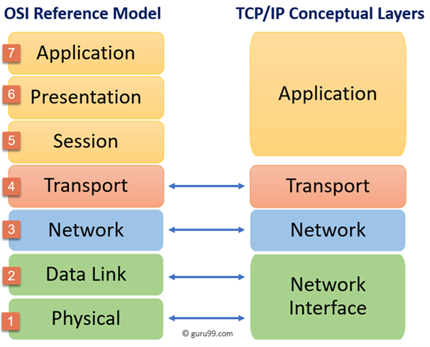
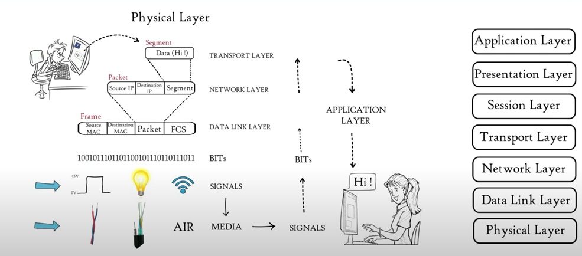

# NTW-01 OSI stack
With this excercise I learned what the OSI and TCP/PI models mean and the uses of it. I also learned the differences between the two.    

## Key terminology
- OSI (Open Systems Interconnection) model: This is a conceptual framework that describes network or telecommunications systems as seven layers, each with its own function and protocols. This model is used for troubleshooting of telecommuncation or computing systems. The model has seven layers and you can troubleshoot the problem by checking out every layer until the problem is found. Most descriptions of the OSI model go from top to bottom, from 7 to 1. A good way to reminder the different layer are: All People Seem To Need Data Processing.   

The 7 layers are:
1. Physical: This represents the electrical and physical representation of the system. When a problem occurs, you can go and check if all the cables are connected properly and if the power plug hasn't been pulled from the router etc.   
2. Data link: This layer provides node-to-node data transfer (two directly connected nodes). This handles the error correction from the physical layer. (Switches)
3. Network: At this layer you'll find the most of the router functionality's. This layer is responsible for packet forwarding, including routing through different routers. (IP Address, Routers) 
4. Transport: This layer deals with the coordination of data transfer between end systems and hosts. How much data, rate, etc. The best example of the Transport Layer is the Transmission Control Protocol (TCP), this is build on top of the internet protocol (IP), TCP/IP. (Port Numbers)  
5. Session: When two computers need to speak to one another, a session needs to be created. This is done at this layer. At this layer there are functions like setup, coordination and termination. (Start and stop sessions) 
6. Presentation: This layer represents the area that is independent of data representation at the application layer. It represents the preparation or translation of applications to network format. This layer "presents" data for the application or network. 
7. Application: This layer is the closest layer to the end user. It receives information directly from users and displays incoming data to the user. Web browsers, FTP and TelNet are examples of communications in this layer.  

- TCP/IP (Transmission Control Protocol/Internet Protocol) model: This is a alternative to the OSI model. This model describes the standard on which the internet was built, so it is more realistic. This model helps you determine how a specific computer should be connected to the internet and how data schould be transmitted between them. The purpose of this model is to allow communication over large distances. This model contains four layers.

The four layers are:
1. Application: To allow acces to network resources. This layer interacts with the highest level of the OSI model. Functions of this layer: indentify partners, resource availability, user log on to remote host, e-mail services, offers distributed database sources.
2. Transport: To provide reliable process to process message delivery and error delivery. This layer builds on the network layer in order to provide data transport from a process on a source system to a destination system. It determines how much data should be sent and at what rate. Functions: Divides messages into segments and numbers to make a sequence, makes sure the message is deliverd to the correct destination, message arrives without any error.
3. Internet: To move packets from source to destination and to provide internetworking. Protocols belonging to the network layer are: Routing protocols, Multicast group management and Network-layer address assignment.
4. Network Interface (network access layer): Responsible for the transmission between two devices on the same network. 

OSI is more practical to use for troubleshooting because of its extra layers.

- Troubleshooting: This is a systematic approach to problem solving. It is used to find and correct issues with (computer or software) systems.
- Telecommuncication: This is the means of electronic transmission of information over distances.  
- Bottom-up: With this approach you begin at the bottom layer and work your way to the top layer.
- Top-down: With this approach you begin your way at the top layer and work your way down to the bottom layer.
 
## Exercise
### Sources
- https://www.techtarget.com/whatis/definition/troubleshooting 
- https://www.umsl.edu/~joshik/msis480/chapt07.htm 
- https://www.networkworld.com/article/3239677/the-osi-model-explained-and-how-to-easily-remember-its-7-layers.html 
- https://www.youtube.com/watch?v=LANW3m7UgWs 
- https://www.guru99.com/tcp-ip-model.html#:~:text=TCP%2FIP%20Model%20helps%20you,allow%20communication%20over%20large%20distances. 
- https://www.youtube.com/watch?v=OTwp3xtd4dg   

### Overcome challenges
- At first I had to look up what troubleshooting means.
- I had to find out what telecommunication is.
- I had to look up what excactly the OSI model is and how it is used. 
- I had to find out what the TCP/IP model is and how it is used.

### Results
- I know the difference between the two models and what are the uses of them.

 