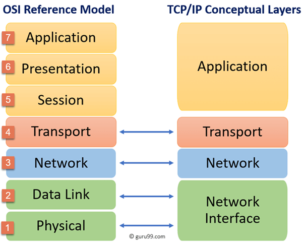

# NTW-02 Network Devices
With this excercise I learned what the OSI and TCP/PI models mean and the uses of it. I also learned the differences between the two.    

## Key terminology
- Network Devices: These are physical devices that are required for communication and interaction between hardware on a computer network. 
- Router: A router help transmit packets to their destinations. A router can also divide internol networks into two or more subnetworks. Each router interface has its own Adress Resolution Protocol (ARP), LAN address (network card address) and Internet Protocol (IP) address.  
- Switch: This is a multiport device that improves network efficiency. You can think of a switch as a device that has some of the best capabilities of routers and hubs combined. A switch maintains limited routing information about nodes in the internal network, and it allows connections to systems like hubs or routers.   
- Repeaters: A repeater is an electronic device that amplifies the signal it receives.
- Hubs: Hubs connect multiple computer networking devices together. It can also work as a repeater. They basically just send data packets to all connected devices.
- Ethernet: This is the system used to communicate directly and via the internet whith eachother. By LAN (Local Area Network) or WAN (Wide Area Network).
- Bridges: Bridges are used to connect two or more hosts or network segments together. 
- Access point: An Access Point (AP) is commonly (not always) a wireless device. It operates either as a bridge connecting a standard wired network to wireless devices or as a router passing data from on AP to another. An access point is a device that creates a wireless local area network (WLAN).   
- Gateway: Gateways provide translation between networking technologies such as Open System Interconnection (OSI) and Transmission Control Protocol/Internet Protocol (TCP/IP). 
- Modem: Modems (modulators-demodulators) are used to transmit digital signals over analog telephone lines. 

## Exercise
### Sources
- https://www.softwaretestinghelp.com/osi-model-layers/ 
- https://blog.netwrix.com/2019/01/08/network-devices-explained/ 
- https://www.linksys.com/us/r/resource-center/what-is-a-wifi-access-point/ 
- https://www.netwerkkabel.eu/nl/blogs/blog/wat-is-ethernet/ 
- https://www.cisco.com/c/en/us/products/switches/what-is-a-lan-local-area-network.html 
- https://www.comptia.org/content/guides/what-is-a-wide-area-network 
-
### Overcome challenges
- At first I had to find out at which layers which devices are used. After that I had to find out what the different devices are and what they do.
- I had to found out what my IP-address is.
- I couldn't login to the IP address website.
- 
### Results
- Devices used at the different layers: 

    1. Repeaters, hubs, Ethernet cable (connectors), bridges, modem
    2. Switches, bridges, modem, access point
    3. Routers, Switches
    4. Gateway
    5. Gateway

- You can read at the terminology part the function discription of the devices.
- 

 