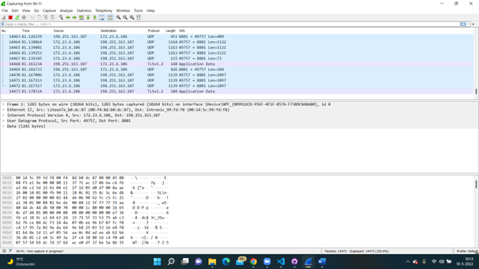

# NTW-03 Protocols
With this excercise I learned what  protocols are and how the different protocols are used on every layer of the OSI stack. I also learned who determines the protocols and what is needed to introduce one of your own. And finally I learned how to install wireshark on my local computer and capture a bit of network data.    

## Key terminology
- Network protocol: A network protocol is an established set of rules that determine how data is transmitted between different devices in the same network. 
- Wireshark: Wireshark is the world’s foremost and widely-used network protocol analyzer. It lets you see what’s happening on your network at a microscopic level and is the de facto (and often de jure) standard across many commercial and non-profit enterprises, government agencies, and educational institutions.  
- Ethernet (IEEE 802.2) protocol: the specification for Ethernet network media.
- Token Ring: 
- RS-232: The specification for standard pin connectors.
- PPP (Point-to-Point Protocol): Point-to-Point Protocol (PPP) is a TCP/IP protocol that is used to connect one computer system to another. Computers use PPP to communicate over the telephone network or the Internet.
- IP (internet protocol): The Internet Protocol (IP) is a set of requirements for addressing and routing data on the Internet. IP can be used with several transport protocols, including TCP and UDP.   
- ARP (Address Resolution Protocol): Address Resolution Protocol (ARP) is a protocol or procedure that connects an ever-changing Internet Protocol (IP) address to a fixed physical machine address, also known as a media access control (MAC) address, in a local-area network (LAN).  
- ICMP (Internet Control Message Protocol): The Internet Control Message Protocol is used to diagnose network issues over the Internet.
- TCP (Transmission Control Protocol): A communications standard that enables application programs and computing devices to exchange messages over a network. It is designed to send packets across the internet and ensure the successful delivery of data and messages over networks.
- UDP (User Datagram Protocol): This is a communication protocol used across the Internet for especially time-sensitive transmissions such as video playback or DNS lookups. It speeds up communications by not formally establishing a connection before data is transferred.  
- NFS (Network File System): This file system protocol allows a user on a client computer to access files over a network in the same way they would access a local storage file.  
- DNS (Domain Name System): DNS lets users connect to websites using domain names instead of IP addresses.   
- telnet: The Telnet Protocol (TELNET) provides a standard method for terminal devices and terminal-oriented processes to interface. TELNET is commonly used by terminal emulation programs that allow you to log into a remote host. 
- ftp (File Transfer Protocol): FTP (File Transfer Protocol) is used to communicate and transfer files between computers on a TCP/IP (Transmission Control Protocol/Internet Protocol) network, aka the internet. Users, who have been granted access, can receive and transfer files in the File Transfer Protocol server (also known as FTP host/site).   
- rlogin: The rlogin (remote login) program was a tool for remotely using a computer over a network. It could be used to get a command-line on a remote computer.  

## Exercise
### Sources
- https://docs.oracle.com/cd/E19683-01/806-4075/ipov-10/index.html 
- https://www.ibm.com/docs/en/i/7.2?topic=concepts-what-is-ppp 
- https://www.cloudflare.com/learning/network-layer/internet-protocol/ 
- https://www.fortinet.com/resources/cyberglossary/what-is-arp 
- https://www.cloudflare.com/learning/ddos/glossary/internet-control-message-protocol-icmp/ 
- https://www.fortinet.com/resources/cyberglossary/tcp-ip#:~:text=TCP%20stands%20for%20Transmission%20Control,data%20and%20messages%20over%20networks. 
- https://www.cloudflare.com/learning/ddos/glossary/user-datagram-protocol-udp/ 
- https://www.extrahop.com/resources/protocols/nfs/ 
- https://www.cloudflare.com/learning/dns/what-is-dns/ 
- https://www.ibm.com/docs/en/aix/7.1?topic=protocols-telnet-protocol 
- https://www.hostinger.com/tutorials/what-is-ftp 
- https://www.ssh.com/academy/ssh/rlogin 
- https://www.comptia.org/content/guides/what-is-a-network-protocol 
- https://www.internetx.com/en/news-detailview/who-creates-the-standards-and-protocols-for-the-internet/ 
- https://www.wireshark.org/ 

### Overcome challenges
- At first I had to find the different protocols that are used on every layer. 
- I then explained them in one or two sentences.
- After that I had to find out who determines the protocols we use. 
- After that I had to find out how to introduce my own protocol. 
- I had to find out what wireshark is and after that I had to find out how to install it. 
- I was confused how to install it, because in the excercise it says to use your VM but it should be your local machine. I knew this after Casper answered the question. 
- I needed to search a bit more of the IP protocol to try to understand it better. 

### Results
- Protocols on each layer:
    1. Physical: Ethernet (IEEE 802.2), Token Ring, RS-232
    2. Data Link: PPP, IEEE 802.2
    3. IP, ARP, ICMP
    4. TCP, UDP
    5. NFS, NIS+, DNS, telnet, ftp, rlogin
    6. Same as 5        
    7. Same as 5 + 6

- You can read at the terminology part the function discription of the protocols.

- Who determines the protocols we use?
    - Since the rise of the global internet, technical experts, academics and policy-makers have come together under the roof of organisations that can ensure the interoperability of the internet. Organisations who determines or ensure protocols are: World Wide Web Consortium (W3C), Telecommunication Standardization Sector (ITU-T), Internet Architecture Board (IAB), Internet Society (ISOC), IETF, IRTF, IEEE, ICANN, IANA.   

- What is needed to introduce your own protocol?
    - Need to do it!

- I installed wireshark and captured a bit of network data, the screenshot is below. 
- The protocol I already knew by name is ofcourse the IP protocol. I already explained what it (in basic) does. I looked some more into it to try to understand it better.

 