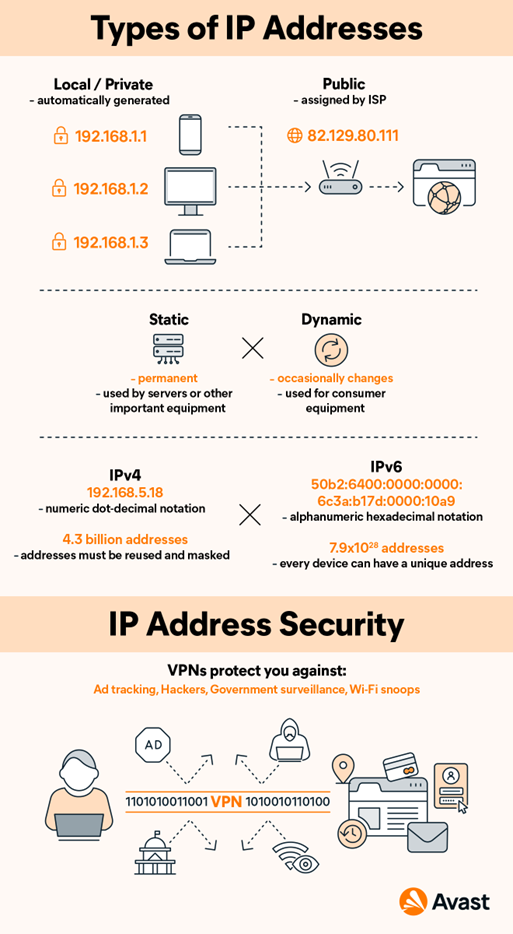

# NTW-05 IP Adressen

## Key terminology
- IP Address: An IP address is a unique address that identifies a device on the internet or a local network. IP stands for "Internet Protocol," which is the set of rules governing the format of data sent via the internet or local network. In essence, IP addresses are the identifier that allows information to be sent between devices on a network: they contain location information and make devices accessible for communication. 
- IPv4 Address: Basically this means that it is the fourth version of the internet protocil. IP (version 4) addresses are 32-bit integers that can be expressed in hexadecimal notation. The more common format, known as dotted quad or dotted decimal, is x.x.x.x, where each x can be any value between 0 and 255. For example, 192.0.2.146 is a valid IPv4 address.  
- IPv6 Address: This is the 6th version of the Internet Protocol. An IPv6 address is 128 bits long and is arranged in eight groups, each of which is 16 bits. Each group is expressed as four hexadecimal digits and the groups are separated by colons. 
- whois-check: Whois is a widely used Internet record listing that identifies who owns a domain and how to get in contact with them. The Internet Corporation for Assigned Names and Numbers (ICANN) regulates domain name registration and ownership. 
- Public IP Address: A public IP address is an IP address that can be accessed directly over the internet and is assigned to your network router by your internet service provider (ISP). Your personal device also has a private IP that remains hidden when you connect to the internet through your router’s public IP.
- Private IP Address: A private IP address is the address your network router assigns to your device. Each device within the same network is assigned a unique private IP address (sometimes called a private network address) — this is how devices on the same internal network talk to each other. 
- NAT-table: The network address translation (NAT) table is what allows devices on a private network to access a public network, such as the internet.
There is often only one entry point between the public network and the private network, and that entry point is usually a router. The router itself has a public-facing IP address, but the devices on the private network ("hidden" behind the router) only have private IP addresses.
When data packets move from the private network to the public network, those private IP addresses need to be "translated" into a public IP address that's compatible with the public network. Same for data packets coming in from public network to private network. 
- Static Address: A static IP address is simply an address that doesn't change. Once your device is assigned a static IP address, that number typically stays the same until the device is decommissioned or your network architecture changes. Static IP addresses generally are used by servers or other important equipment.  
- Dynamic Address: As the name suggests, dynamic IP addresses are subject to change, sometimes at a moment's notice. Dynamic addresses are assigned, as needed, by Dynamic Host Configuration Protocol (DHCP) servers. We use dynamic addresses because IPv4 doesn't provide enough static IP addresses to go around. So, for example, a hotel probably has a static IP address, but each individual device within its rooms would have a dynamic IP address.  

## Exercise
### Sources
- https://www.kaspersky.com/resource-center/definitions/what-is-an-ip-address 
- https://bluecatnetworks.com/glossary/what-is-ipv4/ 
- https://www.techtarget.com/iotagenda/definition/IPv6-address 
- https://www.domaintools.com/support/what-is-whois-information-and-why-is-it-valuable# 
- https://www.avast.com/c-ip-address-public-vs-private#:~:text=A%20public%20IP%20address%20is,through%20your%20router's%20public%20IP. 
- https://www.makeuseof.com/tag/what-is-nat-table/#:~:text=The%20network%20address%20translation%20(NAT,point%20is%20usually%20a%20router. 
- https://www.avast.com/c-static-vs-dynamic-ip-addresses#:~:text=A%20static%20IP%20address%20is,servers%20or%20other%20important%20equipment. 
- 

### Overcome challenges
- At first I had to find out what all the kery terminology mean.
- I then had to find out what the difference is between a Public and Private IP Address.
- 

### Results
- The difference between Public and Private IP addresses: The main difference between public and private IP addresses is how far they reach, and what they’re connected to. A public IP address identifies you to the wider internet so that all the information you’re searching for can find you. A private IP address is used within a private network to connect securely to other devices within that same network. 

 