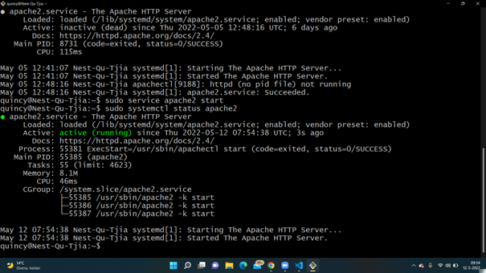
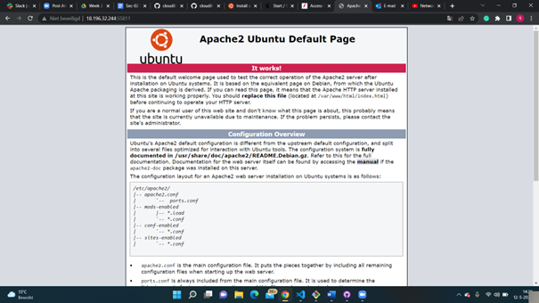
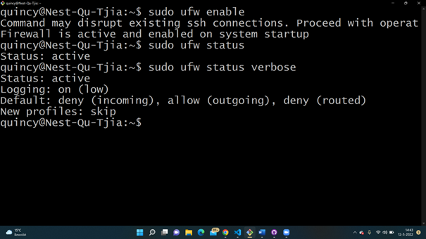
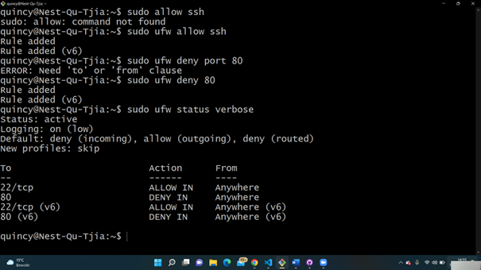
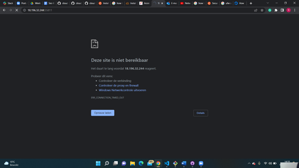

# Sec-02 Firewalls
With this excercise I learned what Firewalls are and what type of Firewalls exist. I also learned how to configure the firewalls.

## Key terminology
- Firewalls: A firewall is a network security device that monitors incoming and outgoing network traffic and permits or blocks data packets based on a set of security rules. Its purpose is to establish a barrier between your internal network and incoming traffic from external sources (such as the internet) in order to block malicious traffic like viruses and hackers. 
- ufw: The default firewall configuration tool for ubuntu is ufw.
- Packet-filtering firewalls: The most common type of firewall, it examines packets and prohibit them from passing through if they don’t match an established security rule set. This type of firewall checks the packet’s source and destination IP addresses. If packets match those of an “allowed” rule on the firewall, then it is trusted to enter the network.
- Stateful firewall: Stateful firewalls monitor all aspects of the traffic streams, their characteristics and communication channels. These firewalls can integrate encryption or tunnels, identify TCP connection stages, packet state and other key status updates.
- Stateless firewall: Stateless firewalls use clues from the destination address, source and other key values to assess whether threats are present, then block or restrict those deemed untrusted. Preset rules enforce whether traffic is permitted or denied, but the system is typically unable to determine the difference between truly desired communications and sophisticated attempts to disguise unauthorized communications as trusted ones. As one of the earlier iterations of firewalls, stateless firewalls don't look beyond the header of packet contents to determine if traffic is authorized. 
- Hardware firewall: A physical firewall is a piece of equipment installed between your network and gateway.
- Software firewall: A software firewall is a program installed on each computer and regulates traffic through port numbers and applications.

## Exercise
### Sources
- https://www.forcepoint.com/cyber-edu/firewall 
- https://www.cdw.com/content/cdw/en/articles/security/stateful-versus-stateless-firewalls.html#:~:text=Stateful%20firewalls%20are%20capable%20of,preset%20rules%20to%20filter%20traffic. 
- https://ubuntu.com/tutorials/install-and-configure-apache#1-overview 
- https://httpd.apache.org/docs/2.4/ 
- https://acloudguru.com/hands-on-labs/install-apache-web-server-and-perform-the-initial-firewall-configuration 
- https://www.digitalocean.com/community/tutorials/how-to-set-up-a-firewall-with-ufw-on-ubuntu-20-04 
- 
### Overcome challenges
- First I had to search what excactly a firewall is and which types there are.
- AFter that I needed to search how to install a webserver on my Linux machine. I found out that Apache2 already was installed.
- I didn't remember how to start the server so I had to google that.
- After that I had to google how to reach the webserver by internet.
- After that I had to find out how to install and change the firewall settings.

### Results
- I started the apache2 webserver en checked if it was up and running.
- It was showing the default page, so it is up and running.
- The default firewall configuration tool for ubuntu is ufw. I used this to change the firewall settings.
- I then allowed ssh traffic and dissallowed http traffic. 
- I then reloaded the page to see if it worked and it worked.

 