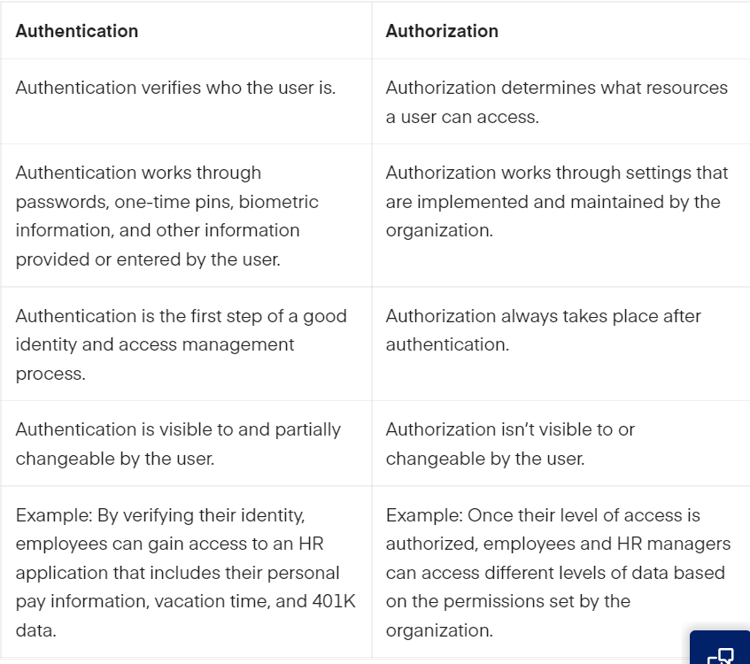

# SEC-03 IAM
With this excercise I learned what Identity and Access Management (IAM) is. I also learned what Authentication and Authorization is and what the differences are between them.  

## Key terminology
- Identity and acces management (IAM): Identity and access management (IAM) is a framework of policies and technology that authenticates and authorizes access to applications, data, systems, and cloud platforms. In basic terms, it helps ensure that the right people have the right access, for the right reasons.  
- Authentication: Authentication is the process of determining whether someone or something is, in fact, who or what it says it is. Authentication technology provides access control for systems by checking to see if a user's credentials match the credentials in a database of authorized users or in a data authentication server. In doing this, authentication assures secure systems, secure processes and enterprise information security. 
- Authorization: Authorization is a security mechanism to determine access levels or user/client privileges related to system resources including files, services, computer programs, data and application features. This is the process of granting or denying access to a network resource which allows the user access to various resources based on the user's identity.
- Multi-factor authentication (MFA): Multi-factor Authentication (MFA) is an authentication method that requires the user to provide two or more verification factors to gain access to a resource such as an application, online account, or a VPN. MFA is a core component of a strong identity and access management (IAM) policy. Rather than just asking for a username and password, MFA requires one or more additional verification factors, which decreases the likelihood of a successful cyber attack. 
- Principle of least privilege: The principle of least privilege (PoLP) refers to an information security concept in which a user is given the minimum levels of access – or permissions – needed to perform his/her job functions. It is widely considered to be a cybersecurity best practice and is a fundamental step in protecting privileged access to high-value data and assets.
 
## Exercise
- The difference between authentication and authorization.
- The three factors of authentication and  how MFA improves security.
- What the principle of least privilege is and how it improves security.

### Sources
- https://www.sailpoint.com/identity-library/difference-between-authentication-and-authorization/#:~:text=So%2C%20what%20is%20the%20difference,a%20user%20has%20access%20to.
- https://www.techtarget.com/searchsecurity/definition/authentication 
- https://economictimes.indiatimes.com/definition/authorization 
- https://www.sailpoint.com/identity-library/identity-and-access-management/?gclid=CjwKCAjw7IeUBhBbEiwADhiEMUfHPAfGhF8SPk1SOF8R6tN_7KpIaJj9mP5kN-Z_QWr_ptFGDDtvthoCOeoQAvD_BwE 
- https://www.onelogin.com/learn/what-is-mfa 
- https://www.cyberark.com/what-is/least-privilege/#:~:text=The%20principle%20of%20least%20privilege,perform%20his%2Fher%20job%20functions. 
- https://www.pearsonitcertification.com/articles/article.aspx?p=1718488 
- 
### Overcome challenges
- I first had to search what the key terminology mean.
- I then had to find out what the difference is between authentication and authorization.
- I then had to search what the three factors of authentication are.
- After that I had to find out how MFA improves security. 
- After that I had to find out how the principle of least privilege improves security.

### Results
- The difference between authentication and authorization: Authentication is the process of verifying who someone is, authorization is the process of verifying what specific applications, files, and data a user has access to.  

- What are the three factors of authentication:

1. Something you know: The something you know factor is the most common factor used and can be a password or a simple personal identification number (PIN). However, it is also the easiest to beat.

2. Something you have :The something you have factor refers to items such as smart cards or hand-held tokens. A smart card is a credit-card sized card that has an embedded certificate used to identify the holder. The user can insert the card into a smart card reader to authenticate the individual. Smart cards are commonly used with a PIN providing multi-factor authentication. In other words, the user must have something (the smart card) and know something (the PIN).

3. Something you are: Biometric methods provide the something you are factor of authentication. Some of the biometric methods that can be used are fingerprints, hand geometry, retinal or iris scans, handwriting, and voice analysis. Fingerprints and handprints are the most widely used biometric method in use today. Many laptops include fingerprint readers and fingerprint readers are also available on USB flash drives. Handprints are used with many amusement parks that sell season passes, or multi-day passes. 

- How does MFA improves security: This improves security because the user then have to do at least two authentication factors. In this way you are more sure the person that tries to login is really the person that tries to login and not a fraud. 

- How does the principle of least privilege improves security?: This improves the security because in this way the user has only access to the things he needs and nothing more. It also reduces the cyber attack surface, stops the spread of malware, improves end-users productivity and it helps streamline compliance and audits.  

The difference between authentication and authorization 

 