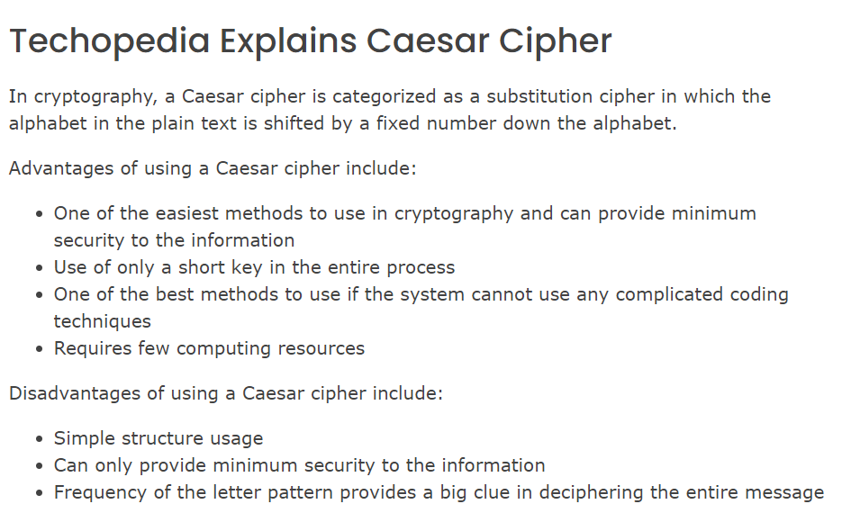

# SEC-04 Symmetric Encryption
With this excercise I learned what symmetric encryption means and how it works. I also learned how to encrypt and decrypt a simple message.  

## Key terminology
- Encryption: Encryption is a way to conceal information by altering it so that it appears to be random data. Encryption is essential for security on the Internet. In technical terms, it is the process of converting human-readable plaintext to incomprehensible text, also known as ciphertext. In simpler terms, encryption takes readable data and alters it so that it appears random. Encryption requires the use of a cryptographic key: a set of mathematical values that both the sender and the recipient of an encrypted message agree on. 
- Symmetrical encryption: Symmetric encryption is a type of encryption where only one key (a secret key) is used to both encrypt and decrypt electronic data. The entities communicating via symmetric encryption must exchange the key so that it can be used in the decryption process. 
- Data at rest: When data collects in one place, it is called data at rest. For a hacker, this data at rest — data in databases, file systems, big data lakes, the cloud, and storage infrastructure in general — is probably much more attractive than the individual data packets crossing the network. Data at rest in these environments tends to have a logical structure, meaningful file names, or other clues which betray that this location is where the “money” is — that is, credit cards, intellectual property, personal information, healthcare information, financial information, and so on. 
- Data in motion: Data in motion is a term used to label any digital information that is being transferred from one location to another. It is also commonly referred to as data in transit or data in flight. When the data is finally contained in one location, it becomes data at rest.
- Cryptography: Cryptography is the study of secure communications techniques that allow only the sender and intended recipient of a message to view its contents. The term is derived from the Greek word kryptos, which means hidden. It is closely associated to encryption, which is the act of scrambling ordinary text into what's known as ciphertext and then back again upon arrival. In addition, cryptography also covers the obfuscation of information in images using techniques such as microdots or merging. 
- Ciphers: Ciphers, also called encryption algorithms, are systems for encrypting and decrypting data. A cipher converts the original message, called plaintext, into ciphertext using a key to determine how it is done. 
- Symmetric ciphers: A symmetric cipher is one that uses the same key for encryption and decryption. Symmetric ciphers are generally faster than their asymmetric counterparts, which use a closely-held private key as well as a public key shared between the two parties (hence public-key cryptography, or PKC). 
- Caesar Cipher: A Caesar cipher is one of the simplest and most well-known encryption techniques. Named after Julius Caesar, it is one of the oldest types of ciphers and is based on the simplest monoalphabetic cipher. It is considered a weak method of cryptography, as it is easy to decode the message owing to its minimum security techniques.For the same reason, a Caesar cipher is often incorporated only in parts of other complex encryption schemes.
- Encode: to convert (a message, information, etc.) into code. 
 
## Exercise
- Find two more historic ciphers besides the Caesar cipher.

- Find two digital ciphers that are being used today.

- Send a symmetrically encrypted message to one of your peers via the public Slack channel. They should be able to decrypt the message using a key you share with them. Try to think of a way to share this encryption key without revealing it to everyone. 
You are not allowed to use any private messages or other communication channels besides Slack. Analyse the shortcomings of this method.

### Sources
- https://www.cloudflare.com/learning/ssl/what-is-encryption/ 
- https://www.cryptomathic.com/news-events/blog/symmetric-key-encryption-why-where-and-how-its-used-in-banking#:~:text=Symmetric%20encryption%20is%20a%20type,used%20in%20the%20decryption%20process. 
- https://cpl.thalesgroup.com/faq/encryption/what-data-rest 
- https://www.manageengine.com/device-control/data-in-motion.html
- https://www.kaspersky.com/resource-center/definitions/what-is-cryptography 
- https://www.hypr.com/cipher/ 
- https://www.techopedia.com/definition/6311/caesar-cipher 
- https://www.dictionary.com/browse/encode
- https://www.secplicity.org/2017/05/25/historical-cryptography-ciphers/ 
- https://www.comparitech.com/blog/information-security/famous-codes-and-ciphers-through-history-and-their-role-in-modern-encryption/#:~:text=of%20the%20algorithm.-,Modern%20Ciphers,at%20processing%20data%20using%20algorithms
- https://www.geeksforgeeks.org/rsa-algorithm-cryptography/ 
- 
### Overcome challenges
- I first had to search for all the key terminology and understand what they mean.
- After that I had to find for two more historic ciphers.
- Then I had to find two digital ciphers which are used nowadays. 
- I had to study how the Caesar methode cipher works and use it to encrypt a message.
- 

### Results
-  Two historic ciphers:

    1. Vigenère Cipher: A Vigenère cipher uses a table consisting of different Caesar shifts in sequence and a key to encode a message across several rows of the table. By using different Caesar shifts for different characters in the message, the Vigenère cipher makes decoding the ciphertext using frequency analysis much more difficult.

    2. Playfair Cipher: The Playfair cipher is a diagraph substitution cipher. Instead of encoding a message by replacing individual characters, it replaces them in pairs. To encode a message, the Playfair cipher uses a keyword to generate a 5 by 5 encoding table and then follows 4 rules to encode digrams (pairs of characters) using the table.

- Two Digital Ciphers that are being used today:

    1. RSA (Rivest, Shamir, Adleman) Algorithm: The idea of RSA is based on the fact that it is difficult to factorize a large integer. The public key consists of two numbers where one number is multiplication of two large prime numbers. And private key is also derived from the same two prime numbers. So if somebody can factorize the large number, the private key is compromised. Therefore encryption strength totally lies on the key size and if we double or triple the key size, the strength of encryption increases exponentially. RSA keys can be typically 1024 or 2048 bits long, but experts believe that 1024 bit keys could be broken in the near future. But till now it seems to be an infeasible task. 

    2. AES: Advanced Encryption Standard (AES) is a specification for the encryption of electronic data established by the U.S National Institute of Standards and Technology (NIST) in 2001. AES is widely used today as it is a much stronger than DES and triple DES despite being harder to implement.  

- 

Advantages vs Disadvantages of using a Caesar cipher

 