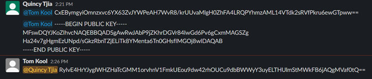
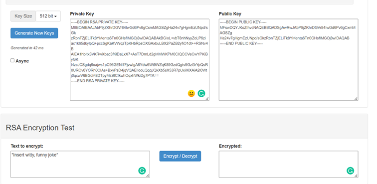

# SEC-05 Asymmetric Encryption
With this excercise I learned what Asymmetric encryption means and how it works. I also learned the difference between symmetric and asymmetric encryption. 

## Key terminology
- Asymmetric Encryption: Asymmetric encryption is a type of encryption that uses two separates yet mathematically related keys to encrypt and decrypt data. The public key encrypts data while its corresponding private key decrypts it. This is why it’s also known as public key encryption, public key cryptography, and asymmetric key encryption.
- Public Key: Public key encryption, or public key cryptography, is a method of encrypting data with two different keys and making one of the keys, the public key, available for anyone to use. 
- Private Key: . Data encrypted with the public key can only be decrypted with the private key, and data encrypted with the private key can only be decrypted with the public key.
 
## Exercise
- Generate a key pair.

- Send an asymmetrically encrypted message to one of your peers via the public Slack channel. They should be able to decrypt the message using a key you share with them. The recipient should be able to read the message, but it should remain a secret to everyone else.
You are not allowed to use any private messages or other communication channels besides Slack. Analyse the difference between this method and symmetric encryption.

### Sources
- https://travistidwell.com/jsencrypt/demo/ 
- https://sectigostore.com/blog/what-is-asymmetric-encryption-how-does-it-work/#:~:text=Asymmetric%20encryption%20is%20a%20type,cryptography%2C%20and%20asymmetric%20key%20encryption. 
- https://www.cloudflare.com/learning/ssl/how-does-public-key-encryption-work/ 
- https://www.youtube.com/watch?v=GSIDS_lvRv4

### Overcome challenges
- I first had to search for the meaning of the key terminology. 
- After that I had to found out how to generate a key pair.
- Then I worked with tom to try to figure out how Asymmetric encryption works.

### Results
-  First Tom shared his public key with me. I then used the public key and encrypted a message for tom. After that I sent tom the encrypted message. Tom then decrypted my message on his computer. 
- Only Tom could read my encrypted messages because we use the same key pairs. Only I use my own Private Key and Tom his. 

- The difference between symmetric and asymmetric encryption: 

    The big difference is that with asymmetric encryption you don't need to share a Private key with someone. You have two different keys, a public one and a private one. You only share your Public key and everyone can see this, but that is not a security issue. With symmetric encryption you only have one key and you need to share that key with someone. If you share this online then it is public and everyone can find that key. You need to give the key in person or by spoken word. You see that asymmetrical encryption is a lot more secure. 

Tom shared his public Key

I encrypted my message

I shared my public key

I decrypted Toms key

 