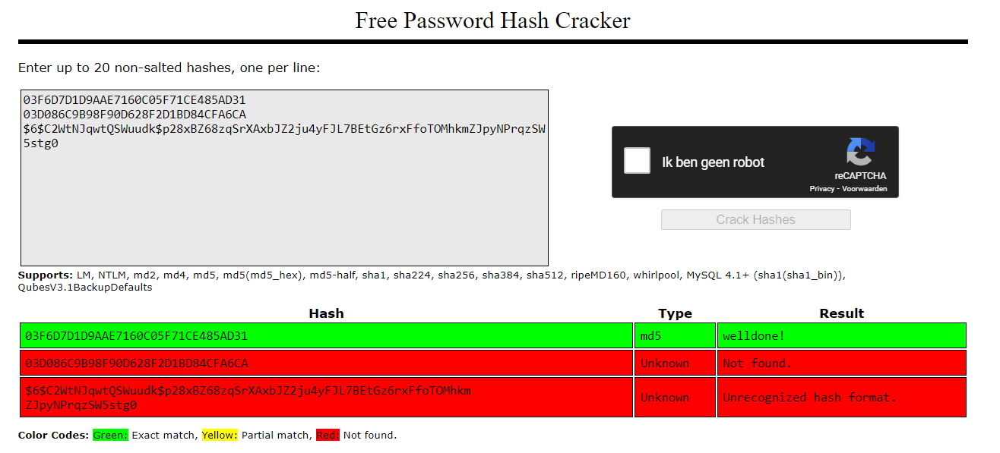

# SEC-07 Passwords
With this exercise I learned what hashing is and how passwords are being hashed. I also learned how to use a rainbow table to crack hashed passwords and what salting is.

## Key terminology
- Password managers: A password manager is an advanced tool that helps individuals and businesses securely store and manage all of their login credentials. This tool is commonly used to generate strong, unique passwords for web applications. Once generated, they are put in a centralized vault, and encrypted with one master password. Users only need to remember one password to access their services. 
- Hashing: Hasing is the process of converting a input of any given length into a fixed size string of text using a mathemetical function. 
- Rainbow Table: A rainbow table is a precomputed compilation of plaintexts and matching ciphertexts (typically passwords and their matching hashes). Rainbow tables greatly speed up many types of password cracking attacks, often taking minutes to crack where other methods (such as dictionary, hybrid, and brute-force password cracking attempts) may take much longer.
- MD5 password hash: MD5 (message-digest algorithm) is a cryptographic protocol used for authenticating messages as well as content verification and digital signatures. MD5 is based on a hash function that verifies that a file you sent matches the file received by the person you sent it to. Previously, MD5 was used for data encryption, but now it’s used primarily for authentication. 
- Salting: Salting is simply the addition of a unique, random string of characters known only to the site to each password before it is hashed, typically this “salt” is placed in front of each password.
The salt value needs to be stored by the site, which means sometimes sites use the same salt for every password. This makes it less effective than if individual salts are used. 
 
## Exercise
- Find out what hashing is and why it is preferred over symmetric encryption for storing passwords.
- Find out how a Rainbow Table can be used to crack hashed passwords.
- Below are two MD5 password hashes. One is a weak password, the other is a string of 16 randomly generated characters. Try to look up both hashes in a Rainbow Table.
03F6D7D1D9AAE7160C05F71CE485AD31
03D086C9B98F90D628F2D1BD84CFA6CA
- Create a new user in Linux with the password 12345. Look up the hash in a Rainbow Table.
- Despite the bad password, and the fact that Linux uses common hashing algorithms, you won’t get a match in the Rainbow Table. This is because the password is salted. To understand how salting works, find a peer who has the same password in /etc/shadow, and compare hashes.

### Sources
- https://www.techopedia.com/definition/14316/hashing-cybersecurity
- https://www.youtube.com/watch?v=2BldESGZKB8 
- https://www.encryptionconsulting.com/education-center/encryption-vs-hashing/#:~:text=Since%20encryption%20is%20two%2Dway,salt%2C%20that%20cannot%20be%20decrypted. 
- https://www.zoho.com/vault/educational-content/what-is-a-password-manager.html#:~:text=A%20password%20manager%20is%20an,encrypted%20with%20one%20master%20password.
- https://www.sciencedirect.com/topics/computer-science/rainbow-table
- https://www.avast.com/c-md5-hashing-algorithm 
- https://crackstation.net/ 
- https://www.theguardian.com/technology/2016/dec/15/passwords-hacking-hashing-salting-sha-2#:~:text=Salting%20is%20simply%20the%20addition,same%20salt%20for%20every%20password. 

### Overcome challenges
- First I had to find out what the key terminology mean.
- After that I had to find out why hashing is preffered to store passwords instead of encryption.
- After that I had to find out what a rainbow table is and how it can be used to crack a hashed password.
- After that I had to find out how I can use a Rainbow table to crack a hashed password.
- After that I had to find out what salting means.

### Results
- Find out what hashing is and why it is preferred over symmetric encryption for storing passwords.

    - Hasing is the process of converting a input of any given length into a fixed size string of text using a mathemetical function. 

    - Encryption is a two-way function where data is passed in as plaintext and comes out as ciphertext, which is unreadable. Since encryption is two-way, the data can be decrypted so it is readable again. Hashing, on the other hand, is one-way, meaning the plaintext is scrambled into a unique digest, that cannot be decrypted. Hashing is preffered over encryption for passwords because it is irreversible. With encryption you can decrypt the message again and then you can see the plain text. 

 - Find out how a Rainbow Table can be used to crack hashed passwords.

    - A Rainbow table is a precomputed table of hashes used to crack password hashes. It uses leaked passwords or passwords that are common (1234) and they ran them to the hashing algorithm. 

- Below are two MD5 password hashes. One is a weak password, the other is a string of 16 randomly generated characters. Try to look up both hashes in a Rainbow Table.
03F6D7D1D9AAE7160C05F71CE485AD31
03D086C9B98F90D628F2D1BD84CFA6CA

    - I used the website http://crackstation.net/ to fill in the hashed passwords and see if the rainbow table would recognize it. It recognized the first on but didn't recognize the second one. 

 - Create a new user in Linux with the password 12345. Look up the hash in a Rainbow Table.

    - It didn't recognize it because the password is salted.

- Despite the bad password, and the fact that Linux uses common hashing algorithms, you won’t get a match in the Rainbow Table. This is because the password is salted. To understand how salting works, find a peer who has the same password in /etc/shadow, and compare hashes.

    - I compared the hashed and salted password with my 3 peers and everybody had a different hashed password. So this comes due to the salting, otherwise we all would have the same hashes password. 

The differences between Encrypting and Hashing

The hashed passwords I looked up in a Rainbow Table

The new user I addes with the Salted password

The looked up (salted) hashed password of my new user 

