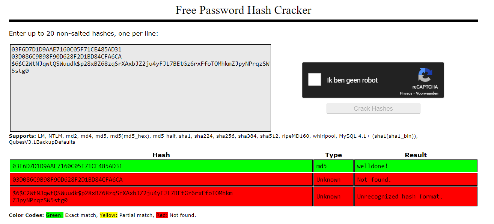

# SEC-08 Detection, response and analysis

## Key terminology
- Detection phase:
- Response phase:
- Analysis phase:
- Malicious software (malware): 
- Social Engineering:
- Intrusion detection systems (IDS): 
- Intrusion prevention systems (IPS): 
- Disaster recovery plan:
- Recovery Point Objective (RPO):
- Recovery Time Objective (RTO):

### Sources
-  

### Overcome challenges
-

### Results
-  

