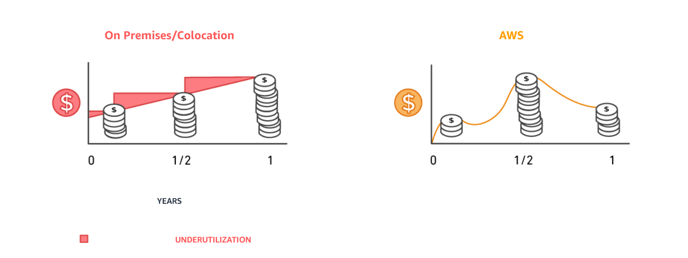
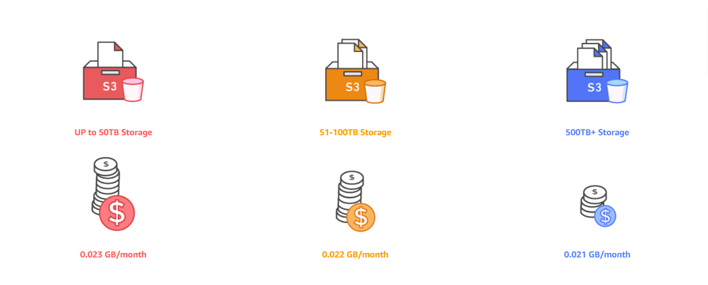
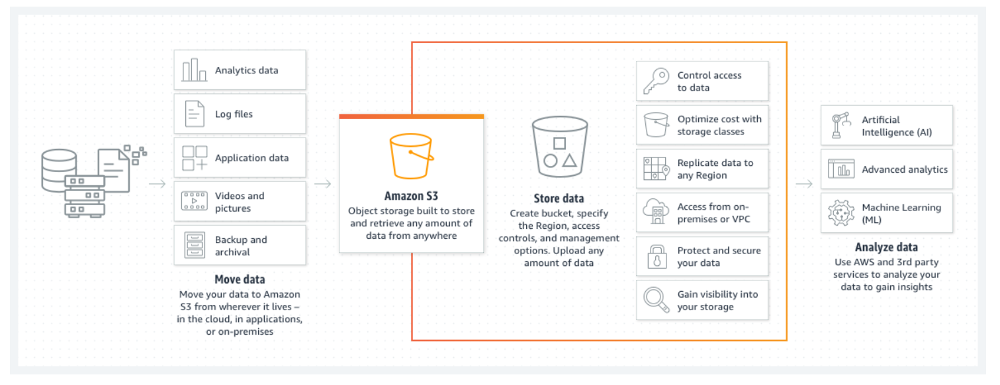
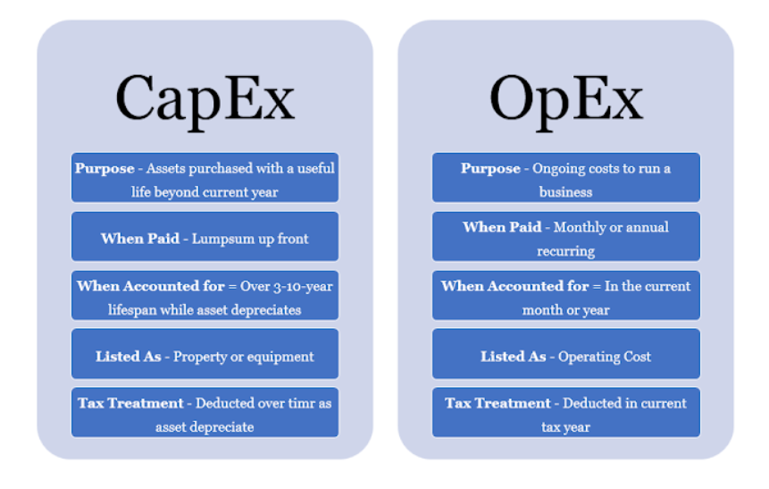

# AWS-02 AWS Pricing 
With this exercise I learned what kind of pricing model there is within the AWS services. I also learned what the four advantages are of the AWS pricing model and what the difference is between CapEx and OpEx.

## Key terminology
- Pay-as-you-go pricing model: Pay-as-you-go pricing allows you to easily adapt to changing business needs without overcommitting budgets and improving your responsiveness to changes. With a pay as you go model, you can adapt your business depending on need and not on forecasts, reducing the risk or overprovisioning or missing capacity. In other words, You only pay for what you use and what you need.  
- Economies of scale: Economies of scale are cost advantages that can occur when a company increases their scale of production and becomes more efficient, resulting in a decreased cost-per-unit. This is because the cost of production (including fixed and variable costs) is spread over more units of production. Economies of scale provide larger companies with a competitive advantage over smaller ones, because the larger the business, the lower its per-unit costs.
- Total Cost of Ownership (TCO): The total cost of ownership (TCO) is the purchase price of an asset plus the costs of operation. Assessing the total cost of ownership represents taking a bigger picture look at what the product is and what its value is over time. 
- Capital Expenditures (CapEx): It is the initial spending of money ( whole together ) on physical infrastructure, and then deducting that up-front expense over time. The up-front cost from CapEx has a value that reduces over time. All expenses incurred for long-term benefits in the future lie under CapEx. These are some of  the examples of Capital Expenditure: Manufacturing plants, equipment, and machinery, Computers and Hardware, Building improvements and Vehicles.
- Operational Expenditure (OpEX): It is like a pay-as-you-go service. You can deduct this expense in the same year you spend it. There is no up-front cost, as you pay for a service or product as you use it. It is as the name suggests, the expense of daily operation. These are some of  the examples of Operational Expenditure: Interest paid on debt, Property taxes, Accounting and legal fees, Wages and salaries, Business travel, Rent and utilities.
- S3 model: Amazon Simple Storage Service (Amazon S3) is an object storage service offering industry-leading scalability, data availability, security, and performance. Customers of all sizes and industries can store and protect any amount of data for virtually any use case, such as data lakes, cloud-native applications, and mobile apps. With cost-effective storage classes and easy-to-use management features, you can optimize costs, organize data, and configure fine-tuned access controls to meet specific business, organizational, and compliance requirements.
- EC2 model: Amazon Elastic Compute Cloud (Amazon EC2) offers the broadest and deepest compute platform, with over 500 instances and choice of the latest processor, storage, networking, operating system, and purchase model to help you best match the needs of your workload. 
- Always free services: These are services that are alway free, even after your free 12 month trial. 
- AWS Pricing Calculator: AWS Pricing Calculator is a web-based planning tool that you can use to create estimates for your AWS use cases. You can use it to model your solutions before building them, explore the AWS service price points, and review the calculations behind your estimates.

## Exercise
Study:

- The four advantages of the AWS pricing model.

- AWS free tier for:

    - S3
    - EC2
    - Always free services

- Understand the differences between capex and opex

### Sources
- https://www.youtube.com/watch?v=WrBmmcwh-BA
- https://aws.amazon.com/savingsplans/
- https://aws.amazon.com/pricing/#
- https://docs.aws.amazon.com/whitepapers/latest/aws-overview/six-advantages-of-cloud-computing.html 
- https://gocardless.com/guides/posts/benefit-economies-scale/#:~:text=Economies%20of%20scale%20are%20cost,over%20more%20units%20of%20production. 
- https://aws.amazon.com/s3/?nc=sn&loc=1 
- https://aws.amazon.com/s3/pricing/?nc=sn&loc=4 
- https://aws.amazon.com/free/?all-free-tier.sort-by=item.additionalFields.SortRank&all-free-tier.sort-order=asc&awsf.Free%20Tier%20Types=*all&awsf.Free%20Tier%20Categories=*all 
- https://aws.amazon.com/ec2/?did=ft_card&trk=ft_card 
- https://aws.amazon.com/free/compute/ 
- https://www.geeksforgeeks.org/capex-vs-opex-in-cloud-computing/
- https://www.investopedia.com/ask/answers/112814/whats-difference-between-capital-expenditures-capex-and-operational-expenditures-opex.asp 
- https://www.programmingtrends.com/2020/05/capital-expenditure-capex-versus.html 
- https://www.investopedia.com/terms/t/totalcostofownership.asp 
- https://docs.aws.amazon.com/pricing-calculator/latest/userguide/what-is-pricing-calculator.html 

### Overcome challenges
- I had to search the key terminology.
- I had to study the AWS pricing model

### Results
- The four advantages of the AWS pricing model.

    - Pay-as-you-go: Pay-as-you-go pricing allows you to easily adapt to changing business needs without overcommitting budgets and improving your responsiveness to changes. With a pay as you go model, you can adapt your business depending on need and not on forecasts, reducing the risk or overprovisioning or missing capacity. 

    

    - Save when you commit: Savings Plans is a flexible pricing model that provides significant savings on your AWS usage. This pricing model offers lower prices on AWS Compute and AWS Machine Learning. Savings Plans offer savings over On-Demand in exchange for a commitment to use a specific amount (measured in $/hour) of an AWS service or a category of services, for a one- or three-year period. In other words, the longer you use certain AWS services, the lower the cost will be.

    - Pay less by using more: With AWS, you can get volume based discounts and realize important savings as your usage increases. For services such as S3 and data transfer OUT from EC2, pricing is tiered, meaning the more you use, the less you pay per GB. In addition, data transfer IN is always free of charge. As a result, as your AWS usage needs increase, you benefit from the economies of scale that allow you to increase adoption and keep costs under control.

     

    - Benefit form massive economies of scale: By using cloud computing, you can achieve a lower variable cost than you can get on your own. Because usage from hundreds of thousands of customers is aggregated in the cloud, providers such as AWS can achieve higher economies of scale, which translates into lower pay as-you-go prices. 

-  AWS free tier for:

    - S3: As part of the AWS Free Tier, you can get started with Amazon S3 for free. Upon sign-up, new AWS customers receive 5GB of Amazon S3 storage in the S3 Standard storage class; 20,000 GET Requests; 2,000 PUT, COPY, POST, or LIST Requests; and 100 GB of Data Transfer Out each month. 

     
     

    - EC2: AWS Free Tier includes 750 hours of Linux and Windows t2.micro instances, ( t3.micro for the regions in which t2.micro is unavailable) each month for one year. To stay within the Free Tier, use only EC2 Micro instances.

    - Always free services: These are services that are alway free, even after your free 12 month trial. There are several services who are (can) be always free, here is one example:

        1. AWS Lambda: AWS Lambda is a serverless compute service that lets you run code without provisioning or managing servers, creating workload-aware cluster scaling logic, maintaining event integrations, or managing runtimes. 

        Always free: 1,000,000 free requests per month. 

        Up to 3.2 million seconds of compute time per month.  

        Other always free services are: Amazon Simple Workflow Service, Amazon DynamoDB, Amazon SimpleDB, Amazon Simple Notification Service(SNS), and Amazon Simple Queue

- Understand the differences between capex and opex.

    - Capital expenditures (CapEx) are major purchases a company makes that are designed to be used over the long term. Operating expenses (OpEx) are the day-to-day expenses a company incurs to keep its business operational.
    
    

