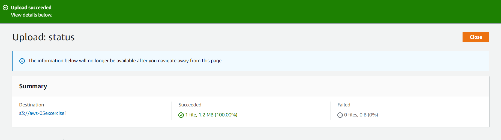
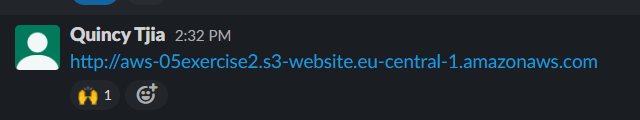

# AWS-05 Simple Storage Service (S3)
With this exercise I learned what S3 is and which classes there are within this service. I also learned how to make buckets and how to grant access to my peers to the database and website. 

## Key terminology
- Object based storage: Object storage, often referred to as object-based storage, is a data storage architecture for handling large amounts of unstructured data. This is data that does not conform to, or cannot be organized easily into, a traditional relational database with rows and columns. Today’s Internet communications data is largely unstructured. This includes email, videos, photos, web pages, audio files, sensor data, and other types of media and web content (textual or non-textual). This content streams continuously from social media, search engines, mobile, and “smart” devices.

- Containers: A container is a standard unit of software that packages up code and all its dependencies so the application runs quickly and reliably from one computing environment to another. A container is a lightweight, standalone, executable package of software that includes everything needed to run an application: code, runtime, system tools, system libraries and settings. 

- Buckets: Buckets are the basic containers that hold your data. Everything that you store in Cloud Storage must be contained in a bucket. You can use buckets to organize your data and control access to your data, but unlike directories and folders, you cannot nest buckets. 

- Bucket policy: An S3 bucket policy is an object that allows you to manage access to specific Amazon S3 storage resources. You can specify permissions for each resource to allow or deny actions requested by a principal (a user or role). When you create a new Amazon S3 bucket, you should set a policy granting the relevant permissions to the data forwarder’s principal roles.

- S3 Standard: S3 Standard offers high durability, availability, and performance object storage for frequently accessed data. Because it delivers low latency and high throughput, S3 Standard is appropriate for a wide variety of use cases, including cloud applications, dynamic websites, content distribution, mobile and gaming applications, and big data analytics. S3 Storage Classes can be configured at the object level and a single bucket can contain objects stored across S3 Standard, S3 Intelligent-Tiering, S3 Standard-IA, and S3 One Zone-IA. You can also use S3 Lifecycle policies to automatically transition objects between storage classes without any application changes. In S3, you pay for: GBs storage per month, Transfer OUT to out of the region, PUT, COPY, POST, LIST, and GET requests. You don’t pay for: Transfer IN to Amazon S3, Transfer OUT from S3 to CloudFront or EC2 in the same region.

- S3 Standard-IA: Amazon S3 Standard - Infrequent Access (Standard - IA) is an Amazon S3 storage class for data that is accessed less frequently, but requires rapid access when needed. Standard - IA offers the high durability, throughput, and low latency of Amazon S3 Standard, with a low per GB storage price and per GB retrieval fee.

- S3 One-zone IA: S3 One Zone-IA storage class is an Amazon S3 storage class that customers can choose to store objects in a single availability zone. S3 One Zone-IA storage redundantly stores data within that single Availability Zone to deliver storage at 20% less cost than geographically redundant S3 Standard-IA storage, which stores data redundantly across multiple geographically separate Availability Zones.

- S3 Glacier: The S3 Glacier storage class is secure, durable, and low-cost storage for data archiving. You can reliably store any amount of data at costs that are competitive with or cheaper than on-premises solutions. To keep costs low yet suitable for varying needs, the S3 Glacier storage class provides three retrieval options that range from a few minutes to several hours.

- S3 Glacier Deep archive: Amazon S3 Glacier Deep Archive is a new Amazon S3 storage class that provides secure and durable object storage for long-term retention of data that is accessed once or twice a year. From just ¥ 0.012 per GB-month, Amazon S3 Glacier Deep Archive offers the lowest cost storage in the cloud, at prices significantly lower than storing and maintaining data in on-premises magnetic tape libraries or archiving data off-site.

- Hosting static websites: A static website uses server-side rendering to serve pre-built HTML, CSS, and JavaScript files to a web browser, in contrast to traditional dynamic sites that work by rendering the webpage at the time of the request. 

- PUT Request: The PUT request operation is used to add an object to a bucket. The response indicates that the object has been successfully stored. S3 never stores partial objects: if you receive a successful response, then you can be confident that the entire object was stored.

- GET: Retrieves objects from Amazon S3. To use GET, you must have READ access to the object. If you grant READ access to the anonymous user, you can return the object without using an authorization header. 

## Exercise
Exercise 1

- Create new S3 bucket with the following requirements: Region: Frankfurt (eu-central-1)
- Upload a cat picture to your bucket.
- Share the object URL of your cat picture with a peer. Make sure they are able to see the picture.

Exercise 2

- Create new bucket with the following requirements:
Region: Frankfurt (eu-central-1)
- Upload the four files that make up AWS’ demo website.
- Enable static website hosting.
- Share the bucket website endpoint with a peer. Make sure they are able to see the website.

### Sources
- https://www.ibm.com/cloud/learn/object-storage
- https://cloud.google.com/storage/docs/key-terms#:~:text=Buckets%20are%20the%20basic%20containers,folders%2C%20you%20cannot%20nest%20buckets. 
- https://www.docker.com/resources/what-container/ 
- https://cloudian.com/blog/s3-bucket-policies-a-practical-guide/#:~:text=An%20S3%20bucket%20policy%20is,(a%20user%20or%20role). 
- https://www.amazonaws.cn/en/s3/faqs/#:~:text=Amazon%20S3%20Standard%20%2D%20Infrequent%20Access,and%20per%20GB%20retrieval%20fee.
- https://aws.amazon.com/s3/storage-classes/
- https://www.sanity.io/what-is-a-static-site 
- https://www.youtube.com/watch?v=77lMCiiMilo
- https://docs.aws.amazon.com/AmazonS3/latest/userguide/create-bucket-overview.html 
- https://docs.aws.amazon.com/AmazonS3/latest/userguide/EnableWebsiteHosting.html
- https://docs.aws.amazon.com/AmazonS3/latest/userguide/WebsiteAccessPermissionsReqd.html
- https://s3.amazonaws.com/doc/s3-developer-guide/RESTObjectPUT.html#:~:text=The%20PUT%20request%20operation%20is,the%20entire%20object%20was%20stored.
- https://docs.aws.amazon.com/AmazonS3/latest/API/API_GetObject.html

### Overcome challenges
- I first had to search for all the key terminology.
- After that I had to find out how S3 exactly works and how I can create a new S3 Bucket.
- After that I had to find out how to upload a cat picture to my bucket.
- After that I had to find out how to share the cat image with my teammates.
- After that I had to find out how to enable static website hosting.
- And at last I had to find out how to make sure my peers could access the website, I changed the bucket policy.

### Results
- Exercise 1

    - Create new S3 bucket with the following requirements: Region: Frankfurt (eu-central-1)

    

    - Upload a cat picture to your bucket.

     

- Share the object URL of your cat picture with a peer. Make sure they are able to see the picture.

    

    - I made a Presigned URL and shared it with my group. I made it public for 10 minutes. They were able to open it and see the cat.

Exercise 2

- Create new bucket with the following requirements:
Region: Frankfurt (eu-central-1)
    
 

- Upload the four files that make up AWS’ demo website.

    

- Enable static website hosting.

- Share the bucket website endpoint with a peer. Make sure they are able to see the website.

I first had to change the Bucket Policy to make sure they were able to see the website. 

I shared the link via slack.

They could access the website.

