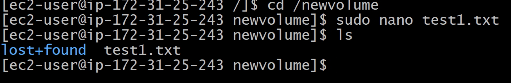

# AWS-07 Elastic Block Store (EBS)
With this exercise I learned what volumes are and how to use it with your instances. 

## Key terminology
- Elastic Block Stores (EBS): Amazon Elastic Block Store (Amazon EBS) provides block level storage volumes for use with EC2 instances. EBS volumes behave like raw, unformatted block devices. You can mount these volumes as devices on your instances. EBS volumes that are attached to an instance are exposed as storage volumes that persist independently from the life of the instance. EBS can be seen as virtual hard drives in the cloud. They can be either root volumes (like an internal hard disk), or seperate volumes (like an external hard disk).

- Volume: An instance of an EBS is called a volume. 

- Root volumes: Its like a internal hard disk.

- Seperate volumes: Its like a external hard disk.

- Snapshots: Amazon Elastic Block Store (EBS) Snapshots provide a simple and secure data protection solution that is designed to protect your block storage data such as EBS volumes, boot volumes, as well as on-premises block data. EBS Snapshots are a point-in-time copy of your data, and can be used to enable disaster recovery, migrate data across regions and accounts, and improve backup compliance. You can create and manage your EBS Snapshots through the AWS Management Console, AWS Command Line Interface (CLI), or the AWS SDKs. 

- Volume types: There are different volume types you can choose from. 

    Solid state drives (SSD): Optimized for transactional workloads involving frequent read/write operations with small I/O size, where the dominant performance attribute is IOPS.

    Hard disk drives (HDD) — Optimized for large streaming workloads where the dominant performance attribute is throughput.

    Previous generation — Hard disk drives that can be used for workloads with small datasets where data is accessed infrequently and performance is not of primary importance. We recommend that you consider a current generation volume type instead.

 

## Exercise
Exercise 1

- Navigate to the EC2 menu.
- Create a t2.micro Amazon Linux 2 machine with all the default settings.
- Create a new EBS volume with the following requirements:
    
    - Volume type: General Purpose SSD (gp3)
    - Size: 1 GiB
    - Availability Zone: same as your EC2

- Wait for its state to be available.

Exercise 2

- Attach your new EBS volume to your EC2 instance.
- Connect to your EC2 instance using SSH.
- Mount the EBS volume on your instance.
- Create a text file and write it to the mounted EBS volume.

Exercise 3

- Create a snapshot of your EBS volume.
- Remove the text file from your original EBS volume.
- Create a new volume using your snapshot.
- Detach your original EBS volume.
- Attach the new volume to your EC2 and mount it.
- Find your text file on the new EBS volume.

### Sources
- https://docs.aws.amazon.com/AWSEC2/latest/UserGuide/AmazonEBS.html
- https://faun.pub/aws-understanding-root-device-volume-76df89d18ec4 
- https://aws.amazon.com/ebs/snapshots/#:~:text=EBS%20Snapshots%20are%20a%20point,)%2C%20or%20the%20AWS%20SDKs.
- https://docs.aws.amazon.com/AWSEC2/latest/UserGuide/ebs-volume-types.html
- https://devopscube.com/mount-ebs-volume-ec2-instance/

### Overcome challenges
- I first had to search for the key terminology to get a better understanding.
- Then I needed to create a EC2 instance and a EBS volume.
- Then I needed to find out how to attach the volume to my EC2 instance.
- I found out I had to make the volumes in a different way (During te making of the instance)
- After that I had to find out how to mount the EBS volume on my instance.
- After that I had to find out how to make a snapshot and replace it.  

### Results
Exercise 1

- Navigate to the EC2 menu.
- Create a t2.micro Amazon Linux 2 machine with all the default settings.

- Create a new EBS volume with the following requirements:
    
    - Volume type: General Purpose SSD (gp3)
    - Size: 1 GiB
    - Availability Zone: same as your EC2

- Wait for its state to be available. I also attached the volume already. 

Exercise 2

- Attach your new EBS volume to your EC2 instance.
- Connect to your EC2 instance using SSH.

- Mount the EBS volume on your instance.

    Used commands:

    - sudo file -s /dev/xvdb

    - sudo mkfs -t ext4 /dev/xvdb
    
    - sudo mkdir entrypoint1

    - sudo mount /dev/xvdb entrypoint1

    - cd entrypoint1

    - df -h

- Create a text file and write it to the mounted EBS volume.

Exercise 3

- Create a snapshot of your EBS volume.

- Remove the text file from your original EBS volume.

- Create a new volume using your snapshot.

- Detach your original EBS volume.

- Attach the new volume to your EC2 and mount it.

- Find your text file on the new EBS volume.

