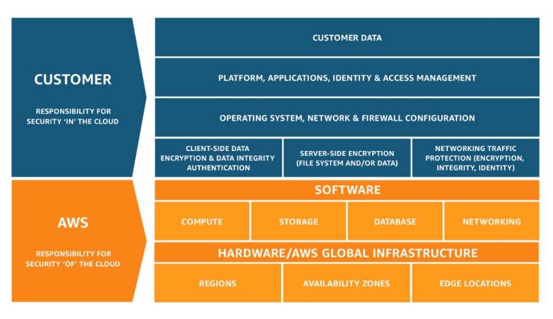
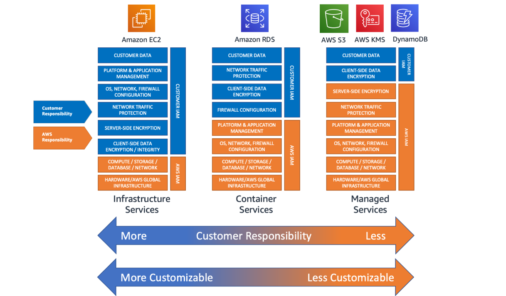

# AWS-09 Shared Responsibility Model 
With this exercise I learned what the Shared Responsibility Model is and how it is used and described within AWS. 

## Key terminology
- The Shared Responsibility Model: The Shared Responsibility Model is a globally accepted cloud security framework that reflects the security obligations and responsibilities of your cloud provider and those that belong to you, the customer.

## Exercise
Study

- The AWS Shared Responsibility Model

### Sources
- https://aws.amazon.com/compliance/shared-responsibility-model/
- https://www.youtube.com/watch?v=U632-ND7dKQ 
- https://www.threatscape.com/what-is-the-shared-responsibility-model-your-cloud-security-responsibilities-defined/

### Overcome challenges
- None really, I already knew what this model meant. I only had to search the model for AWS. 

### Results
Study

- The AWS Shared Responsibility Model

    - The AWS shared responsibility model describes who is responsible for the security of what part of the cloud. AWS is responsible for the security 'of' the cloud and the customer is responsible for the security 'in' the cloud.  

