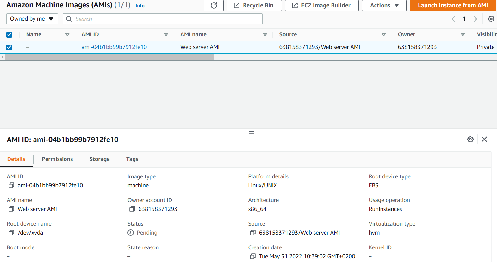

# AWS-11 Elastic Load Balancing (ELB) & Auto Scaling
With this exercise I learned what auto scaling is and what ELB is. I also learned how to use it within AWS.

## Key terminology
- Auto Scaling service: Amazon EC2 Auto Scaling helps you maintain application availability and allows you to automatically add or remove EC2 instances according to conditions you define. You can use the fleet management features of EC2 Auto Scaling to maintain the health and availability of your fleet. You can also use the dynamic and predictive scaling features of EC2 Auto Scaling to add or remove EC2 instances. Dynamic scaling responds to changing demand and predictive scaling automatically schedules the right number of EC2 instances based on predicted demand. Dynamic scaling and predictive scaling can be used together to scale faster. Amazon EC2 Auto Scaling will perform three main functions to automate fleet management for EC2 instances:

Monitor the health of running instances:
Amazon EC2 Auto Scaling ensures that your application is able to receive traffic and that EC2 instances are working properly. Amazon EC2 Auto Scaling periodically performs health checks to identify any instances that are unhealthy.

Replace impaired instances automatically:
When an impaired instance fails a health check, Amazon EC2 Auto Scaling automatically terminates it and replaces it with a new one. That means that you don’t need to respond manually when an instance needs replacing.

Balance capacity across Availability Zones:
Amazon EC2 Auto Scaling can automatically balance instances across zones, and always launches new instances so that they are balanced between zones as evenly as possible across your entire fleet. 

- Fleet of EC2 intances: Amazon EC2 Fleet is a new feature that simplifies the provisioning of Amazon EC2 capacity across different Amazon EC2 instance types, Availability Zones and across On-Demand, Amazon EC2 Reserved Instances (RI) and Amazon EC2 Spot purchase models. With a single API call, now you can provision capacity across EC2 instance types and across purchase models to achieve desired scale, performance and cost. 

- CloudWatch: Amazon CloudWatch is a monitoring and management service that provides data and actionable insights for AWS, hybrid, and on-premises applications and infrastructure resources. You can collect and access all your performance and operational data in the form of logs and metrics from a single platform rather than monitoring them in silos (server, network, or database). CloudWatch enables you to monitor your complete stack (applications, infrastructure, and services) and use alarms, logs, and events data to take automated actions and reduce mean time to resolution (MTTR). This frees up important resources and allows you to focus on building applications and business value.

- Load Balancer: Cloud load balancing is the process of distributing workloads across computing resources in a cloud computing environment and carefully balancing the network traffic accessing those resources. Load balancing enables organizations to meet workload demands by routing incoming traffic to multiple servers, networks or other resources, while improving performance and protecting against disruptions in services. Load balancing also makes it possible to distribute workloads across two or more geographic regions. The load balancer will forward the request to one of the servers in the fleet, and relay the response back to the client.

- Elastic Load Balancing (ELB) service: Elastic Load Balancing (ELB) automatically distributes incoming application traffic across multiple targets and virtual appliances in one or more Availability Zones (AZs). 

There are four types of ELBs:

Application Load Balancer: this ELB works using HTTP and HTTPS protocols (layer 7 of the OSI stack).
    Network Load Balancer: this ELB works using TCP and UDP (layer 4 of the OSI stack).

Classic Load Balancer: this ELB is outdated and not recommended for use. AWS has (so far) never stopped supporting any services. The reason for this is that it can harm existing applications.

Gateway Load Balancer: this ELB acts as a gateway into your network, as well as a load balancer. It will first route traffic to a (3rd party) application that checks the traffic, like an IDS/IPS or Firewall. After the packet has been inspected, the GWLB acts like a NLB routing to your application. GWLB act on layers 3 and 4 of the OSI stack.

- AMI (Amazon Machine Image): An Amazon Machine Image (AMI) defines the programs and settings that will be applied when you launch an EC2 instance. Once you have finished configuring the data, services, and applications on your ArcGIS Server instance, you can save your work as a custom AMI stored in Amazon EC2. You can scale out your site by using this custom AMI to launch additional instances.

## Exercise
Exercise 1

Launch an EC2 instance with the following requirements

Region: Frankfurt (eu-central-1)

AMI: Amazon Linux 2

Type: t3.micro

User data:

#!/bin/bash
#Install Apache Web Server and PHP
yum install -y httpd mysql php
#Download Lab files
wget https://aws-tc-largeobjects.s3.amazonaws.com/CUR-TF-100-RESTRT-1/80-lab-vpc-web-server/lab-app.zip
unzip lab-app.zip -d /var/www/html/
#Turn on web server
chkconfig httpd on
service httpd start

- Security Group: Allow HTTP

- Wait for the status checks to pass.
- Create an AMI from your instance with the following requirements:
- Image name: Web server AMI    

Exercise 2

- Create an application load balancer with the following requirements:

    - Name: LabELB
    - Listener: HTTP on port 80
    - AZs: eu-central-1a and eu-central-1b
    - Subnets: must be public
    - Security Group: 

        - Name: ELB SG
        - Rules: allow HTTP access

    - Target Group:
        
        - Name: LabTargetGroup
        - Targets: to be registered by Auto Scaling
  
Exercise 3

- Create a launch configuration for the Auto Scaling group. It has to be identical to the server that is currently running.
- Create an auto scaling group with the following requirements:

    - Name: Lab ASG
    - Launch Configuration: Web server launch configuration
    - Subnets: must be in eu-central-1a and eu-central-1b
    - Load Balancer: LabELB
    - Group metrics collection in CloudWatch must be enabled
    - Group Size:

        - Desired Capacity: 2
        - Minimum Capacity: 2
        - Maximum Capacity: 4

    - Scaling policy: Target tracking with a target of 60% average CPU utilisation

Exercise 4

- Verify that the EC2 instances are online and that they are part of the target group for the load balancer.
- Access the server via the ELB by using the DNS name of the ELB.
- Perform a load test on your server(s) using the website on your server to activate auto scaling. There might be a delay on the creation of new servers in your fleet, depending on the settings on your Auto Scaling Group.

### Sources
- https://aws.amazon.com/ec2/autoscaling/
- https://aws.amazon.com/about-aws/whats-new/2018/04/introducing-amazon-ec2-fleet/#:~:text=Amazon%20EC2%20Fleet%20is%20a,Amazon%20EC2%20Spot%20purchase%20models.
- https://aws.amazon.com/cloudwatch/features/#:~:text=Amazon%20CloudWatch%20is%20a%20monitoring,premises%20applications%20and%20infrastructure%20resources.
- https://www.techtarget.com/searchcloudcomputing/definition/cloud-load-balancing
- https://aws.amazon.com/elasticloadbalancing/?nc=sn&loc=1
- https://enterprise.arcgis.com/en/server/10.3/cloud/amazon/create-your-own-ami.htm#:~:text=Log%20in%20to%20the%20AWS,input%20text%20for%20Image%20Description.

### Overcome challenges
- I first had to search for the different key terminology.
- I couldn't find how to make a AMI, I found it with help from my teammate.
- The rest of the exercise was quit straightforward.

### Results
Exercise 1

Launch an EC2 instance with the following requirements:

Region: Frankfurt (eu-central-1)

AMI: Amazon Linux 2

Type: t3.micro

User data:

#!/bin/bash
#Install Apache Web Server and PHP
yum install -y httpd mysql php
#Download Lab files
wget https://aws-tc-largeobjects.s3.amazonaws.com/CUR-TF-100-RESTRT-1/80-lab-vpc-web-server/lab-app.zip
unzip lab-app.zip -d /var/www/html/
#Turn on web server
chkconfig httpd on
service httpd start

Security Group: Allow HTTP

- Wait for the status checks to pass.

 

- Create an AMI from your instance with the following requirements:
- Image name: Web server AMI 

 

Exercise 2

- Create an application load balancer with the following requirements:

    - Name: LabELB
    - Listener: HTTP on port 80
    - AZs: eu-central-1a and eu-central-1b
    - Subnets: must be public
    - Security Group: 

        - Name: ELB SG
        - Rules: allow HTTP access

    - Target Group:
        
        - Name: LabTargetGroup
        - Targets: to be registered by Auto Scaling   

Exercise 3

- Create a launch configuration for the Auto Scaling group. It has to be identical to the server that is currently running.

- Create an auto scaling group with the following requirements:

    - Name: Lab ASG
    - Launch Configuration: Web server launch configuration
    - Subnets: must be in eu-central-1a and eu-central-1b
    - Load Balancer: LabELB
    - Group metrics collection in CloudWatch must be enabled
    - Group Size:

        - Desired Capacity: 2
        - Minimum Capacity: 2
        - Maximum Capacity: 4

    - Scaling policy: Target tracking with a target of 60% average CPU utilisation

Exercise 4

- Verify that the EC2 instances are online and that they are part of the target group for the load balancer.

- Access the server via the ELB by using the DNS name of the ELB.
- Perform a load test on your server(s) using the website on your server to activate auto scaling. There might be a delay on the creation of new servers in your fleet, depending on the settings on your Auto Scaling Group.

It took a very long time before new servers where created. But eventually there were new servers created. 

    

