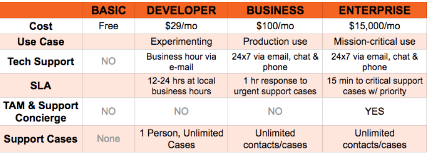

# AWS-14 ECS, AWS Support Plans, Trusted Advisor, AWS Config, AWS Cloud Trail
With this exercise I had to study some services within AWS. This exercise is only theoretical and don't include any practice with the services. The services I studied are: ECS, AWS Support Plans, Trusted Advisor, AWS Config and AWS Cloud Trail.

## Key terminology
- Docker: Docker is an open platform for developing, shipping, and running applications. Docker enables you to separate your applications from your infrastructure so you can deliver software quickly. With Docker, you can manage your infrastructure in the same ways you manage your applications. By taking advantage of Docker’s methodologies for shipping, testing, and deploying code quickly, you can significantly reduce the delay between writing code and running it in production. 

- ECS (Elastic Container Service): Amazon Elastic Container Service (Amazon ECS) is a highly scalable and fast container (docker) management service. You can use it to run, stop, and manage containers on a cluster. With Amazon ECS, your containers are defined in a task definition that you use to run an individual task or task within a service. In this context, a service is a configuration that you can use to run and maintain a specified number of tasks simultaneously in a cluster. You can run your tasks and services on a serverless infrastructure that's managed by AWS Fargate. Alternatively, for more control over your infrastructure, you can run your tasks and services on a cluster of Amazon EC2 instances that you manage.There are two models that you can use to run your containers:

    - Fargate launch type - This is a serverless pay-as-you-go option. You can run containers without needing to manage your infrastructure.

    - EC2 launch type - Configure and deploy EC2 instances in your cluster to run your containers.

The Fargate launch type is suitable for the following workloads:

    - Large workloads that need to be optimized for low overhead

    - Small workloads that have occasional burst

    - Tiny workloads

    - Batch workloads

The EC2 launch type is suitable for the following workloads:

    - Workloads that require consistently high CPU core and memory usage

    - Large workloads that need to be optimized for price

    - Your applications need to access persistent storage

    - You must directly manage your infrastructure

- ECS container: An Amazon ECS container instance is an Amazon EC2 instance that is running the Amazon ECS container agent and has been registered into an Amazon ECS cluster. When you run tasks with Amazon ECS using the EC2 launch type or an Auto Scaling group capacity provider, your tasks are placed on your active container instances. 

- AWS Support Plans: AWS Support offers a range of plans that provide access to tools and expertise that support the success and operational health of your AWS solutions. All support plans provide 24/7 access to customer service, AWS documentation, technical papers, and support forums. For technical support and more resources to plan, deploy, and improve your AWS environment, you can choose a support plan that best aligns with your AWS use case. There are five Support plans: Basic, Developer, Business, Enterprise On-Ramp and Enterprise. If you go to the link to the website you can see which what plans include. On the picture below you can see som key differences. It's really important for the exam to know the different plans and what they contain.   

- Trusted Advisor: Trusted Advisor draws upon best practices learned from serving hundreds of thousands of AWS customers. Trusted Advisor inspects your AWS environment, and then makes recommendations when opportunities exist to save money, improve system availability and performance, or help close security gaps. If you have a Basic or Developer Support plan, you can use the Trusted Advisor console to access all checks in the Service Limits category and six checks in the Security category. If you have a Business, Enterprise On-Ramp, or Enterprise Support plan, you can use the Trusted Advisor console and the AWS Support API to access all Trusted Advisor checks. You also can use Amazon CloudWatch Events to monitor the status of Trusted Advisor checks.You can access Trusted Advisor in the AWS Management Console. 

- AWS Config: AWS Config is a service that enables you to assess, audit, and evaluate the configurations of your AWS resources. Config continuously monitors and records your AWS resource configurations and allows you to automate the evaluation of recorded configurations against desired configurations. With Config, you can review changes in configurations and relationships between AWS resources, dive into detailed resource configuration histories, and determine your overall compliance against the configurations specified in your internal guidelines. This enables you to simplify compliance auditing, security analysis, change management, and operational troubleshooting. There is no free pricing tier, it will cost around 2$ per active rule per region per month (less after 10 rules).

- API (Application Programming Interface): APIs are mechanisms that enable two software components to communicate with each other using a set of definitions and protocols. For example, the weather bureau’s software system contains daily weather data. The weather app on your phone “talks” to this system via APIs and shows you daily weather updates on your phone. Interface can be thought of as a contract of service between two applications. This contract defines how the two communicate with each other using requests and responses. Their API documentation contains information on how developers are to structure those requests and responses.

- SNS (Simple Notafication Service): Amazon Simple Notification Service (Amazon SNS) is a fully managed messaging service for both application-to-application (A2A) and application-to-person (A2P) communication. The A2A pub/sub functionality provides topics for high-throughput, push-based, many-to-many messaging between distributed systems, microservices, and event-driven serverless applications. Using Amazon SNS topics, your publisher systems can fanout messages to a large number of subscriber systems, including Amazon SQS queues, AWS Lambda functions, HTTPS endpoints, and Amazon Kinesis Data Firehose, for parallel processing. The A2P functionality enables you to send messages to users at scale via SMS, mobile push, and email. 

- AWS Cloud Trail: AWS CloudTrail is an AWS service that helps you enable governance, compliance, and operational and risk auditing of your AWS account. Actions taken by a user, role, or an AWS service are recorded as events in CloudTrail. Events include actions taken in the AWS Management Console, AWS Command Line Interface, and AWS SDKs and APIs. CloudTrail is enabled on your AWS account when you create it. When activity occurs in your AWS account, that activity is recorded in a CloudTrail event. You can easily view recent events in the CloudTrail console by going to Event history. For an ongoing record of activity and events in your AWS account, create a trail. 

## Exercise
Study

- ECS
- AWS Support Plans
- Trusted Advisor
- AWS Config
- AWS Cloud Trail

### Sources
- https://docs.aws.amazon.com/AmazonECS/latest/developerguide/ECS_instances.html
- https://docs.aws.amazon.com/AmazonECS/latest/developerguide/Welcome.html 
- https://aws.amazon.com/ecs/
- https://www.youtube.com/watch?v=I9VAMGEjW-Q
- https://docs.docker.com/get-started/overview/
- https://docs.aws.amazon.com/awssupport/latest/user/getting-started.html
- https://aws.amazon.com/premiumsupport/plans/
- https://awsnewbies.com/billing/
- https://docs.aws.amazon.com/awssupport/latest/user/trusted-advisor.html
- https://aws.amazon.com/premiumsupport/technology/trusted-advisor/#:~:text=AWS%20Trusted%20Advisor%20provides%20recommendations,costs%2C%20and%20monitor%20service%20quotas.
- https://www.youtube.com/watch?v=PQtM_sPA0M4
- https://aws.amazon.com/config/#:~:text=AWS%20Config%20is%20a%20service,recorded%20configurations%20against%20desired%20configurations.
- https://docs.aws.amazon.com/config/latest/developerguide/WhatIsConfig.html
- https://www.youtube.com/watch?v=eiB2cwpV_H8
- https://aws.amazon.com/what-is/api/
- https://aws.amazon.com/sns/?whats-new-cards.sort-by=item.additionalFields.postDateTime&whats-new-cards.sort-order=desc 
- https://docs.aws.amazon.com/awscloudtrail/latest/userguide/cloudtrail-user-guide.html
- https://www.youtube.com/watch?v=jncdEQNBi5s 

### Overcome challenges
- Not that much, it was a lot of theory. The only thing that was a bit harder to understand was the ECS service. I had to spend some more time on that. 

### Results
I had to study a few services, you can the services I studied see at the key terminology part. 

    

