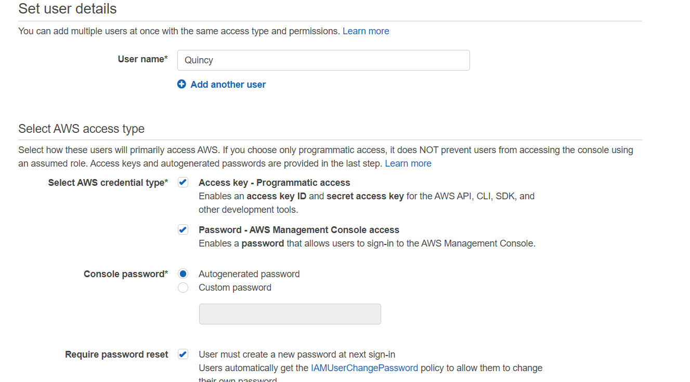
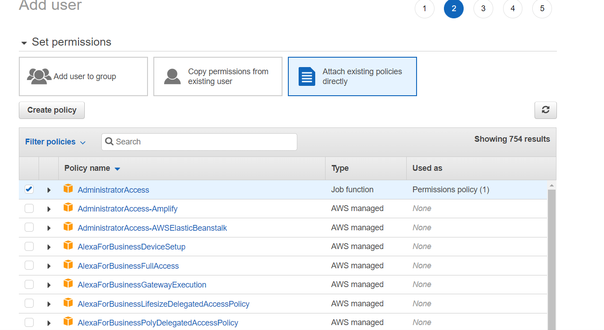
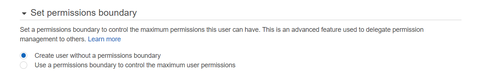
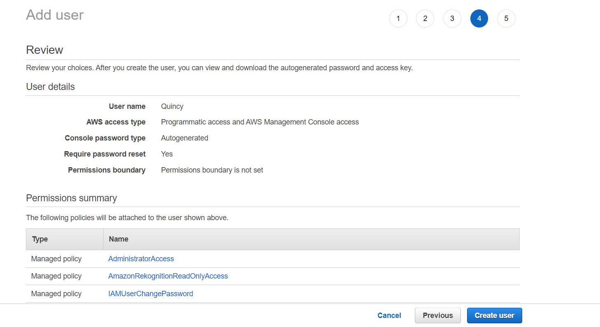
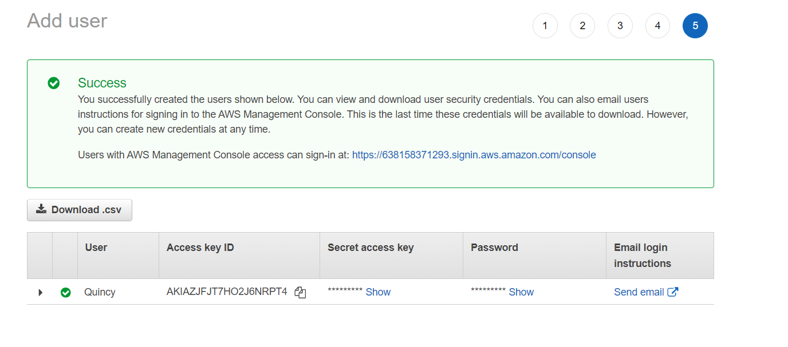
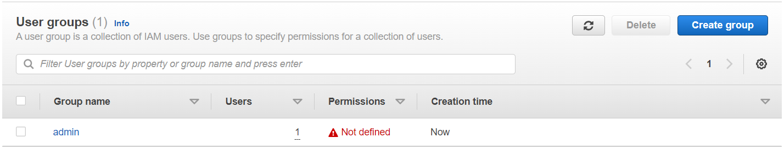
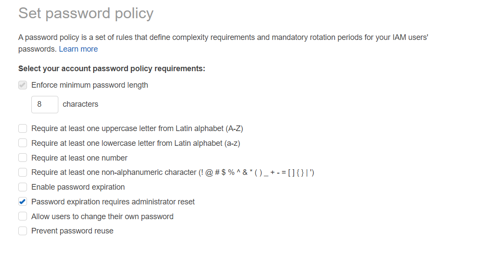
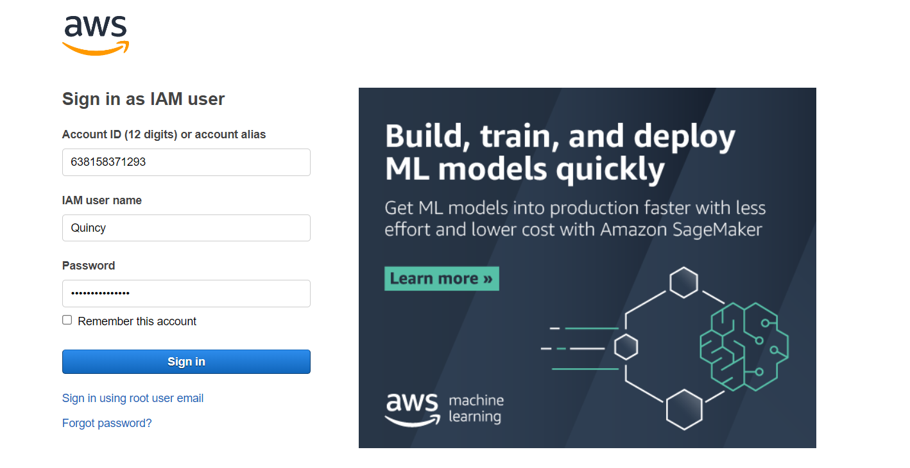
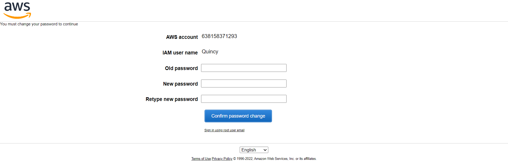
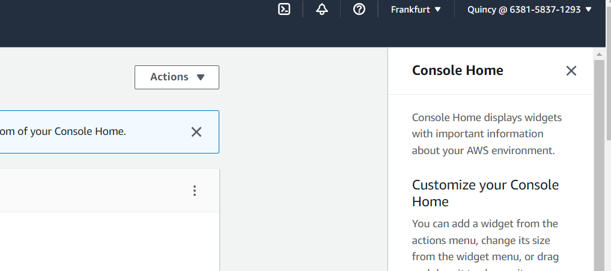

# AWS-14.2 IAM 
With this exercise I learned what the IAM service is and how it works. I also did some practice with it. 

## Key terminology
- IAM (Identity and Access Management): AWS Identity and Access Management (IAM) is a web service that helps you securely control access to AWS resources. You use IAM to control who is authenticated (signed in) and authorized (has permissions) to use resources. With your root user account you have complete access to all the AWS resources. It is better however to use your IAM user to do day to day tasks. You are then safe to do tasks without actually causing damage beacuse of the permissions you can set.       

## Exercise
Exercise

- IAM

### Sources
- https://aws.amazon.com/iam/#:~:text=AWS%20Identity%20and%20Access%20Management%20(IAM)%20provides%20fine%2Dgrained,to%20ensure%20least%2Dprivilege%20permissions.
- https://docs.aws.amazon.com/IAM/latest/UserGuide/introduction.html 
- https://www.youtube.com/watch?v=Ul6FW4UANGc
- https://www.youtube.com/watch?v=3y596T1eH_8 

### Overcome challenges
- None really, had to search wat IAM is and how it is used. 

### Results
 IAM practice

 When I went to the IAM service page I saw at security recommendations that I needed to add a MFA (multi factor Authentication) to my root user account due to safety reasons. I searched how to set (youtube link) that but I didn't do it because this is my pratice account. 

 So the next step I did was to actually add an IAM user. 

I choose for this user to give all Administrator access because it is to practice. Here you can choose which policy (set of permissions) you can give to the user. You can also add a user to a group but for now I only use this.

Here you can see the review of our choosen settings.

Here you can see the user is created. You have to download the csv file to see all the credential. This is the last time you can download it, so make sure you do this. 

For the next step I created a user group. I didn't include any policies for now because it was for practice how to create a group. 

There is also an option to make a password policy for your users. I haven't changed it for now, but it exists and I wanted to show it. 

Here I logged in using my IAM user credentials. 

Here you can see I need to change my password. This is because of the policy I defined. 

As you can see here I am now logged in as the IAM user. 

    

