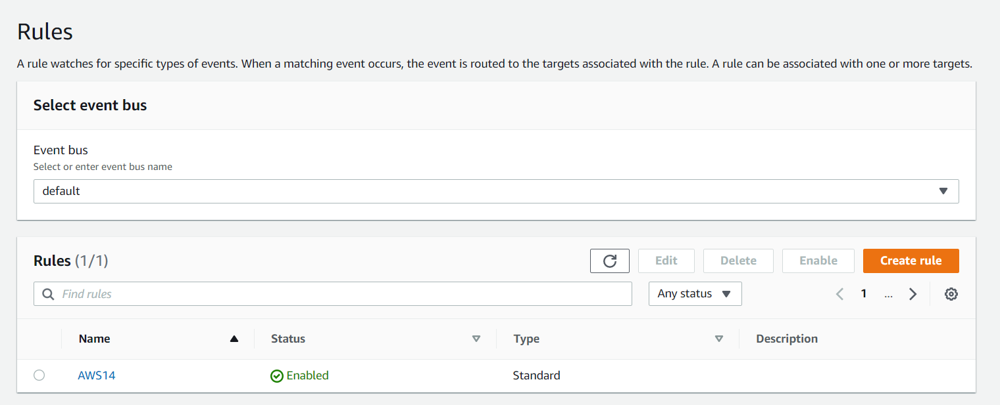

# AWS-14.6 SNS, SQS, Event Bridge 
With this exercise I learned what SNS, SQS and Evenbridge are and how to use them. 

## Key terminology
- SNS (Simple Notification Service): Amazon Simple Notification Service (Amazon SNS) is a managed service that provides message delivery from publishers to subscribers (also known as producers and consumers). Publishers communicate asynchronously with subscribers by sending messages to a topic, which is a logical access point and communication channel. Clients can subscribe to the SNS topic and receive published messages using a supported endpoint type, such as Amazon Kinesis Data Firehose, Amazon SQS, AWS Lambda, HTTP, email, mobile push notifications, and mobile text messages (SMS). SNS messages are Pushed.

- SQS (Simple Queue Service): Amazon Simple Queue Service (SQS) is a fully managed message queuing service that enables you to decouple and scale microservices, distributed systems, and serverless applications. SQS eliminates the complexity and overhead associated with managing and operating message-oriented middleware, and empowers developers to focus on differentiating work. Using SQS, you can send, store, and receive messages between software components at any volume, without losing messages or requiring other services to be available. Consumers pull messages form SQS.  

- SNS vs SQS: 

- EventBridge: Amazon EventBridge is a serverless event bus service that you can use to connect your applications with data from a variety of sources. EventBridge delivers a stream of real-time data from your applications, software as a service (SaaS) applications, and AWS services to targets such as AWS Lambda functions, HTTP invocation endpoints using API destinations, or event buses in other AWS accounts. EventBridge receives an event, an indicator of a change in environment, and applies a rule to route the event to a target. Rules match events to targets based on either the structure of the event, called an event pattern, or on a schedule. For example, when an Amazon EC2 instance changes from pending to running, you can have a rule that sends the event to a Lambda function. All events that come to EventBridge are associated with an event bus. Rules are tied to a single event bus, so they can only be applied to events on that event bus. Your account has a default event bus which receives events from AWS services, and you can create custom event buses to send or receive events from a different account or Region. 

## Exercise
Exercise

- SNS, SQS, Event Bridge

### Sources
- https://docs.aws.amazon.com/sns/latest/dg/welcome.html
- https://docs.aws.amazon.com/sns/latest/dg/welcome-features.html
- https://aws.amazon.com/sns/?whats-new-cards.sort-by=item.additionalFields.postDateTime&whats-new-cards.sort-order=desc
- https://aws.amazon.com/sqs/
- https://docs.aws.amazon.com/AWSSimpleQueueService/latest/SQSDeveloperGuide/welcome.html
- https://medium.com/awesome-cloud/aws-difference-between-sqs-and-sns-61a397bf76c5#:~:text=SQS%20%3A%20All%20the%20consumers%20are,the%20messages%20in%20different%20ways.
- https://docs.aws.amazon.com/eventbridge/latest/userguide/eb-what-is.html
- https://aws.amazon.com/eventbridge/

### Overcome challenges
I wanted to do the practise all by myself so I didn't use any tutorial. At some points I didn't quite understand what is meant, but I found out with help from my teammate that I was connected to the wrong SNS. 

### Results
SNS, SQS and Event Bridge practice

I already did some practice for SNS at the Cloudwatch assignment, so I will only do a SQS and Eventbridge exercise here. 

So for the practice for SQS I just went to the SQS service on the dashboard and created a queue. I used alle the default settings. 

You can see it is created. 

The next step what I did is to make a message to receive and send via the queue.

You can see that the message is delivered. 

- Eventbridge

To practice with this part I went to the the AWS Eventbridge service on the console. I wanted to see how it works by trying things out, so I created a rule and see how you can do to configure it. 

I choose a service I already knew as the event source (EC2). Then I choose the option to give a notification if an EC2 instance changes from state. 

The target was my SNS. 

You can see that the Eventbridge rule has been created.

I also created a new SQS so that I could receive a message when something changes. I also connected the SNS to my SQS.

I started and stopped the instance and I received the messages.

