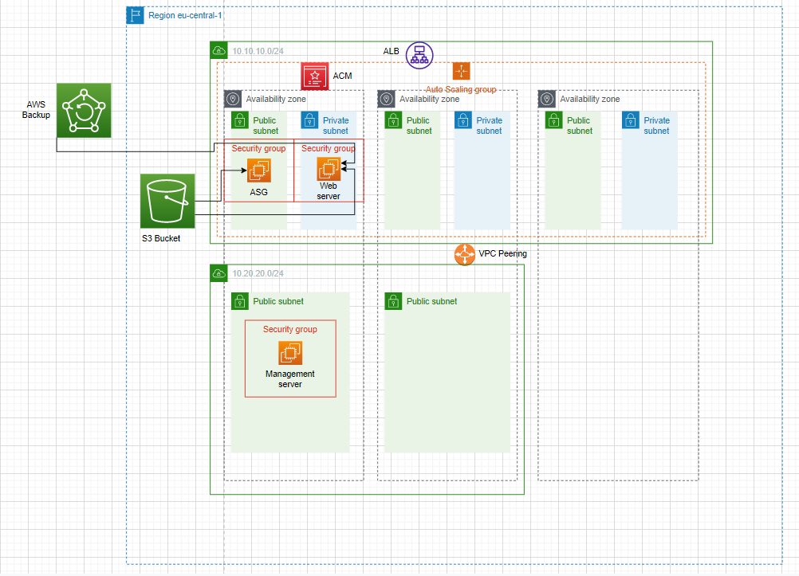

# Design Document version 1.1
This document will include a list with all the components used for this project. The order of the list is also the order in which the app is deployed in the cloud.

The following architecture has been created:

## VPC
- There are two VPC's deployed (management VPC and webserver VPC).
- The CIDR blocks are: 10.10.10.0/24 and 10.20.20.0/24.
- There are a public and a private subnet in each AZ (3) for the webserver VPC.
- There are two public subnets in both AZ's (2) for the management server VPC.

## VPC Peering
- There is a VPC peering connection enabled between the two VPC's.
- In order to make sure the right connections are being made, there are also routingtables added, 3 in total.

## Security Groups
- All the instances within the VPC's are protected by Security Groups.
- SG Managementserver: All outbound is true, allow SSH, RDP, HTTP and HTTPS. 
- SG Webserver: All outbound is true, allow HTTP, HTTPS and allow SSH from Managementserver.

## Network Access Control List's
- All the subnets within the VPC's are protected by NACL's.
- NACL Managementserver: 
    
    - Allow inbound: SSH, Ephemeral, RDP, HTTP, HTTPS
    - Allow outbound: SSH, Ephemeral, RDP, HTTP, HTTPS

- Public NACL Webserver:

    - Allow inbound: SSH, Ephemeral, HTTP, HTTPS
    - Allow outbound: Ephemeral, HTTP, HTTPS

- Private NACL Webserver: 

    - Allow inbound: HTTP, HTTPS, Ephemeral, SSH
    - Allow outbound: HTTP, HTTPS, Ephemeral

## S3
- There is a S3 Bucket created.
- In the S3 bucket are the postdeployment scripts stored (webserver user data en HTML file).

## Instances
- There are two instances deployed in the different VPC's.
- A Managementserver is deployed in the Management VPC.
- A Webserver is deployed in the Webserver VPC.

## Encryption
- All the data in rest and in transit are encrypted.
- Data in rest: Both VM disks, the S3 bucket and the BackupVault.
- Everything is encrypted with the standard AWS Key.

## Auto scaling Group
- An Auto scaling group has been created for the web server.
- The Instances will be deployed in the webserver VPC. 

## Application Load Balancer
- There is also an ALB placed before the ASG.
- A self signed certificate is being used for HTTPS.
- It redirects HTTP traffic to HTTPS traffic.

## Backup
- There is a Vault created where to store the RP's.
- Everyday at 14:00 CET a backup will be created of the webserver.
- The backups will be stored for 7 days, after that they will be destroyed. 